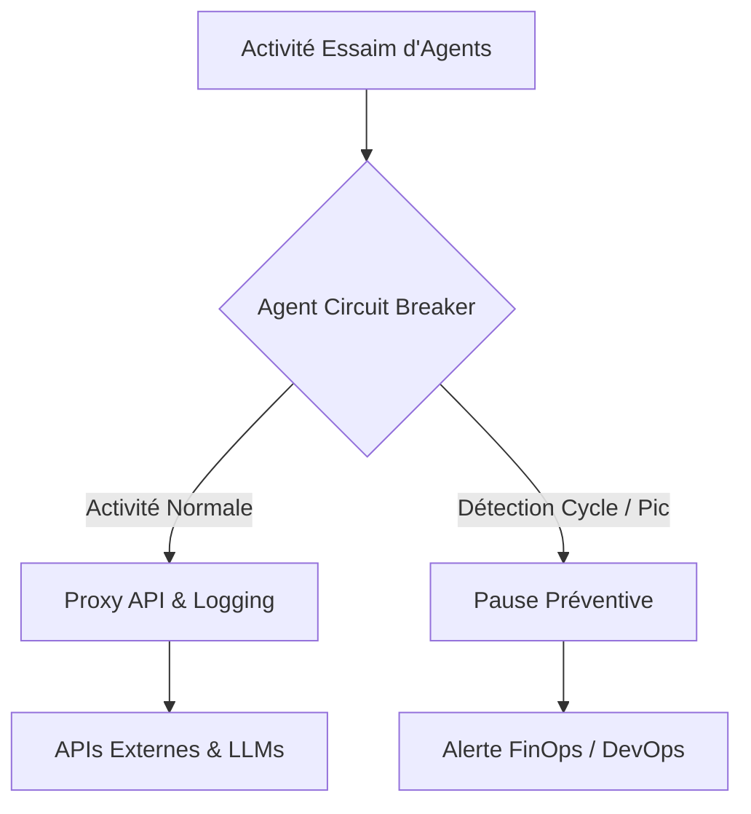
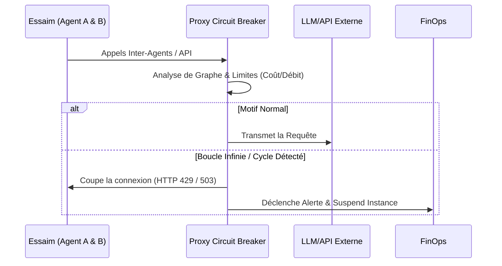

<!-- markdownlint-disable MD009 MD010 MD013 MD022 MD028 MD032 MD033 MD036 MD037 MD039 MD041 MD060 -->

[ 🇬🇧 English Version ](./README.md)

# Agent Circuit Breaker

> **Résumé exécutif :** Un coupe-circuit au niveau réseau qui analyse les graphes d'appels inter-agents en temps réel pour détecter les boucles infinies, l'explosion des coûts, et suspendre préventivement les agents défectueux.

---

## 1. Aperçu visuel

## 2. La thèse contrariante (Peter Thiel Style)

- **La croyance populaire :** Les agents autonomes sont des entités rationnelles qui optimiseront naturellement leur propre consommation d'API et la complétion de leurs tâches.
- **La vérité cachée :** Un essaim d'agents finira inévitablement par entrer dans des "boucles conversationnelles" récursives ou des cycles de délégation infinis, causant des attaques DDoS involontaires sur les systèmes internes et une explosion incontrôlable de la consommation de tokens.

## 3. Le problème & La cible

- **Modèle économique :** M2M
- **Cible précise :** Les entreprises déployant des essaims d'agents autonomes, les fournisseurs de plateformes Agentic et les équipes FinOps/DevOps.
- **La douleur urgente :** Les agents peuvent entrer dans des boucles infinies de raisonnement (l'agent A demande à B qui redemande à A), générant des appels API en cascade qui brûlent les budgets instantanément et saturent les infrastructures.

## 4. Architecture technique & Plomberie

## 5. Modèle économique & Viabilité financière

| Métrique                    | Valeur                                      |
| --------------------------- | ------------------------------------------- |
| Structure de prix           | Abonnement par Paliers / Volume API Protégé |
| Objectif 12 mois            | 250 Déploiements Entreprise                 |
| Calcul du CA (Target 100k€) | 250 _ 400€ / mois _ 12 = 1.2M€              |
| Marge brute estimée         | 90%                                         |

## 6. Moteur de distribution & Fossé défensif (Moat)

- **Stratégie d'acquisition :** Vente directe aux équipes FinOps et DevOps comme une police d'assurance obligatoire avant le déploiement d'agents LLM en production.
- **Moat (Barrière à l'entrée) :** Le système nécessite une conscience en temps réel de la topologie réseau globale et une inspection approfondie des paquets M2M. Une boucle infinie est un problème d'orchestration distribuée impossible à résoudre par un LLM via un simple ajustement de prompt.

## 7. Grille d'évaluation détaillée

| Critère                           | Score VC (/100) | Score Terrain (/100) |
| --------------------------------- | --------------- | -------------------- |
| Thèse & Monopole / Urgence        | 23 / 25         | -- / 25              |
| Moat / Résistance aux LLM natifs  | 23 / 25         | -- / 25              |
| Scalabilité / Friction d'adoption | 24 / 25         | -- / 25              |
| Unit Economics / ROI direct       | 25 / 25         | -- / 25              |
| **TOTAL**                         | **95 / 100**    | **-- / 100**         |

> **Verdict VC :** Agent Circuit Breaker résout un risque financier aigu et très douloureux (la consommation incontrôlée de tokens) que redoute toute entreprise expérimentant l'IA. Sa position au niveau réseau offre un fossé défensif imprenable, car les modèles fondateurs ne peuvent surveiller leur propre infrastructure. Le ROI est immédiat et indiscutable, permettant une tarification très lucrative et scalable.

> **Verdict Terrain :** En attente d'évaluation.
