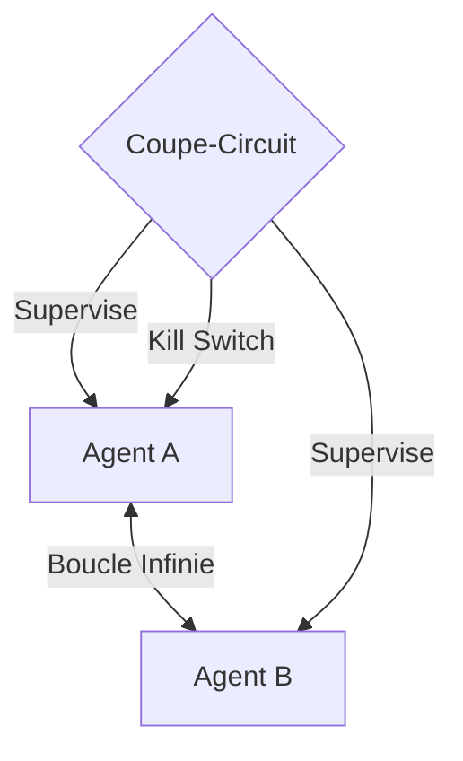
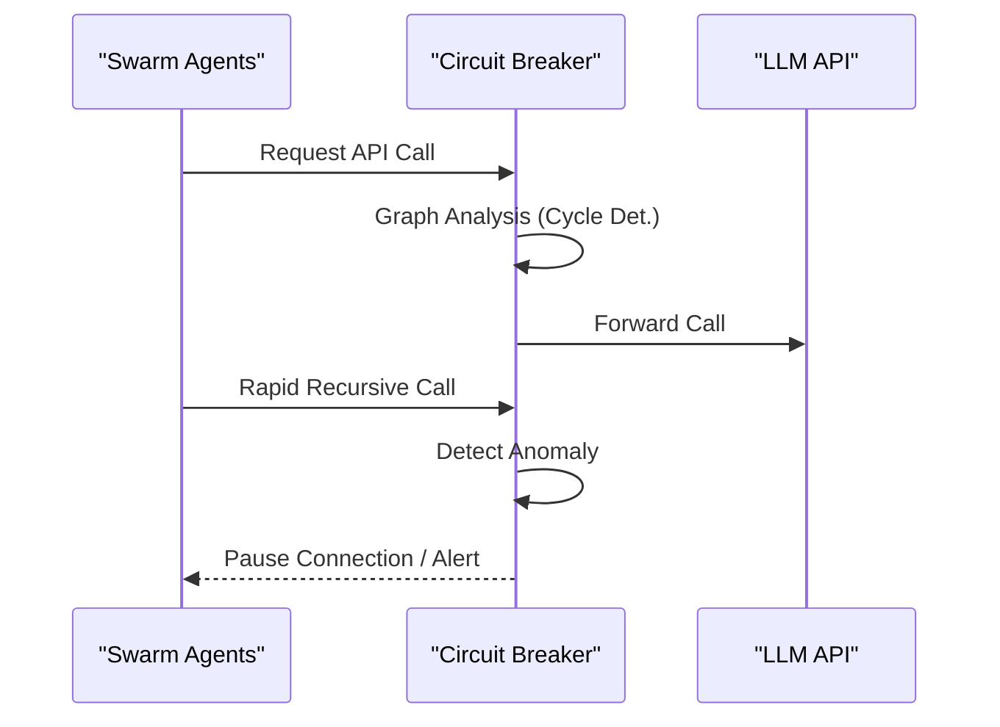

<!-- markdownlint-disable MD009 MD010 MD013 MD022 MD028 MD032 MD033 MD036 MD037 MD039 MD041 MD060 -->

[ 🇬🇧 English Version ](./README.md)

# Agent Circuit Breaker

> **Résumé exécutif :** Un coupe-circuit au niveau réseau analysant les graphes d'appels inter-agents en temps réel pour détecter les boucles infinies et stopper les agents défectueux.

---

## 1. Aperçu visuel

```mermaid
graph TD
    %% Flux
    A["Agent A"] <-->|Boucle Infinie| B["Agent B"]
    C{"Coupe-Circuit"} -->|Supervise| A
    C -->|Supervise| B
    C -->|Kill Switch| A
```

## 2. La thèse contrariante (Peter Thiel Style)

**La croyance populaire :** Il suffit de dire à un LLM de s'arrêter s'il tourne en boucle.

**La vérité cachée :** Les boucles infinies sont un problème d'orchestration distribuée invisible pour le LLM ; seule une couche réseau externe peut couper le processus.

## 3. Le problème & La cible

**Modèle économique :** M2M / B2B
**Cible précise :** Entreprises déployant des essaims d'agents, fournisseurs de plateformes Agentic, équipes FinOps/DevOps.
**La douleur urgente :** Les agents entrent dans des boucles infinies, générant des appels API en cascade qui brûlent les budgets (token burn) et saturent l'infrastructure.

## 4. Architecture technique & Plomberie

**L'approche technique :** Coupe-circuit au niveau réseau analysant les graphes d'appels en temps réel. Détecte les cycles et pics de coûts pour mettre en pause les agents défectueux.

```mermaid
sequenceDiagram
    participant Ag as "Swarm Agents"
    participant CB as "Circuit Breaker"
    participant API as "LLM API"
    Ag->>CB: Request API Call
    CB->>CB: Graph Analysis (Cycle Det.)
    CB->>API: Forward Call
    Ag->>CB: Rapid Recursive Call
    CB->>CB: Detect Anomaly
    CB-->>Ag: Pause Connection / Alert
```

## 5. Modèle économique & Viabilité financière

| Métrique                        | Valeur                              |
| :------------------------------ | :---------------------------------- |
| **Structure de prix**           | Usage-based / % of saved tokens     |
| **Objectif 12 mois**            | 200 companies                       |
| **Calcul du CA (Target 100k€)** | 200 companies \* $500/mo = $100k/mo |
| **Marge brute estimée**         | 90%                                 |

## 6. Moteur de distribution & Fossé défensif (Moat)

**Stratégie d'acquisition :** Intégrations d'outils FinOps, marketplaces cloud, ventes B2B directes.

**Moat (Barrière à l'entrée) :** Un LLM n'a pas conscience de la topologie réseau ni du coût global. Une supervision externe de l'infrastructure est impossible par un simple ajustement de prompt.

## 7. Grille d'évaluation détaillée

| Critère                               | Score VC (/100) | Score Terrain (/100) |
| :------------------------------------ | :-------------- | :------------------- |
| **Thèse & Monopole / Urgence**        | -- / 25         | -- / 25              |
| **Moat / Résistance aux LLM natifs**  | -- / 25         | -- / 25              |
| **Scalabilité / Friction d'adoption** | -- / 25         | -- / 25              |
| **Unit Economics / ROI direct**       | -- / 25         | -- / 25              |
| **TOTAL**                             | -- / 100        | -- / 100             |

> **Verdict VC :** En attente d'évaluation.
> **Verdict Terrain :** En attente d'évaluation.
