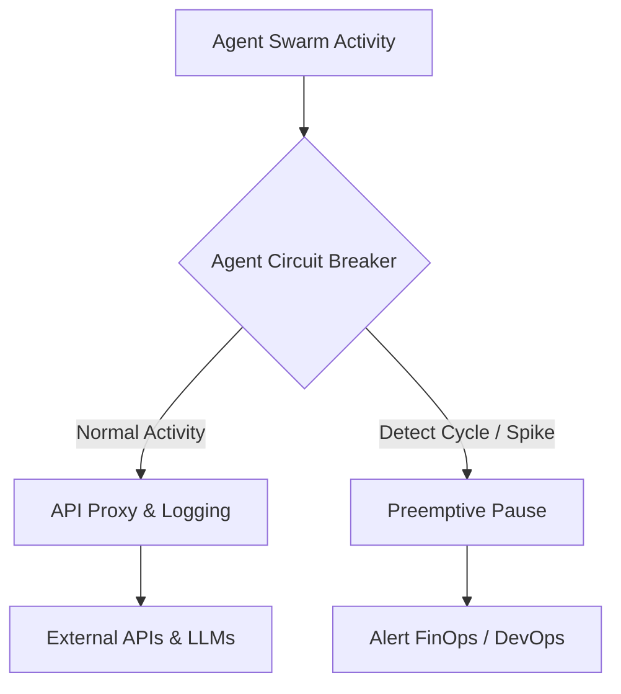
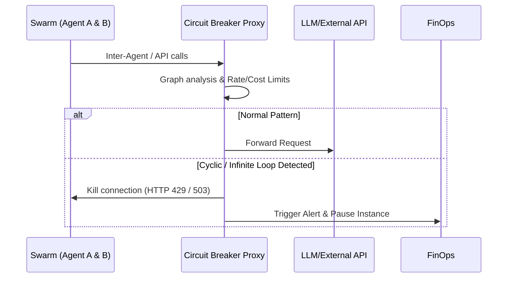

<!-- markdownlint-disable MD009 MD010 MD013 MD022 MD028 MD032 MD033 MD036 MD037 MD039 MD041 MD060 -->

[ 🇫🇷 Version Française ](./README.fr.md)

# Agent Circuit Breaker

> **Executive Summary:** A network-level circuit breaker that analyzes real-time inter-agent call graphs to detect infinite loops, budget-burning cycles, and anomalous cost spikes, preemptively pausing defective autonomous agents.

---

## 1. Visual Overview

## 2. Contrarian Thesis (Peter Thiel Style)

- **Popular Belief:** Autonomous agents are independent, rational actors that will natively optimize their own API consumption and task completion logic.
- **Hidden Truth:** A swarm of agents will inevitably enter recursive "conversational loops" or infinite task-delegation cycles causing unintentional DDoS attacks on internal systems and runaway token burn.

## 3. Problem & Target Market

- **Business Model:** M2M
- **Target Audience:** Enterprises deploying swarms of autonomous agents, Agentic platform providers, and FinOps/DevOps teams.
- **Urgent Pain Point:** Agents can enter infinite reasoning or communication loops (Agent A asks B who asks A), generating cascading API calls that burn budgets instantly and saturate internal infrastructures.

## 4. Technical Architecture & Infrastructure

## 5. Business Model & Financial Viability

| Metric                 | Value                                      |
| ---------------------- | ------------------------------------------ |
| Pricing Structure      | Tiered Subscription / Protected API Volume |
| 12-Month Target        | 250 Enterprise Deployments                 |
| Revenue Formula        | 250 _ €400 / month _ 12 = 1.2M€            |
| Estimated Gross Margin | 90%                                        |

## 6. Distribution Engine & Moat

- **Acquisition Strategy:** Direct sales to FinOps and DevOps teams as a mandatory insurance policy before deploying any LLM agents to production.
- **Moat (Defensibility):** The system relies on real-time global network topology awareness and deep packet inspection of M2M API patterns, requiring external state management that a stateless generative LLM cannot provide or monitor natively.

## 7. Detailed Evaluation Grid

| Criterion                   | VC Score (/100) | Market Score (/100) |
| --------------------------- | --------------- | ------------------- |
| Thesis & Monopoly / Urgency | -- / 25         | -- / 25             |
| Moat / LLM Immunity         | -- / 25         | -- / 25             |
| Scalability / UX Friction   | -- / 25         | -- / 25             |
| Unit Economics / ROI        | -- / 25         | -- / 25             |
| **TOTAL**                   | **-- / 100**    | **-- / 100**        |

> **VC Verdict:** Pending evaluation.

> **Market Verdict:** Pending evaluation.
