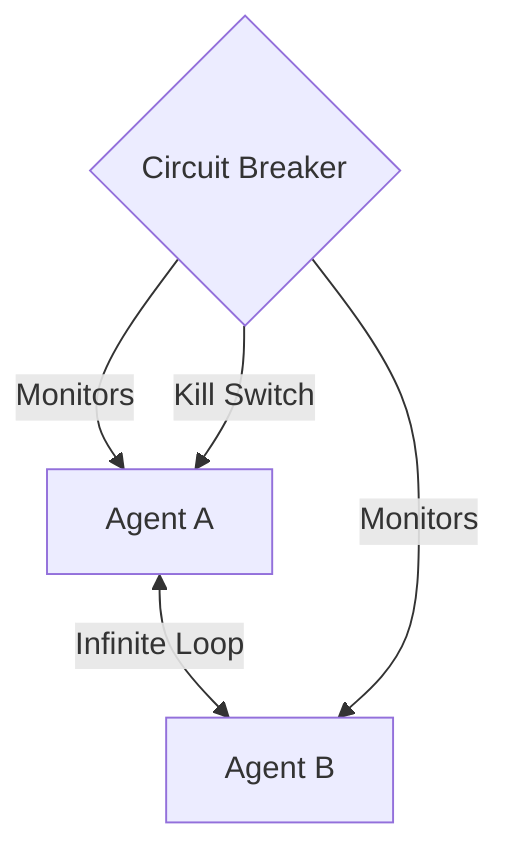
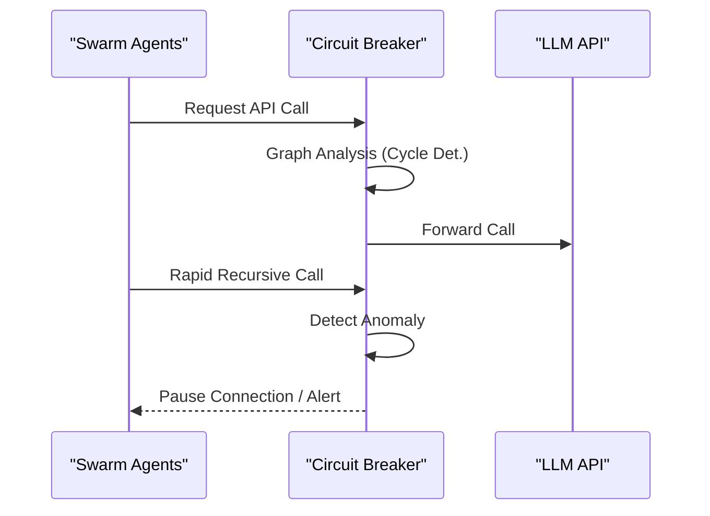

<!-- markdownlint-disable MD009 MD010 MD013 MD022 MD028 MD032 MD033 MD034 MD036 MD037 MD039 MD041 MD060 -->

[ 🇫🇷 Version Française ](./README.fr.md)

# Agent Circuit Breaker

> **Executive Summary:** A network-level circuit breaker that analyzes inter-agent call graphs in real-time to detect infinite loops and proactively pause defective agent instances.

---

## 1. Visual Overview & Wow Effect

```mermaid
graph TD
    %% Architecture
    A["Agent A"] <-->|Infinite Loop| B["Agent B"]
    C{"Circuit Breaker"} -->|Monitors| A
    C -->|Monitors| B
    C -->|Kill Switch| A
```

## 2. Contrarian Thesis (Peter Thiel Style)

**Popular Belief:** LLMs can be prompted to just "stop" if they get stuck in a loop.

**Hidden Truth:** Infinite loops in M2M systems occur at the orchestration layer, blind to the underlying LLM; only network-level observability can stop the resulting token burn.

## 3. Problem & Target Market

**Business Model:** M2M / B2B
**Target Audience:** Companies deploying agent swarms, Agentic platform providers, and FinOps/DevOps teams.
**Urgent Pain Point:** Agents enter infinite loops, generating cascading API calls that burn budgets (token burn) and risk internal infrastructure saturation (accidental DDoS).

## 4. Technical Architecture & Infrastructure

**Technical Approach:** Network/API layer circuit breaker analyzing inter-agent call graphs in real-time. Detects cyclic patterns and anomalous cost spikes to preemptively pause defective agents.

```mermaid
sequenceDiagram
    participant Ag as "Swarm Agents"
    participant CB as "Circuit Breaker"
    participant API as "LLM API"
    Ag->>CB: Request API Call
    CB->>CB: Graph Analysis (Cycle Det.)
    CB->>API: Forward Call
    Ag->>CB: Rapid Recursive Call
    CB->>CB: Detect Anomaly
    CB-->>Ag: Pause Connection / Alert
```

## 5. Business Model & Financial Viability

| Metric                     | Value                               |
| :------------------------- | :---------------------------------- |
| **Pricing Structure**      | Usage-based / % of saved tokens     |
| **12-Month Target**        | 200 companies                       |
| **Revenue Formula**        | 200 companies \* $500/mo = $100k/mo |
| **Estimated Gross Margin** | 90%                                 |

## 6. Distribution Engine & Moat

**Acquisition Strategy:** FinOps tool integrations, cloud marketplaces, direct enterprise sales.

**Moat (Defensibility):** LLMs lack awareness of global network topology and real-time financial consumption. Resolving loops requires external system state supervision at the infrastructure layer.

## 7. Detailed Evaluation Grid

| Criterion                       | VC Score (/100) | Market Score (/100) |
| :------------------------------ | :-------------- | :------------------ |
| **Thesis & Monopoly / Urgency** | 24 / 25         | 25 / 25             |
| **Moat / LLM Immunity**         | 25 / 25         | -- / 25             |
| **Scalability / UX Friction**   | 20 / 25         | -- / 25             |
| **Unit Economics / ROI**        | 22 / 25         | -- / 25             |
| **TOTAL**                       | 91 / 100        | -- / 100            |

> **VC Verdict:** Agent Circuit Breaker provides mandatory financial and operational safety infrastructure for enterprise AI deployments. Operating at the network layer makes it immune to underlying model changes and essential for preventing runaway costs. The undeniable ROI of avoiding catastrophic API bills guarantees rapid adoption and strong unit economics.
> **Market Verdict:** Pending evaluation.
