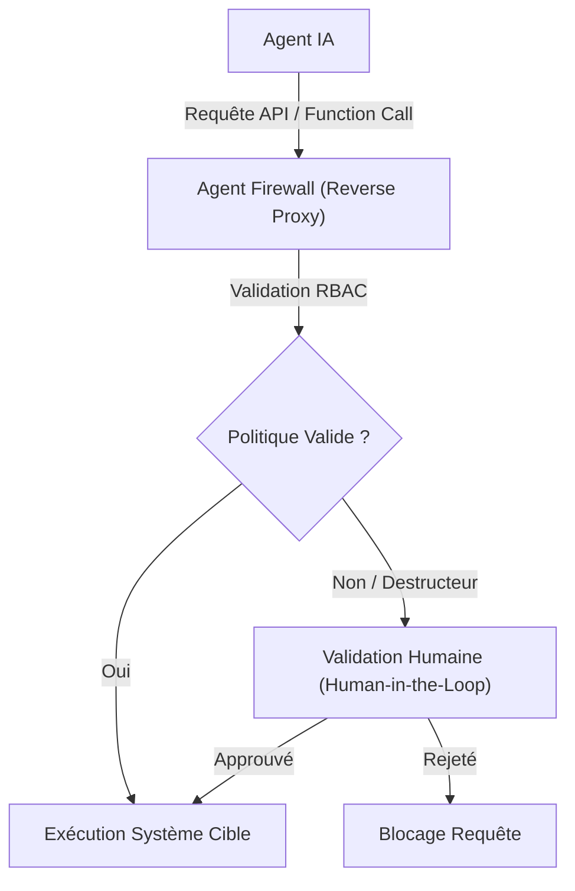
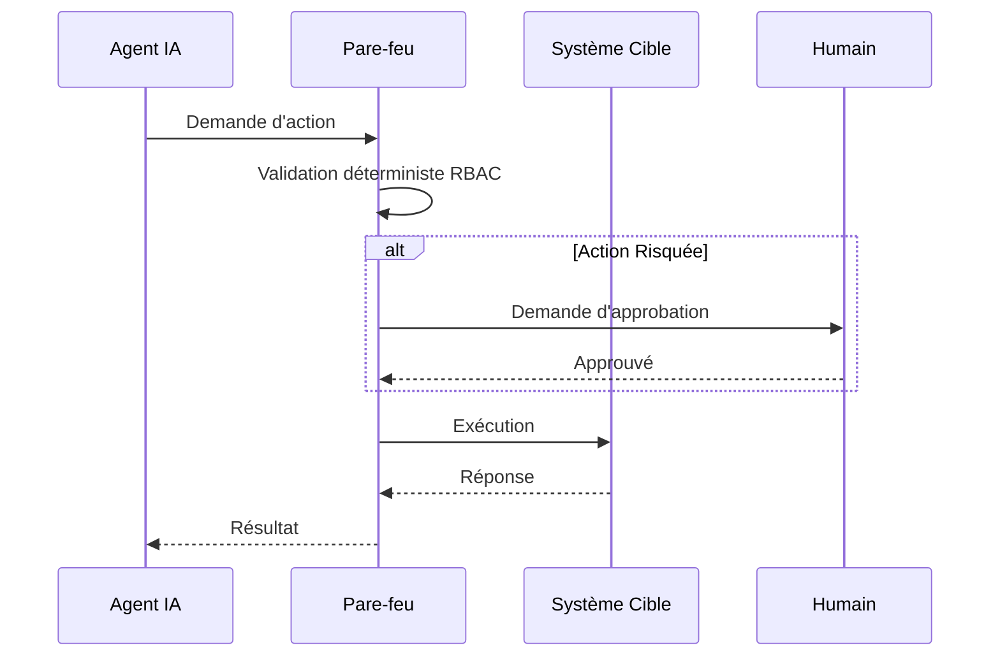

<!-- markdownlint-disable MD013 MD028 MD033 MD036 MD039 MD041 MD060 -->

[ 🇬🇧 English Version ](./README.md)

# Agent Firewall

> **Résumé exécutif :** Un pare-feu API agnostique au LLM qui intercepte et valide les "Function Calls" des agents IA contre des politiques déterministes.

---

## 1. Aperçu visuel

## 2. La thèse contrariante (Peter Thiel Style)

La croyance populaire : L'amélioration des directives système (prompts) suffit à sécuriser les actions d'un agent IA.
La vérité cachée : Un LLM est un système probabiliste et ne peut sécuriser ses actions de manière fiable. Une infrastructure de validation déterministe externe est indispensable.

## 3. Le problème & La cible

Modèle économique : M2M / B2B
Cible précise : Entreprises déployant des agents IA autonomes (Customer Success, DevTools, RPA) interagissant avec leurs bases de données ou API internes.
La douleur urgente : Vulnérabilité aux injections de prompt et hallucinations entraînant des fuites de données (PII), suppressions accidentelles, ou consommation de ressources incontrôlée.

## 4. Architecture technique & Plomberie

## 5. Modèle économique & Viabilité financière

| Métrique                    | Valeur                                     |
| --------------------------- | ------------------------------------------ |
| Structure de prix           | Abonnement B2B basé sur le volume de proxy |
| Objectif 12 mois            | 100 clients entreprise                     |
| Calcul du CA (Target 100k€) | Clients \* Abonnement                      |
| Marge brute estimée         | 80-90%                                     |

## 6. Moteur de distribution & Fossé défensif (Moat)

Stratégie d'acquisition : Acquisition B2B directe (SecOps, DevOps), intégration développeur.
Moat (Barrière à l'entrée) : Couche de validation externe et déterministe qui ne peut pas être remplacée nativement par une simple mise à jour d'OpenAI ou Google.

## 7. Grille d'évaluation détaillée

| Critère                           | Score VC (/100) | Score Terrain (/100) |
| --------------------------------- | --------------- | -------------------- |
| Thèse & Monopole / Urgence        | 21 / 25         | 17 / 25              |
| Moat / Résistance aux LLM natifs  | 22 / 25         | 21 / 25              |
| Scalabilité / Friction d'adoption | 23 / 25         | 19 / 25              |
| Unit Economics / ROI direct       | 24 / 25         | 24 / 25              |
| **TOTAL**                         | **90 / 100**    | **81 / 100**         |

> **Verdict Terrain :** L'outil Agent Firewall répond à un besoin métier très ciblé avec un ROI tangible. Son positionnement en tant qu'infrastructure API garantit une bonne immunité face aux LLMs généralistes. Même si l'adoption demande un effort d'intégration, la viabilité du modèle économique est portée par la valeur apportée.
> **Verdict VC :** Ce pare-feu déterministe capitalise sur la faille fatale des LLM : leur incapacité à garantir des résultats structurés et sécurisés. En séparant le plan de sécurité du plan de raisonnement, il crée un produit d'entreprise très captif. L'exécution doit être rapide pour dominer la niche avant que les passerelles API traditionnelles n'adaptent leurs fonctionnalités.
