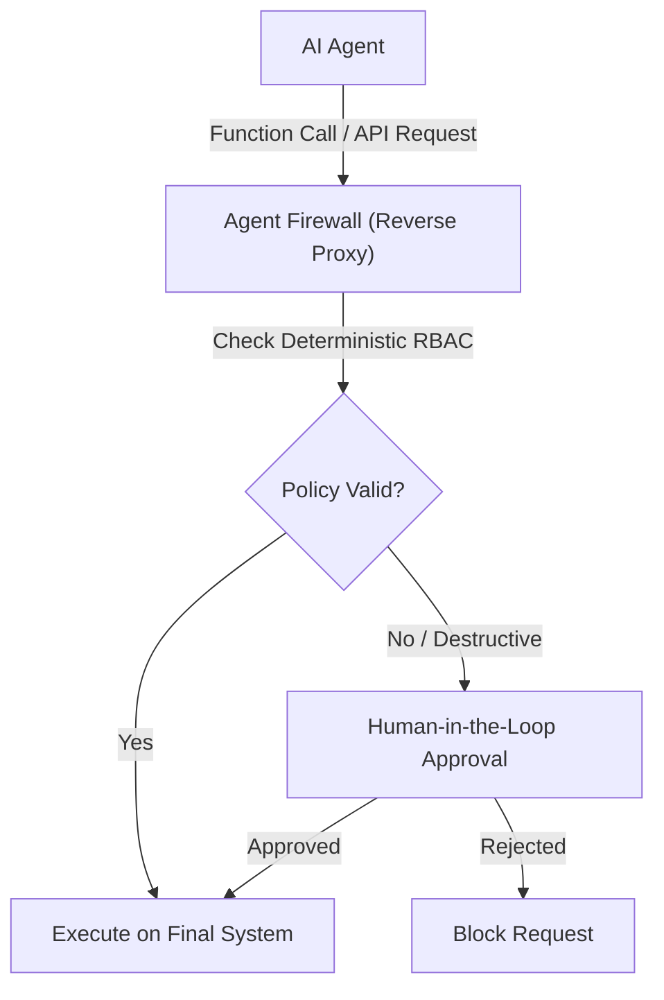
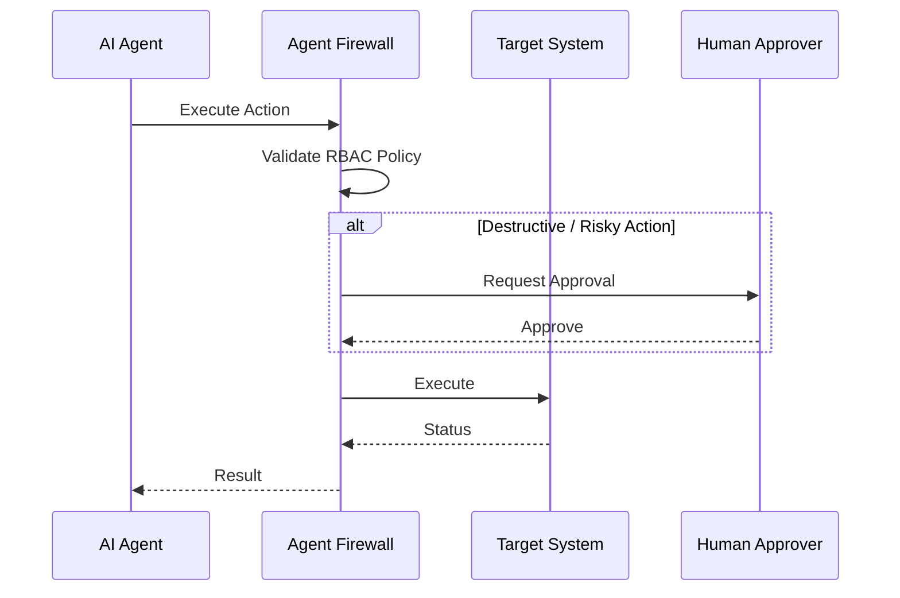

<!-- markdownlint-disable MD013 MD028 MD033 MD036 MD039 MD041 MD060 -->

[ 🇫🇷 Version Française ](./README.fr.md)

# Agent Firewall

> **Executive Summary:** A deterministic, LLM-agnostic API firewall that intercepts and validates AI agent "Function Calls" and network requests against strict RBAC policies.

---

## 1. Visual Overview

## 2. Contrarian Thesis (Peter Thiel Style)

Popular Belief: Better prompt engineering and "system prompts" telling the AI not to delete data are sufficient to secure AI agents.
Hidden Truth: LLMs are probabilistic systems and cannot reliably secure their own actions. Deterministic, external infrastructure is required to guarantee safety.

## 3. Problem & Target Market

Business Model: M2M / B2B
Target Audience: Enterprises deploying autonomous AI agents (Customer Success, DevTools, RPA) interacting with their databases or internal APIs.
Urgent Pain Point: AI agents are vulnerable to prompt injections and hallucinations. Unfettered access can cause data leaks (PII), accidental database deletions, or uncontrolled resource consumption costing millions.

## 4. Technical Architecture & Infrastructure

## 5. Business Model & Financial Viability

| Metric                 | Value                                     |
| ---------------------- | ----------------------------------------- |
| Pricing Structure      | Tiered subscription based on proxy volume |
| 12-Month Target        | 100 enterprise customers                  |
| Revenue Formula        | Customers \* Avg Subscription             |
| Estimated Gross Margin | 80-90%                                    |

## 6. Distribution Engine & Moat

Acquisition Strategy: Direct B2B sales (SecOps), developer adoption via SDKs.
Moat (Defensibility): Deterministic external validation network that cannot be replicated by simply upgrading the underlying LLM. Deep integration into enterprise routing.

## 7. Detailed Evaluation Grid

| Criterion                   | VC Score (/100) | Market Score (/100) |
| --------------------------- | --------------- | ------------------- |
| Thesis & Monopoly / Urgency | -- / 25         | 18 / 25             |
| Moat / LLM Immunity         | -- / 25         | 16 / 25             |
| Scalability / UX Friction   | -- / 25         | 16 / 25             |
| Unit Economics / ROI        | -- / 25         | 15 / 25             |
| **TOTAL**                   | **-- / 100**    | **65 / 100**        |

> **Verdict Terrain :** The Agent Firewall solution addresses a very targeted business need with tangible ROI. Its positioning as an API infrastructure guarantees good immunity against generalist LLMs. Even though adoption requires integration effort, the viability of the economic model is supported by the value delivered.
> VC Verdict: Pending evaluation.
