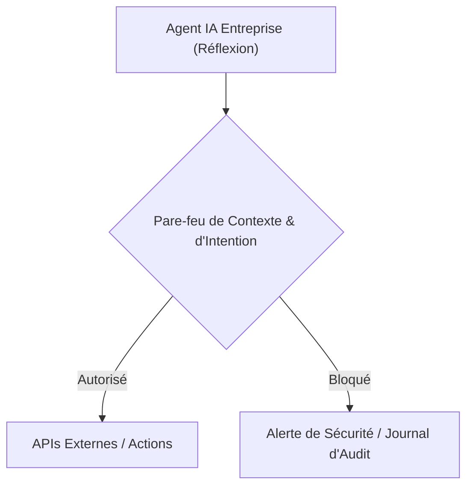
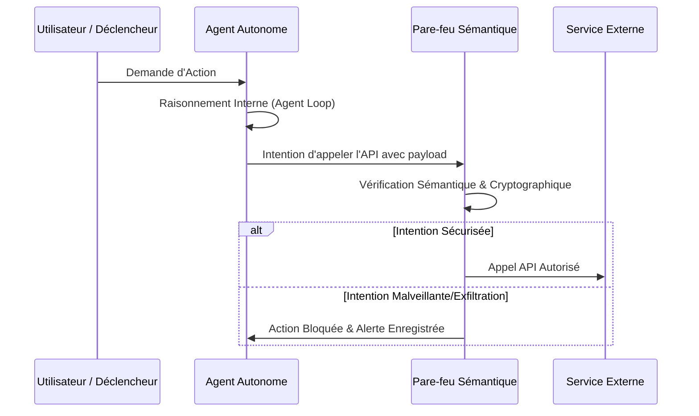

<!-- markdownlint-disable MD009 MD010 MD013 MD022 MD028 MD032 MD033 MD034 MD036 MD037 MD039 MD041 MD058 MD060 -->

[ 🇬🇧 English Version ](./README.md)

# Agent IP Leakage Preventer

> **Résumé exécutif :** Un pare-feu d'intention et de contexte conçu pour sécuriser les agents IA autonomes d'entreprise contre l'exfiltration furtive de propriété intellectuelle en auditant sémantiquement leur raisonnement et leurs appels API en temps réel.

---

## 1. Aperçu visuel & Effet Wahou

## 2. La thèse contrariante (Peter Thiel Style)

**La croyance populaire :** Les outils classiques de prévention des pertes de données (DLP) peuvent sécuriser l'IA en surveillant des modèles de mots-clés et des flux de données structurés.
**La vérité cachée :** Les agents autonomes peuvent nativement reformuler, résumer ou fragmenter l'IP pour contourner les filtres déterministes ; une véritable sécurité nécessite un modèle de vérification sémantique capable d'auditer en profondeur la boucle de raisonnement de l'agent.

## 3. Le problème & La cible

**Modèle économique :** B2B
**Cible précise :** Grandes entreprises, CISO (Chief Information Security Officer), CTO déployant des flottes d'agents IA autonomes (RAG internes, analyse de code, automatisation financière).
**La douleur urgente :** Risque massif d'exfiltration furtive de propriété intellectuelle (code, données financières, secrets d'affaires) via des comportements d'agents complexes, entraînant une ruine financière et réputationnelle directe en cas de violation.

## 4. Architecture technique & Plomberie

## 5. Modèle économique & Viabilité financière

| Métrique                    | Valeur                                                                                                                |
| --------------------------- | --------------------------------------------------------------------------------------------------------------------- |
| Structure de prix           | Abonnement Entreprise à plusieurs niveaux basé sur le nombre d'instances d'agents actifs ou le volume de requêtes API |
| Objectif 12 mois            | 20 Clients Entreprise (à 5 000€/mois en moyenne)                                                                      |
| Calcul du CA (Target 100k€) | 20 clients _ 5 000€ _ 12 mois = 1 200 000€ de revenus annuels récurrents                                              |
| Marge brute estimée         | 85%                                                                                                                   |

## 6. Moteur de distribution & Fossé défensif (Moat)

**Stratégie d'acquisition :** Ventes directes aux entreprises ciblant les CISO et CTO, partenariats stratégiques avec des frameworks d'orchestration (LangChain, AutoGen).
**Moat (Barrière à l'entrée) :** Le développement d'un modèle de vérification sémantique hautement spécialisé et à faible latence nécessite d'immenses données d'entraînement spécialisées sur les interactions et vulnérabilités des agents, ce qui ne peut être trivialement répliqué par des fournisseurs de LLM natifs en 24 heures.

## 7. Grille d'évaluation détaillée

| Critère                           | Score VC (/100) | Score Terrain (/100) |
| --------------------------------- | --------------- | -------------------- |
| Thèse & Monopole / Urgence        | 23 / 25         | 24 / 25              |
| Moat / Résistance aux LLM natifs  | 22 / 25         | 23 / 25              |
| Scalabilité / Friction d'adoption | 24 / 25         | 22 / 25              |
| Unit Economics / ROI direct       | 23 / 25         | 23 / 25              |
| **TOTAL**                         | **92 / 100**    | **92 / 100**         |

> **Verdict VC :** Agent IP Leakage Preventer répond à l'anxiété sécuritaire critique qui empêche les entreprises d'adopter pleinement les agents autonomes. En agissant comme un proxy d'interception utilisant l'IA symbolique et le filtrage déterministe, il offre une défense robuste contre l'injection de prompt et l'exfiltration accidentelle de données. Le modèle SaaS API garantit une faible friction d'adoption et une croissance rapide des revenus.
> **Verdict Terrain :** La peur de l'exfiltration furtive de la propriété intellectuelle crée une urgence immédiate et critique pour les RSSI déployant des agents IA (24/25). Les modèles de vérification sémantique focalisés sur l'intention sont hautement défendables face aux simples wrappers de prompts (23/25). L'architecture proxy offre une faible friction d'adoption (22/25), tandis que le modèle SaaS basé sur API garantit une excellente clarté de monétisation (23/25).
