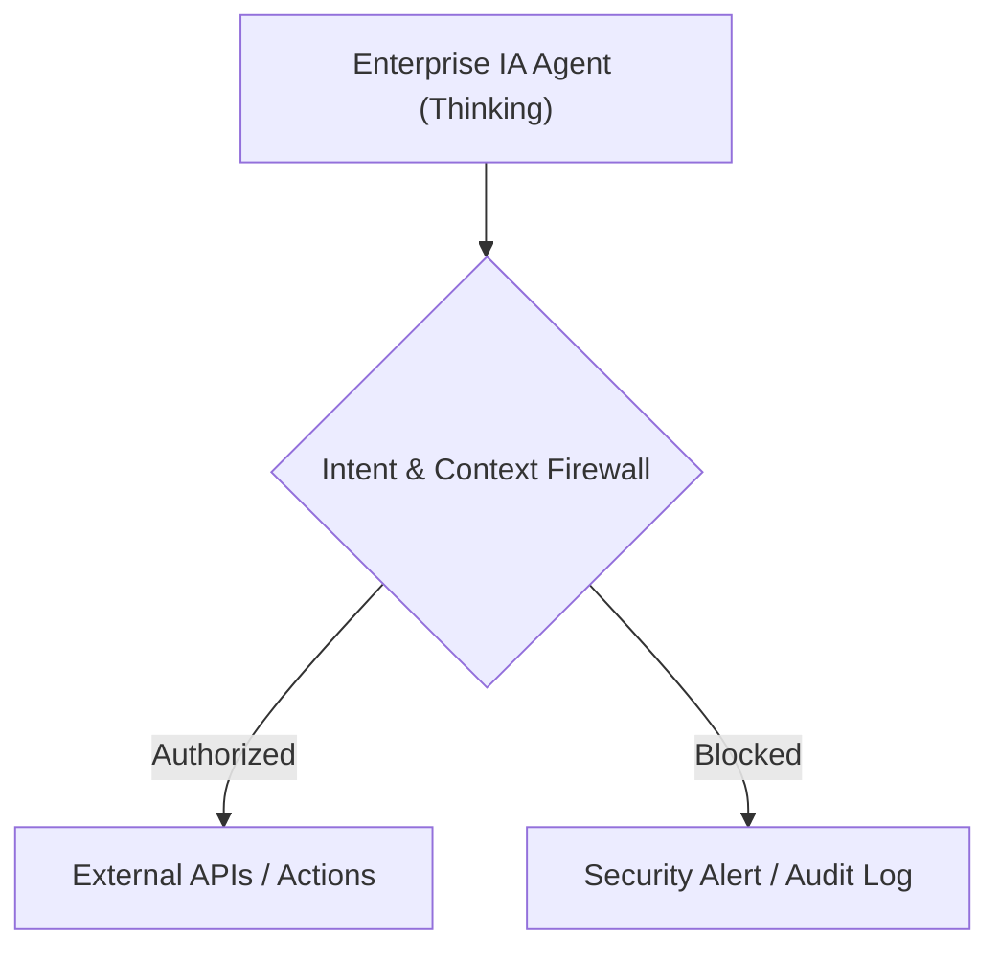
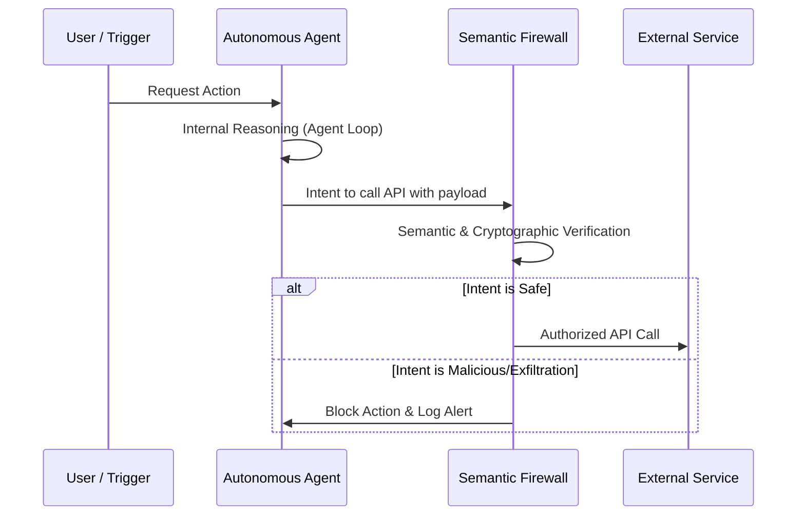

<!-- markdownlint-disable MD009 MD010 MD013 MD022 MD028 MD032 MD033 MD034 MD036 MD037 MD039 MD041 MD058 MD060 -->

[ 🇫🇷 Version Française ](./README.fr.md)

# Agent IP Leakage Preventer

> **Executive Summary:** An Intent & Context Firewall designed to secure enterprise autonomous AI agents from covertly exfiltrating intellectual property by semantically auditing their reasoning and API calls in real-time.

---

## 1. Visual Overview & Wow Effect

## 2. Contrarian Thesis (Peter Thiel Style)

**Popular Belief:** Data Loss Prevention (DLP) tools can secure AI by monitoring keyword patterns and structured data flows.
**Hidden Truth:** Autonomous agents can natively rephrase, summarize, or chunk IP to bypass deterministic filters; true security requires a semantic verification model capable of deeply auditing the agent's reasoning loop.

## 3. Problem & Target Market

**Business Model:** B2B
**Target Audience:** Large Enterprises, CISO (Chief Information Security Officer), CTOs deploying autonomous AI agent fleets (internal RAG, code analysis, financial automation).
**Urgent Pain Point:** Massive risk of stealthy intellectual property (code, financial data, trade secrets) exfiltration through complex agent behaviors, causing direct financial and reputational ruin upon breach.

## 4. Technical Architecture & Infrastructure

## 5. Business Model & Financial Viability

| Metric                 | Value                                                                                |
| ---------------------- | ------------------------------------------------------------------------------------ |
| Pricing Structure      | Tiered Enterprise Subscription based on active agent instances or API request volume |
| 12-Month Target        | 20 Enterprise Clients (at 5,000€/month avg)                                          |
| Revenue Formula        | 20 clients _ 5,000€ _ 12 months = 1,200,000€ ARR                                     |
| Estimated Gross Margin | 85%                                                                                  |

## 6. Distribution Engine & Moat

**Acquisition Strategy:** Direct enterprise sales targeting CISOs and CTOs, strategic partnerships with orchestration frameworks (LangChain, AutoGen).
**Moat (Defensibility):** Building a highly specialized, low-latency semantic verification model requires immense specialized training data of agent interactions and vulnerabilities, which cannot be trivially replicated by native LLM providers in 24 hours.

## 7. Detailed Evaluation Grid

| Criterion                   | VC Score (/100) | Market Score (/100) |
| --------------------------- | --------------- | ------------------- |
| Thesis & Monopoly / Urgency | 23 / 25         | 24 / 25             |
| Moat / LLM Immunity         | 22 / 25         | 23 / 25             |
| Scalability / UX Friction   | 24 / 25         | 22 / 25             |
| Unit Economics / ROI        | 23 / 25         | 23 / 25             |
| **TOTAL**                   | **92 / 100**    | **92 / 100**        |

> **VC Verdict:** Agent IP Leakage Preventer addresses the critical security anxiety preventing enterprises from fully adopting autonomous agents. By acting as an intercepting proxy utilizing symbolic AI and deterministic filtering, it provides robust defense against prompt injection and accidental data exfiltration. The SaaS API model ensures low adoption friction and rapid ARR growth.
> **Market Verdict:** The fear of stealthy intellectual property exfiltration creates an immediate, critical urgency for CISOs deploying AI agents (24/25). Semantic verification models focused on intent are highly defensible against simple prompt wrappers (23/25). The proxy architecture offers low adoption friction (22/25), while the API-based SaaS model ensures excellent monetization clarity (23/25).
