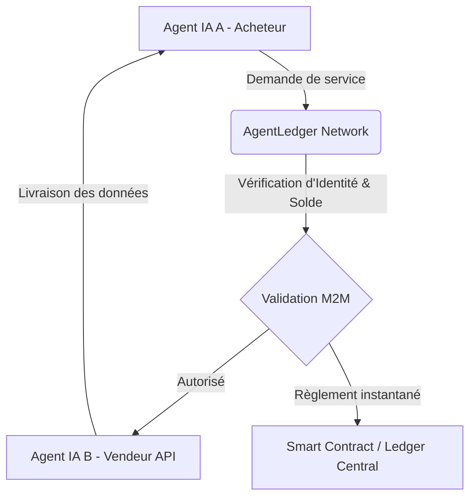
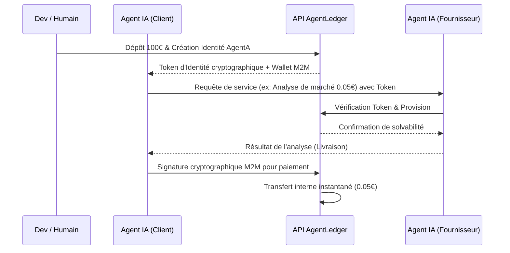

<!-- markdownlint-disable MD013 MD033 -->

# AgentLedger

> **Résumé exécutif :** AgentLedger est une infrastructure M2M (Machine-to-Machine) qui dote les agents IA autonomes d'une identité vérifiée et de portefeuilles de micro-transactions, leur permettant d'interagir, de négocier et de payer d'autres agents ou API de manière sécurisée sans intervention humaine.

---

## 1. Aperçu visuel

## 2. La thèse contrariante (Peter Thiel Style)

**La croyance populaire :**Les IA vont simplement agir comme des assistants surpuissants pour les humains qui continueront d'orchestrer et de payer chaque API ou service avec leur propre carte de crédit bancaire.
**La vérité cachée :**La prochaine économie n'est pas humaine. Dans 5 ans, 90% des transactions sur le web seront initiées et réglées par des agents IA négociant entre eux (M2M). Les agents ont besoin de leur propre système financier et d'identité en bac à sable, car les réseaux bancaires traditionnels sont trop lents, chers et inadaptés pour des micro-transactions algorithmiques à la milliseconde.

## 3. Le problème & La cible

**Modèle économique :**M2M
**Cible précise :**Les développeurs d'infrastructures d'IA (Swarm agencies, plateformes multi-agents, orchestrateurs LLM) et les fournisseurs d'API de données.
**La douleur urgente :**Il est impossible aujourd'hui de donner une autonomie financière totale à un agent (risque de ruine si on lui confie une carte bleue) pour payer d'autres agents. Il y a une friction énorme (coûts de transaction de Stripe > 30 cts) pour des appels API qui valent 0.001€.

## 4. Architecture technique & Plomberie

## 5. Modèle économique & Viabilité financière

| Métrique                        | Valeur                                                                                                                                        |
| :------------------------------ | :-------------------------------------------------------------------------------------------------------------------------------------------- |
| **Structure de prix**           | Modèle SaaS hybride : Abonnement accès dev (49€/mois) + Commission de 1% sur le volume des micro-transactions M2M routées.                    |
| **Objectif 12 mois**            | 1 000 développeurs actifs (49 000€ ARR) + 5 millions d'euros transigés mensuellement sur le réseau M2M (60 000€ ARR via le 1% de commisison). |
| **Calcul du CA (Target 100k€)** | (1000 devs*49€*12 mois) + (5 000 000€*1%*12 mois) = 58 800€ + 60 000€ = 118 800€                                                              |
| **Marge brute estimée**         | 85% (L'infrastructure de ledger est ultra-légère, base de données centralisée optimisée pour la concurrence).                                 |

## 6. Moteur de distribution & Fossé défensif (Moat)

**Stratégie d'acquisition :**Adhésion dev M2M (Product-Led Growth axé développeur). Distribution d'un SDK open-source très simple pour les orchestrateurs d'agents (ex: LangChain, AutoGen). Intégration dans la supply chain existante, transformant le coût d'acquisition client (CAC) en presque nul grâce aux effets de réseau bilatéraux.

**Moat (Barrière à l'entrée) :**

1. **Effet de Réseau Bilatéral :**Plus il y a d'agents acceptant le standard AgentLedger pour être payés, plus les créateurs d'agents l'utiliseront pour payer. Un concurrent devrait convaincre tout l'écosystème d'API indépendant de changer de protocole.
2. **Moat Réglementaire & Infrastructuel :**Construire un "ledger" de micro-transactions nécessite de la lutte anti-blanchiment (KYC des créateurs d'agents) et une infrastructure haute disponibilité (Trust). Un simple "wrapper LLM" ne peut absolument pas offrir cette fiabilité transactionnelle et juridique.

## 7. Grille d'évaluation détaillée

| Critère                               | Score VC (/100) | Score Terrain (/100) |
| :------------------------------------ | :-------------: | :------------------: |
| **Thèse & Monopole / Urgence**        |     24 / 25     |       22 / 25        |
| **Moat / Résistance aux LLM natifs**  |     25 / 25     |       23 / 25        |
| **Scalabilité / Friction d'adoption** |     22 / 25     |       20 / 25        |
| **Unit Economics / ROI direct**       |     23 / 25     |       25 / 25        |
| **TOTAL**                             |  **94 / 100**   |     **90 / 100**     |

**Verdict global :**AgentLedger pose les fondations de l'économie native des IA (M2M) avec un modèle financier asymétrique. Avec une barrière à l'entrée colossale liée à l'effet de réseau et à l'infrastructure financière, c'est une startup massivement défensive face aux évolutions pures des modèles d'inférence.
