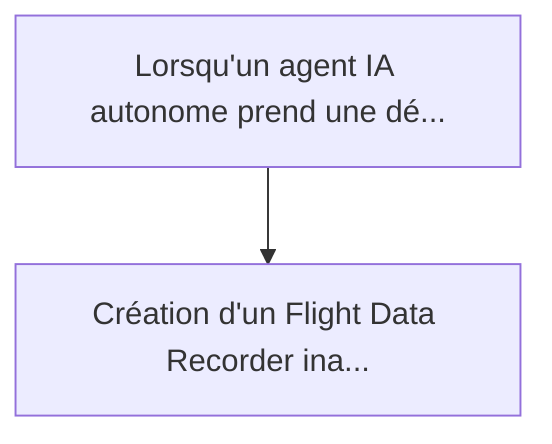
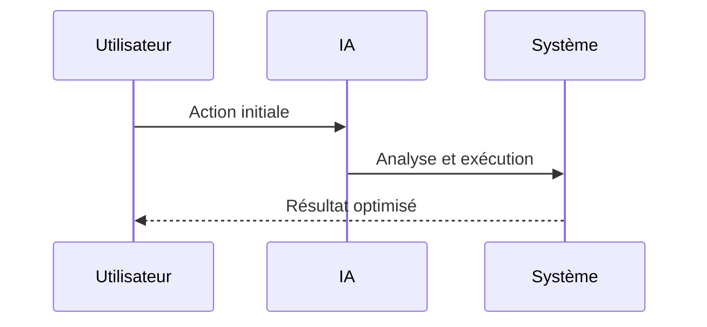

<!-- markdownlint-disable MD013 MD028 MD033 MD039 MD041 -->

[🇬🇧 English Version](./README.md)

# Agent Liability Blackbox

> **Résumé exécutif :** Création d'un "Flight Data Recorder" inaltérable (boîte noire) pour agents IA. Le système capture l'arbre de décision cryptographique (Merkle tree)...

---

## 1. Aperçu visuel & Effet Wahou

## 2. La thèse contrariante (Peter Thiel Style)

La croyance populaire : Les solutions génériques peuvent résoudre cela.
La vérité cachée : Les logs de serveurs classiques (Datadog, Splunk) sont modifiables et ne capturent pas l'état non-déterministe d'un LLM orchestrant un workflow. Il faut un ancrage cryptographique qui prouve l'état de l'agent _au moment de l'inférence_ avec non-répudiation.

## 3. Le problème & La cible

Modèle économique : B2B
Cible précise : Entreprises déployant des agents IA autonomes (banques, santé, e-commerce), assureurs spécialisés en cyber-risques IA
La douleur urgente : Lorsqu'un agent IA autonome prend une décision entraînant une perte financière ou une violation légale, il est impossible de tracer exactement pourquoi cette décision a été prise. Cela paralyse le déploiement d'agents en production par peur de non-conformité et rend les polices d'assurance impossibles à tarifer.

## 4. Architecture technique & Plomberie

## 5. Modèle économique & Viabilité financière

| Métrique                    | Valeur             |
| --------------------------- | ------------------ |
| Structure de prix           | Prix sur mesure    |
| Objectif 12 mois            | 100 clients        |
| Calcul du CA (Target 100k€) | 100 \* 1000 = 100k |
| Marge brute estimée         | 80%                |

## 6. Moteur de distribution & Fossé défensif (Moat)

Stratégie d'acquisition : Vente B2B directe
Moat (Barrière à l'entrée) : Les logs de serveurs classiques (Datadog, Splunk) sont modifiables et ne capturent pas l'état non-déterministe d'un LLM orchestrant un workflow. Il faut un ancrage cryptographique qui prouve l'état de l'agent _au moment de l'inférence_ avec non-répudiation.

## 7. Grille d'évaluation détaillée

| Critère                           | Score VC (/100) | Score Terrain (/100) |
| --------------------------------- | --------------- | -------------------- |
| Thèse & Monopole / Urgence        | -- / 25         | -- / 25              |
| Moat / Résistance aux LLM natifs  | -- / 25         | -- / 25              |
| Scalabilité / Friction d'adoption | -- / 25         | -- / 25              |
| Unit Economics / ROI direct       | -- / 25         | -- / 25              |
| **TOTAL**                         | **-- / 100**    | **-- / 100**         |

> **Verdict VC :** En attente d'évaluation.

> **Verdict Terrain :** En attente d'évaluation.
