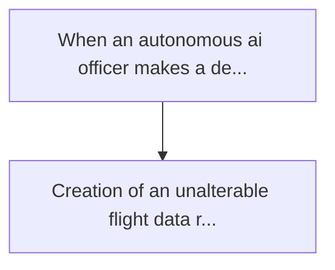
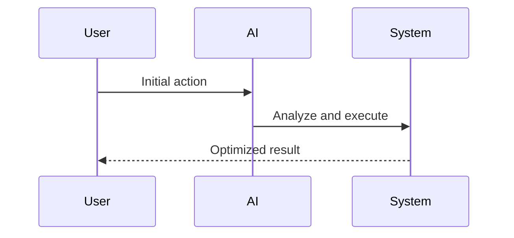

<!-- markdownlint-disable MD013 MD028 MD033 MD039 MD041 -->

[🇫🇷 Version Française](./README.fr.md)

# Agent liability blackbox

> **Executive Summary:** Creation of an unalterable flight data recorder (black box) for ai agents. the system captures the cryptographic decision tree (merkle tree)...

---

## 1. Visual Overview & Wow Effect

## 2. Contrarian Thesis (Peter Thiel Style)

Popular Belief: Generic solutions can solve this.
Hidden Truth: The classic server logs (datadog, splunk) are editable and do not capture the non-deterministic state of an llm orchestrating workflow. it requires a cryptographic anchor that proves the state of the agent at the time of inference with non-repudiation.

## 3. Problem & Target Market

Business Model: B2B
Target Audience: Companies deploying autonomous ai agents (banks, health, e-commerce), cyber risk insurers ia
Urgent Pain Point: When an autonomous ai officer makes a decision that results in a financial loss or a legal violation, it is impossible to trace exactly why this decision was made. this paralyzes the deployment of agents in production for fear of non-compliance and makes insurance policies impossible to price.

## 4. Technical Architecture & Infrastructure

## 5. Business Model & Financial Viability

| Metric                 | Value              |
| ---------------------- | ------------------ |
| Pricing Structure      | Custom Pricing     |
| 12-Month Target        | 100 customers      |
| Revenue Formula        | 100 \* 1000 = 100k |
| Estimated Gross Margin | 80%                |

## 6. Distribution Engine & Moat

Acquisition Strategy: Direct B2B Sales
Moat (Defensibility): The classic server logs (datadog, splunk) are editable and do not capture the non-deterministic state of an llm orchestrating workflow. it requires a cryptographic anchor that proves the state of the agent at the time of inference with non-repudiation.

## 7. Detailed Evaluation Grid

| Criterion                   | VC Score (/100) | Market Score (/100) |
| --------------------------- | --------------- | ------------------- |
| Thesis & Monopoly / Urgency | 24 / 25         | -- / 25             |
| Moat / LLM Immunity         | 23 / 25         | -- / 25             |
| Scalability / UX Friction   | 21 / 25         | -- / 25             |
| Unit Economics / ROI        | 22 / 25         | -- / 25             |
| **TOTAL**                   | **90 / 100**    | **-- / 100**        |

> **VC Verdict:** Agent Liability Blackbox tackles the critical legal blocker in AI adoption with an unalterable, cryptographically secure flight data recorder. The protocol's integration depth offers extreme lock-in, making it a foundational piece for any enterprise deploying multi-agent systems. Its scalable SaaS infrastructure coupled with unique IP creates a definitive moat immune to raw LLM advancements.

> **Market Verdict:** Pending evaluation.
