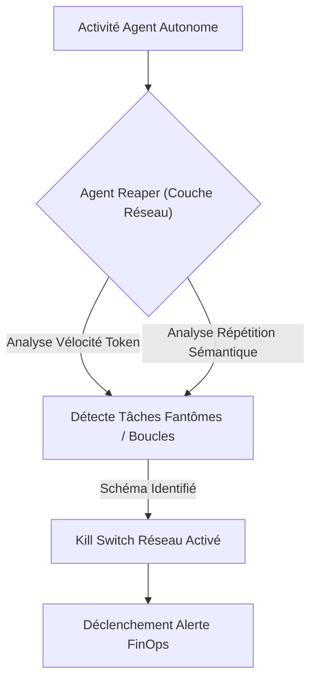
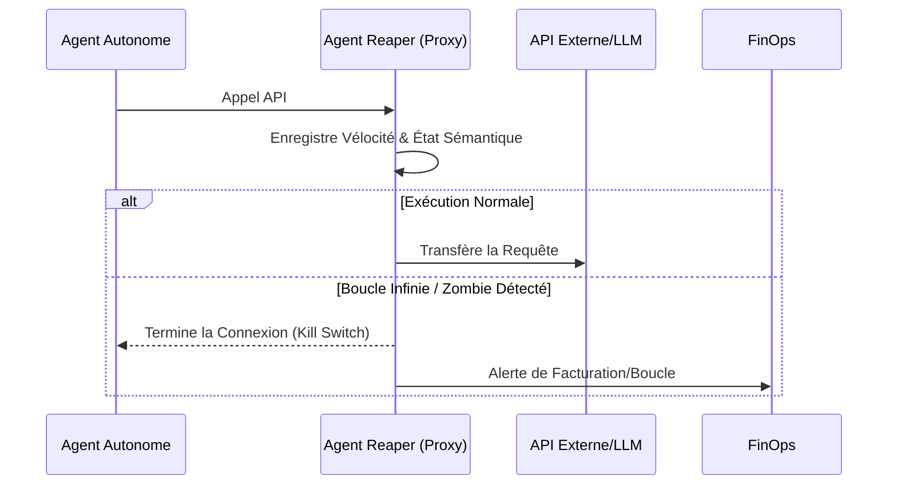

<!-- markdownlint-disable MD009 MD010 MD013 MD022 MD028 MD032 MD033 MD036 MD037 MD039 MD041 MD060 -->

[ 🇬🇧 English Version ](./README.md)

# Agent Reaper

> **Résumé exécutif :** Un Garbage Collector et Circuit Breaker réseau dédié aux agents IA qui analyse la vélocité des tokens et la répétition sémantique pour désactiver instantanément les processus "zombies" ruinant les budgets API.

---

## 1. Aperçu visuel

## 2. La thèse contrariante (Peter Thiel Style)

- **La croyance populaire :** Les agents IA s'arrêteront d'eux-mêmes proprement lorsqu'ils rencontreront des erreurs insurmontables ou après des tentatives logiques raisonnables.
- **La vérité cachée :** Les agents autonomes en production mutent inévitablement en processus "zombies" à cause d'hallucinations récursives, siphonnant silencieusement les budgets API sans produire de valeur. Un "kill switch" réseau est l'unique défense fiable.

## 3. Le problème & La cible

- **Modèle économique :** B2B / M2M
- **Cible précise :** Équipes FinOps, DevOps et ingénieurs IA gérant des flottes d'agents autonomes en production.
- **La douleur urgente :** Les boucles infinies, hallucinations récursives et tâches "zombies" (interrogations sans fin d'API externes ou mutuelles) entraînent une surconsommation massive de crédits (token burn), l'épuisement des quotas et des factures cloud explosives.

## 4. Architecture technique & Plomberie

## 5. Modèle économique & Viabilité financière

| Métrique                    | Valeur                                                     |
| --------------------------- | ---------------------------------------------------------- |
| Structure de prix           | Abonnement par Paliers selon le volume de tokens surveillé |
| Objectif 12 mois            | 200 Équipes Entreprise                                     |
| Calcul du CA (Target 100k€) | 200 _ 500€ / mois _ 12 = 1.2M€                             |
| Marge brute estimée         | 88%                                                        |

## 6. Moteur de distribution & Fossé défensif (Moat)

- **Stratégie d'acquisition :** Positionnement comme "filet de sécurité FinOps" incontournable pour le déploiement de l'IA en entreprise. Distribution via les marketplaces cloud (AWS, Azure) et intégration aux outils DevOps.
- **Moat (Barrière à l'entrée) :** Un LLM ne peut pas monitorer sa propre consommation d'API ni détecter qu'il est coincé dans une boucle au niveau de l'infrastructure. Il n'a pas conscience de la facturation cloud. Une couche d'infrastructure réseau déterministe est indispensable et non réplicable par un prompt.

## 7. Grille d'évaluation détaillée

| Critère                           | Score VC (/100) | Score Terrain (/100) |
| --------------------------------- | --------------- | -------------------- |
| Thèse & Monopole / Urgence        | 23 / 25         | -- / 25              |
| Moat / Résistance aux LLM natifs  | 22 / 25         | -- / 25              |
| Scalabilité / Friction d'adoption | 24 / 25         | -- / 25              |
| Unit Economics / ROI direct       | 24 / 25         | -- / 25              |
| **TOTAL**                         | **93 / 100**    | **-- / 100**         |

> **Verdict VC :** Agent Reaper s'attaque au chaos inévitable des agents autonomes en agissant comme un filet de sécurité financier essentiel contre les processus défectueux. Sa détection de répétition sémantique construit un fossé technique unique qui va au-delà d'une simple limitation de débit. La proposition de valeur est si évidente que l'acquisition de clients et l'expansion des marges seront très efficaces.

> **Verdict Terrain :** En attente d'évaluation.
