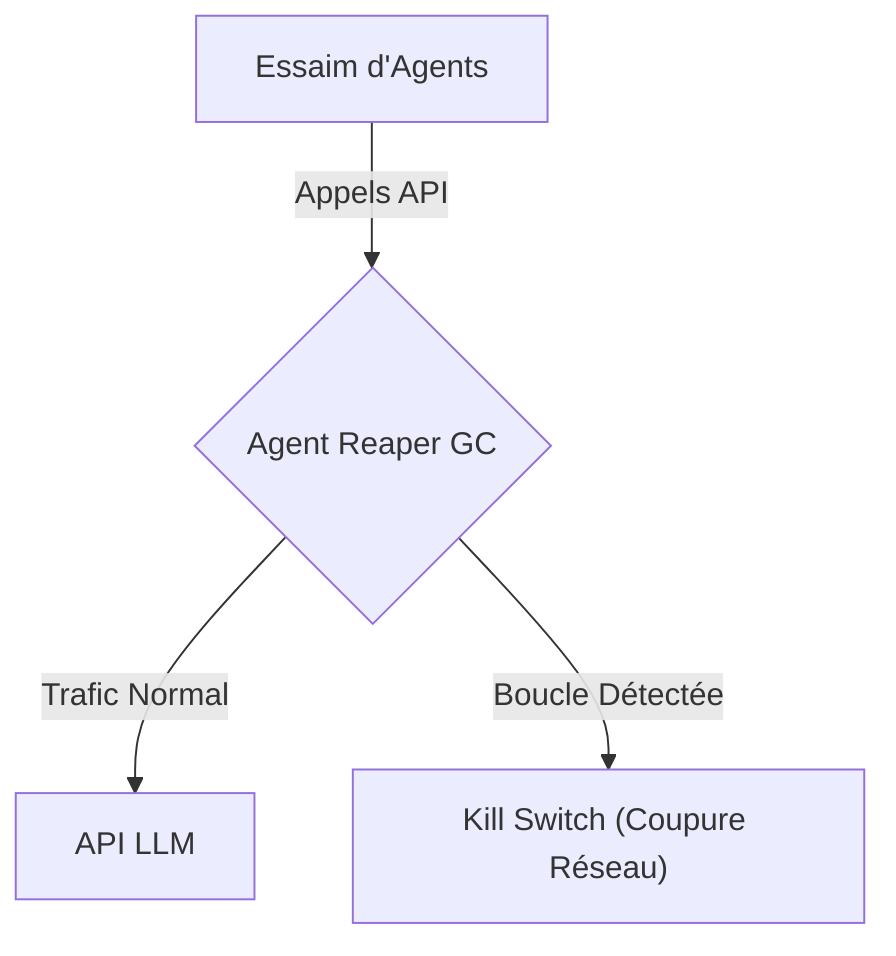
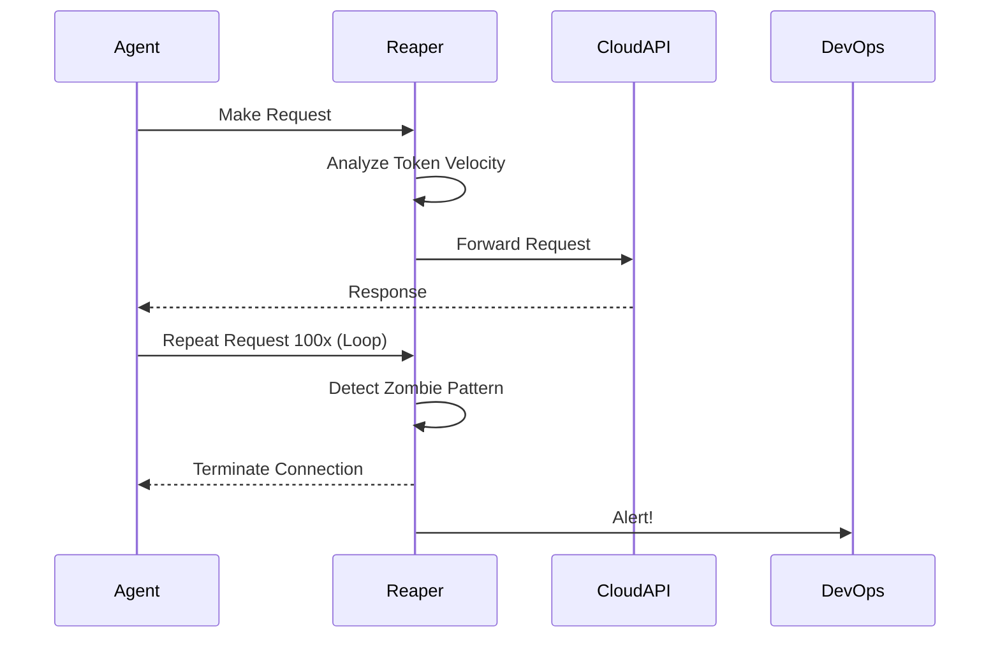

<!-- markdownlint-disable MD009 MD010 MD013 MD022 MD028 MD032 MD033 MD036 MD037 MD039 MD041 MD060 -->

[ 🇬🇧 English Version ](./README.md)

# Agent Reaper

> **Résumé exécutif :** Un disjoncteur et garbage collector réseau pour détecter et tuer les agents IA zombies bloqués dans des boucles infinies, évitant l'explosion des factures cloud.

---

## 1. Aperçu visuel

```mermaid
graph TD
    %% Flux
    A["Essaim d'Agents"] -->|Appels API| B{"Agent Reaper GC"}
    B -->|Trafic Normal| C["API LLM"]
    B -->|Boucle Détectée| D["Kill Switch (Coupure Réseau)"]
```

## 2. La thèse contrariante (Peter Thiel Style)

**La croyance populaire :** Les développeurs peuvent faire confiance au LLM sous-jacent pour gérer ses propres boucles et s'arrêter en toute sécurité.

**La vérité cachée :** Les LLMs n'ont ni la conscience de l'infrastructure en temps réel ni de contexte financier ; ils ne peuvent pas s'auto-interrompre proprement.

## 3. Le problème & La cible

**Modèle économique :** B2B / M2M
**Cible précise :** Équipes FinOps, DevOps et ingénieurs IA gérant des flottes d'agents autonomes en production.
**La douleur urgente :** Les tâches zombies (boucles infinies) entraînent une surconsommation massive de crédits d'API et des factures cloud explosives.

## 4. Architecture technique & Plomberie

**L'approche technique :** Garbage Collector au niveau réseau. Surveille les modèles d'appels API et la consommation de tokens. Coupe l'accès réseau de l'agent fautif dès qu'un schéma zombie est détecté.

```mermaid
sequenceDiagram
    participant Agent
    participant Reaper
    participant CloudAPI
    Agent->>Reaper: Make Request
    Reaper->>Reaper: Analyze Token Velocity
    Reaper->>CloudAPI: Forward Request
    CloudAPI-->>Agent: Response
    Agent->>Reaper: Repeat Request 100x (Loop)
    Reaper->>Reaper: Detect Zombie Pattern
    Reaper-->>Agent: Terminate Connection
    Reaper->>DevOps: Alert!
```

## 5. Modèle économique & Viabilité financière

| Métrique                        | Valeur                                                             |
| :------------------------------ | :----------------------------------------------------------------- |
| **Structure de prix**           | Tiered SaaS by Token Volume Monitored                              |
| **Objectif 12 mois**            | 100 Enterprise Customers                                           |
| **Calcul du CA (Target 100k€)** | 100 customers \* $1k/month = $100k ARR target roughly (or $833/mo) |
| **Marge brute estimée**         | 90%                                                                |

## 6. Moteur de distribution & Fossé défensif (Moat)

**Stratégie d'acquisition :** Partenariats avec les frameworks majeurs (LangChain, AutoGPT) et marketplaces cloud.

**Moat (Barrière à l'entrée) :** Un LLM ne peut pas monitorer sa consommation d'API. Une couche d'infrastructure réseau déterministe est indispensable pour agir comme kill switch financier.

## 7. Grille d'évaluation détaillée

| Critère                               | Score VC (/100) | Score Terrain (/100) |
| :------------------------------------ | :-------------- | :------------------- |
| **Thèse & Monopole / Urgence**        | -- / 25         | -- / 25              |
| **Moat / Résistance aux LLM natifs**  | -- / 25         | -- / 25              |
| **Scalabilité / Friction d'adoption** | -- / 25         | -- / 25              |
| **Unit Economics / ROI direct**       | -- / 25         | -- / 25              |
| **TOTAL**                             | -- / 100        | -- / 100             |

> **Verdict VC :** En attente d'évaluation.
> **Verdict Terrain :** En attente d'évaluation.
