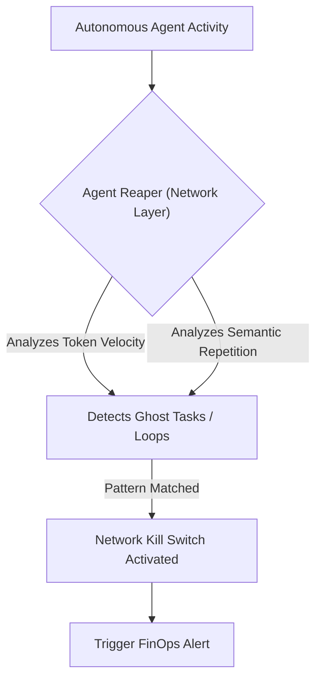
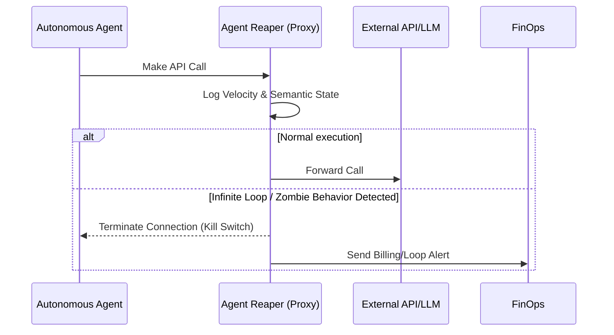

<!-- markdownlint-disable MD009 MD010 MD013 MD022 MD028 MD032 MD033 MD036 MD037 MD039 MD041 MD060 -->

[ 🇫🇷 Version Française ](./README.fr.md)

# Agent Reaper

> **Executive Summary:** A network-level Garbage Collector and Circuit Breaker for AI agents that detects semantic repetition and token velocity to instantly kill rogue "zombie" processes burning API budgets.

---

## 1. Visual Overview

## 2. Contrarian Thesis (Peter Thiel Style)

- **Popular Belief:** AI agents will gracefully exit tasks when they encounter insurmountable errors or exhaust reasonable logical attempts.
- **Hidden Truth:** Autonomous agents in production inevitably mutate into "zombie" processes due to recursive hallucinations, silently draining vast API budgets without producing any value. A network-level kill switch is the only reliable defense.

## 3. Problem & Target Market

- **Business Model:** B2B / M2M
- **Target Audience:** FinOps teams, DevOps, and AI engineers managing fleets of autonomous agents in production environments.
- **Urgent Pain Point:** Agents getting stuck in infinite loops, recursive hallucinations, or "ghost tasks" (repeatedly querying external APIs or each other) lead to massive token burn, exhausted rate limits, and unexpected, explosive cloud billing.

## 4. Technical Architecture & Infrastructure

## 5. Business Model & Financial Viability

| Metric                 | Value                                               |
| ---------------------- | --------------------------------------------------- |
| Pricing Structure      | Tiered Subscription based on monitored token volume |
| 12-Month Target        | 200 Enterprise Teams                                |
| Revenue Formula        | 200 _ €500 / month _ 12 = 1.2M€                     |
| Estimated Gross Margin | 88%                                                 |

## 6. Distribution Engine & Moat

- **Acquisition Strategy:** Positioned as an essential "FinOps safety net" for enterprise AI deployment. Distributed via cloud marketplaces (AWS, Azure) and DevOps tooling integrations.
- **Moat (Defensibility):** A foundational LLM cannot monitor its own API consumption or detect infrastructure-level infinite loops. It lacks real-time cloud billing awareness. A deterministic network layer is mandatory to act as a financial and operational kill switch, which cannot be prompt-engineered.

## 7. Detailed Evaluation Grid

| Criterion                   | VC Score (/100) | Market Score (/100) |
| --------------------------- | --------------- | ------------------- |
| Thesis & Monopoly / Urgency | -- / 25         | -- / 25             |
| Moat / LLM Immunity         | -- / 25         | -- / 25             |
| Scalability / UX Friction   | -- / 25         | -- / 25             |
| Unit Economics / ROI        | -- / 25         | -- / 25             |
| **TOTAL**                   | **-- / 100**    | **-- / 100**        |

> **VC Verdict:** Pending evaluation.

> **Market Verdict:** Pending evaluation.
