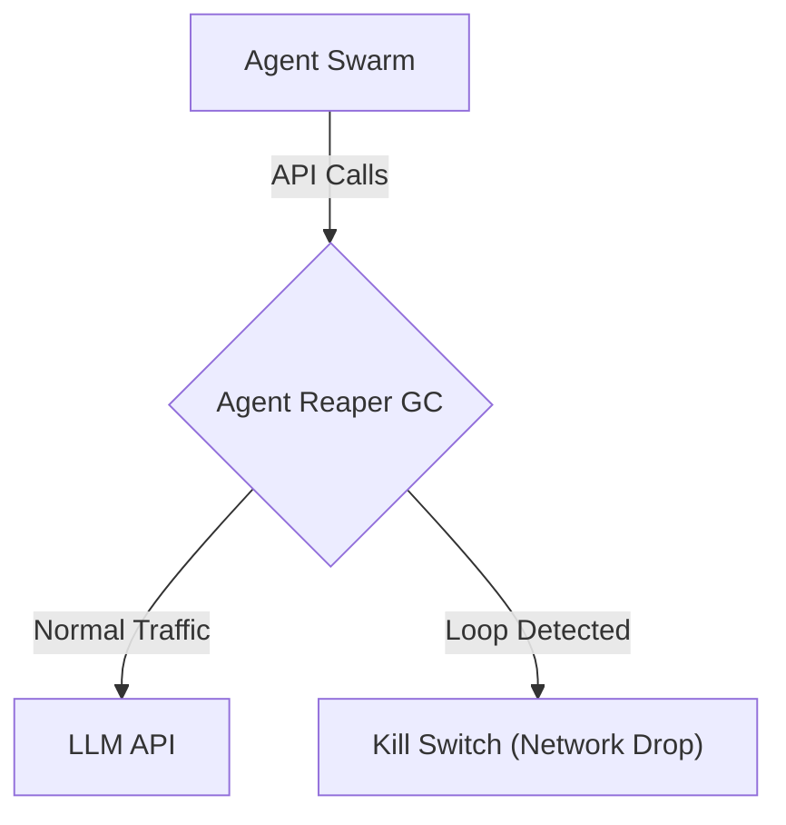
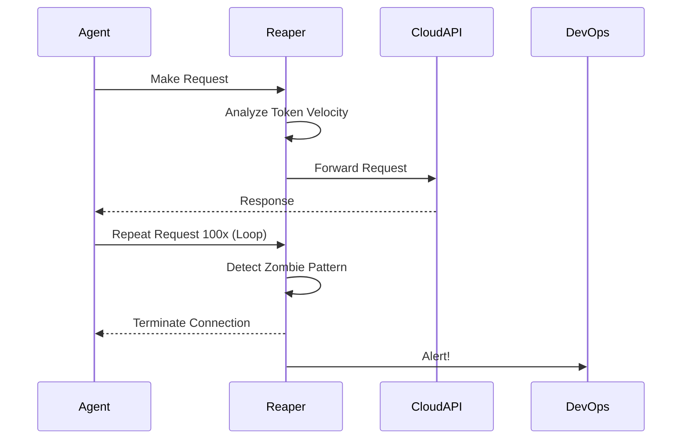

<!-- markdownlint-disable MD009 MD010 MD013 MD022 MD028 MD032 MD033 MD034 MD036 MD037 MD039 MD041 MD060 -->

[ 🇫🇷 Version Française ](./README.fr.md)

# Agent Reaper

> **Executive Summary:** A network-level circuit breaker and garbage collector designed to detect and terminate zombie AI agents stuck in infinite loops, preventing massive API budget burn.

---

## 1. Visual Overview & Wow Effect

```mermaid
graph TD
    %% Architecture
    A["Agent Swarm"] -->|API Calls| B{"Agent Reaper GC"}
    B -->|Normal Traffic| C["LLM API"]
    B -->|Loop Detected| D["Kill Switch (Network Drop)"]
```

## 2. Contrarian Thesis (Peter Thiel Style)

**Popular Belief:** Developers can rely on the underlying LLM to manage its own infinite loops and stop safely.

**Hidden Truth:** LLMs lack real-time infrastructure awareness and financial context; they cannot self-terminate loops gracefully.

## 3. Problem & Target Market

**Business Model:** B2B / M2M
**Target Audience:** FinOps, DevOps, and AI engineering teams managing fleets of autonomous agents in production.
**Urgent Pain Point:** Zombie agents stuck in recursive loops consume massive API credits, burn cloud budgets, and hit rate limits, leading to explosive unexpected bills.

## 4. Technical Architecture & Infrastructure

**Technical Approach:** A dedicated network-level Garbage Collector. Monitors API call patterns, token consumption velocity, and M2M request repetitions. Upon detecting a zombie loop, it cuts network access and alerts the team.

```mermaid
sequenceDiagram
    participant Agent
    participant Reaper
    participant CloudAPI
    Agent->>Reaper: Make Request
    Reaper->>Reaper: Analyze Token Velocity
    Reaper->>CloudAPI: Forward Request
    CloudAPI-->>Agent: Response
    Agent->>Reaper: Repeat Request 100x (Loop)
    Reaper->>Reaper: Detect Zombie Pattern
    Reaper-->>Agent: Terminate Connection
    Reaper->>DevOps: Alert!
```

## 5. Business Model & Financial Viability

| Metric                     | Value                                                              |
| :------------------------- | :----------------------------------------------------------------- |
| **Pricing Structure**      | Tiered SaaS by Token Volume Monitored                              |
| **12-Month Target**        | 100 Enterprise Customers                                           |
| **Revenue Formula**        | 100 customers \* $1k/month = $100k ARR target roughly (or $833/mo) |
| **Estimated Gross Margin** | 90%                                                                |

## 6. Distribution Engine & Moat

**Acquisition Strategy:** Partnerships with major agent frameworks (LangChain, AutoGPT) and cloud marketplaces.

**Moat (Defensibility):** An LLM cannot monitor its own infrastructure API consumption or cloud billing. A deterministic network layer is mandatory to act as a financial and operational kill switch.

## 7. Detailed Evaluation Grid

| Criterion                       | VC Score (/100) | Market Score (/100) |
| :------------------------------ | :-------------- | :------------------ |
| **Thesis & Monopoly / Urgency** | -- / 25         | -- / 25             |
| **Moat / LLM Immunity**         | -- / 25         | -- / 25             |
| **Scalability / UX Friction**   | -- / 25         | -- / 25             |
| **Unit Economics / ROI**        | -- / 25         | -- / 25             |
| **TOTAL**                       | -- / 100        | -- / 100            |

> **VC Verdict:** Pending evaluation.
> **Market Verdict:** Pending evaluation.
