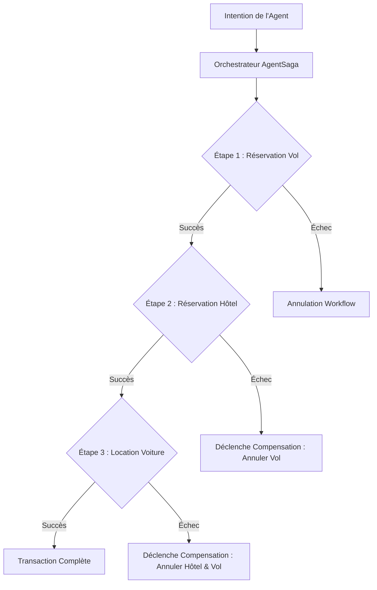
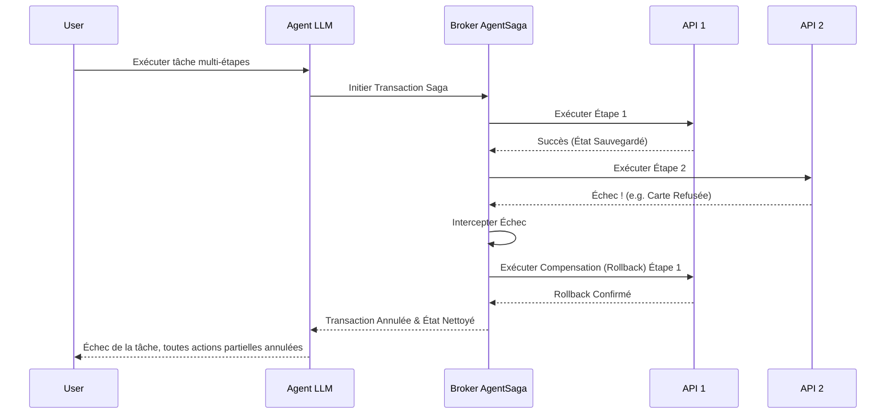

<!-- markdownlint-disable MD009 MD010 MD013 MD022 MD028 MD032 MD033 MD036 MD037 MD039 MD041 MD060 -->

[ 🇬🇧 English Version ](./README.md)

# AgentSaga

> **Résumé exécutif :** AgentSaga est un orchestrateur d'exécution offrant des capacités de transactions distribuées et de rollback garanti (pattern Saga) pour les agents IA autonomes.

---

## 1. Aperçu visuel & Effet Wahou

## 2. La thèse contrariante (Peter Thiel Style)

**La croyance populaire :** Le marché part du principe que les grands modèles de langage (LLM) peuvent s'auto-corriger et annuler proprement leurs erreurs si on leur fournit un contexte suffisant via un prompt.

**La vérité cachée :** Les LLM manquent de déterminisme et échouent souvent en plein processus. Une véritable intégrité transactionnelle pour les workflows agentiques nécessite un broker d'orchestration asynchrone qui impose des rollbacks déterministes, fonctionnant de manière totalement indépendante de l'état probabiliste du LLM.

## 3. Le problème & La cible

**Modèle économique :** M2M / B2B

**Cible précise :** Les équipes d'ingénierie, plateformes RPA et entreprises déployant des agents autonomes orchestrant des flux complexes multi-API (e.g., e-commerce, réservations de voyages, orchestration ERP).

**La douleur urgente :** Lorsqu'un agent autonome exécute une suite d'actions sur plusieurs systèmes externes (par exemple : réserver un vol, puis un hôtel, puis louer une voiture) et échoue sur la dernière étape, les actions précédemment validées restent actives. L'incapacité à annuler de manière sûre et prédictible les transactions partielles entraîne des pertes financières directes, des états incohérents dans le système d'information de l'entreprise et des réclamations clients massives.

## 4. Architecture technique & Plomberie

## 5. Modèle économique & Viabilité financière

| Métrique                        | Valeur                                                            |
| ------------------------------- | ----------------------------------------------------------------- |
| **Structure de prix**           | Niveaux API basés sur l'usage / 500$ base mensuelle par locataire |
| **Objectif 12 mois**            | 200 clients entreprises ou intégrations plateformes               |
| **Calcul du CA (Target 100k€)** | 200 clients _ 500$/mois _ 12 mois                                 |
| **Marge brute estimée**         | 85%                                                               |

## 6. Moteur de distribution & Fossé défensif (Moat)

**Stratégie d'acquisition :** Adoption par les développeurs via des SDK et outils open-source, couplée à des ventes directes B2B aux grandes plateformes RPA et de création d'agents.

**Moat (Barrière à l'entrée) :** Un fournisseur pur LLM (OpenAI, Google) ne peut pas garantir nativement l'orchestration atomique de l'état à travers des systèmes externes disparates sans construire une couche d'orchestration dédiée avec gestion de l'état. Les concurrents ne peuvent pas répliquer cette fiabilité uniquement via de meilleurs prompts ou de plus grands modèles ; cela requiert une infrastructure architecturale fondamentalement différente (le broker Saga).

## 7. Grille d'évaluation détaillée

| Critère                               | Score VC (/100) | Score Terrain (/100) |
| ------------------------------------- | --------------- | -------------------- |
| **Thèse & Monopole / Urgence**        | -- / 25         | -- / 25              |
| **Moat / Résistance aux LLM natifs**  | -- / 25         | -- / 25              |
| **Scalabilité / Friction d'adoption** | -- / 25         | -- / 25              |
| **Unit Economics / ROI direct**       | -- / 25         | -- / 25              |
| **TOTAL**                             | -- / 100        | -- / 100             |

> **Verdict VC :** En attente d'évaluation.

> **Verdict Terrain :** En attente d'évaluation.
