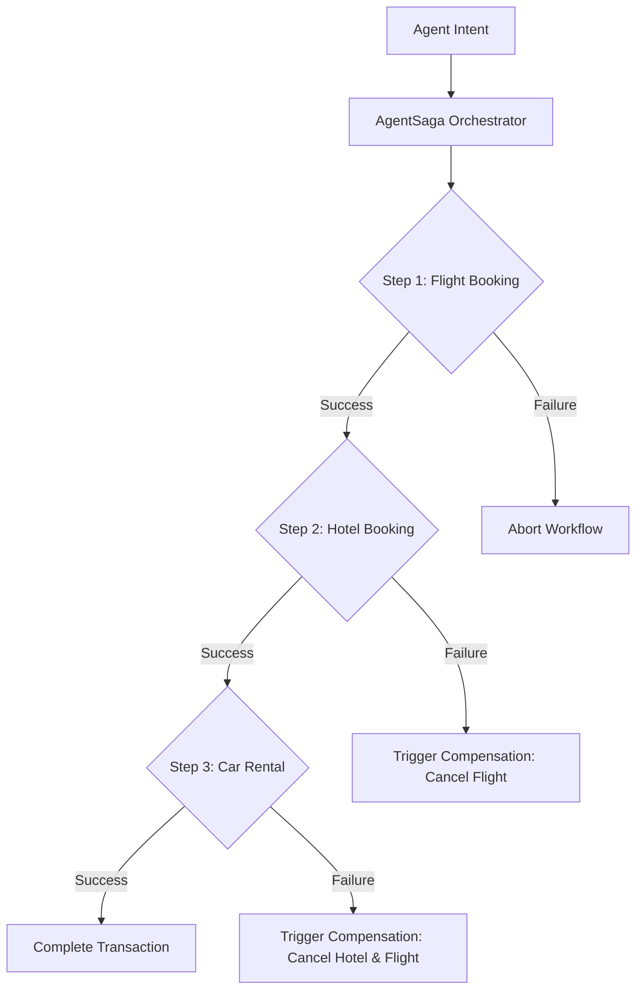
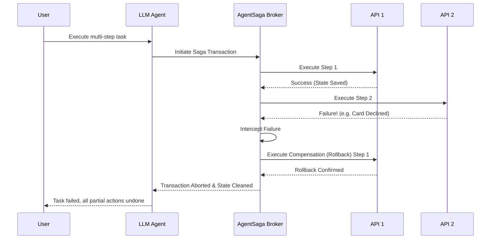

<!-- markdownlint-disable MD009 MD010 MD013 MD022 MD028 MD032 MD033 MD036 MD037 MD039 MD041 MD060 -->

[ 🇫🇷 Version Française ](./README.fr.md)

# AgentSaga

> **Executive Summary:** AgentSaga is an execution orchestrator providing distributed transaction and guaranteed rollback capabilities (Saga pattern) for autonomous AI agents.

---

## 1. Visual Overview & Wow Effect

## 2. Contrarian Thesis (Peter Thiel Style)

**Popular Belief:** The market assumes that large language models (LLMs) can self-correct and cleanly undo their mistakes if prompted with sufficient context.

**Hidden Truth:** LLMs lack determinism and often fail mid-process. True transactional integrity for agent workflows requires an asynchronous orchestration broker enforcing deterministic rollbacks, functioning entirely independently of the LLM's probabilistic state.

## 3. Problem & Target Market

**Business Model:** M2M / B2B

**Target Audience:** Engineering teams, RPA platforms, and enterprises deploying autonomous agents that orchestrate complex multi-API flows (e.g., e-commerce, travel booking, ERP orchestration).

**Urgent Pain Point:** When an autonomous agent performs sequential actions across multiple external systems (e.g., booking a flight, then a hotel, then renting a car) and fails on the final step, previously committed actions remain valid. The inability to safely and predictably undo partial transactions leads to direct financial losses, inconsistent enterprise system states, and massive customer complaints.

## 4. Technical Architecture & Infrastructure

## 5. Business Model & Financial Viability

| Metric                     | Value                                                |
| -------------------------- | ---------------------------------------------------- |
| **Pricing Structure**      | Usage-based API tiers / $500 monthly base per tenant |
| **12-Month Target**        | 200 enterprise customers or platform integrations    |
| **Revenue Formula**        | 200 customers _ $500/month _ 12 months               |
| **Estimated Gross Margin** | 85%                                                  |

## 6. Distribution Engine & Moat

**Acquisition Strategy:** Developer adoption through open-source SDKs and tooling, coupled with direct B2B sales to major RPA and agent-building platforms.

**Moat (Defensibility):** A pure LLM provider (OpenAI, Google) cannot natively guarantee atomic state orchestration across disparate external systems without building a dedicated, stateful orchestration layer. Competitors cannot replicate this reliability purely through better prompting or larger models; it requires a fundamentally different architectural infrastructure (the Saga broker).

## 7. Detailed Evaluation Grid

| Criterion                       | VC Score (/100) | Market Score (/100) |
| ------------------------------- | --------------- | ------------------- |
| **Thesis & Monopoly / Urgency** | -- / 25         | -- / 25             |
| **Moat / LLM Immunity**         | -- / 25         | -- / 25             |
| **Scalability / UX Friction**   | -- / 25         | -- / 25             |
| **Unit Economics / ROI**        | -- / 25         | -- / 25             |
| **TOTAL**                       | -- / 100        | -- / 100            |

> **VC Verdict:** Pending evaluation.

> **Market Verdict:** Pending evaluation.
