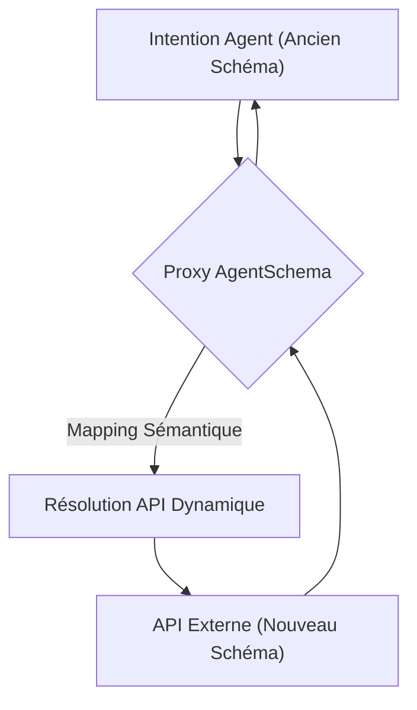
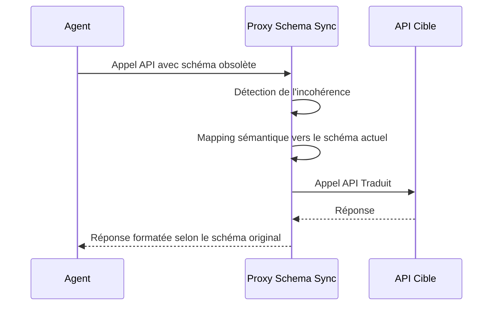

<!-- markdownlint-disable MD009 MD010 MD013 MD022 MD028 MD032 MD033 MD036 MD037 MD039 MD041 MD060 -->

[ 🇬🇧 English Version ](./README.md)

# AgentSchema Sync

> **Résumé exécutif :** Un proxy API sémantique qui mappe dynamiquement les intentions des agents autonomes aux schémas d'API tiers en constante évolution pour éviter les ruptures d'intégration.

---

## 1. Aperçu visuel

## 2. La thèse contrariante (Peter Thiel Style)

- **La croyance populaire :** Les agents IA s'adapteront nativement aux changements d'API simplement en lisant la documentation mise à jour.
- **La vérité cachée :** Les modifications silencieuses de schéma cassent instantanément les outils déterministes. Une couche de traduction sémantique en temps réel est requise car les LLMs se basent sur des données d'entraînement obsolètes et ne peuvent pas "s'auto-réparer" à la volée sans coûts et latences sévères.

## 3. Le problème & La cible

- **Modèle économique :** M2M / B2B
- **Cible précise :** Développeurs d'agents autonomes, entreprises déployant des agents IA dépendant d'API tierces.
- **La douleur urgente :** Les agents se cassent de manière inattendue lorsque les API tierces modifient silencieusement leur structure (schémas JSON, endpoints), provoquant l'échec de workflows critiques et nécessitant des correctifs manuels constants.

## 4. Architecture technique & Plomberie

## 5. Modèle économique & Viabilité financière

| Métrique                    | Valeur                                 |
| --------------------------- | -------------------------------------- |
| Structure de prix           | Facturation par volume de requêtes API |
| Objectif 12 mois            | 20M requêtes/mois sur 500 développeurs |
| Calcul du CA (Target 100k€) | 500 \* 200€ / mois = 100k€             |
| Marge brute estimée         | 80%                                    |

## 6. Moteur de distribution & Fossé défensif (Moat)

- **Stratégie d'acquisition :** SDK open-source pour le développement local d'agents, poussant vers le proxy cloud entreprise payant pour la synchronisation multi-API à haut volume.
- **Moat (Barrière à l'entrée) :** Le moteur de mapping propriétaire combiné à un référentiel global des états d'API agit comme un effet de réseau. Les LLMs basés sur des données anciennes ne peuvent pas effectuer de mapping "zero-shot" efficacement sans ce contexte externe en temps réel.

## 7. Grille d'évaluation détaillée

| Critère                           | Score VC (/100) | Score Terrain (/100) |
| --------------------------------- | --------------- | -------------------- |
| Thèse & Monopole / Urgence        | -- / 25         | -- / 25              |
| Moat / Résistance aux LLM natifs  | -- / 25         | -- / 25              |
| Scalabilité / Friction d'adoption | -- / 25         | -- / 25              |
| Unit Economics / ROI direct       | -- / 25         | -- / 25              |
| **TOTAL**                         | **-- / 100**    | **-- / 100**         |

> **Verdict VC :** En attente d'évaluation.

> **Verdict Terrain :** En attente d'évaluation.
