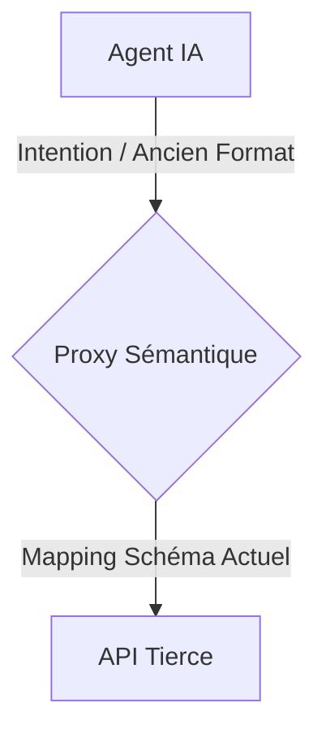
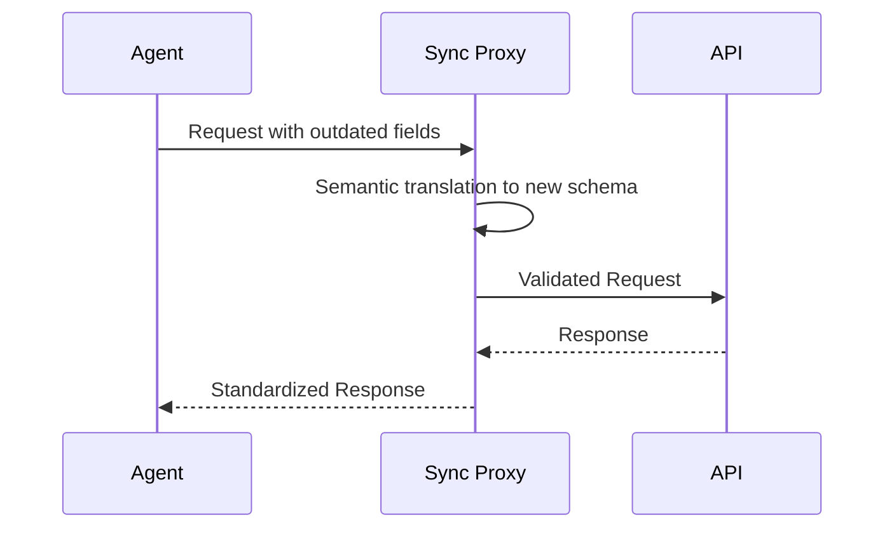

<!-- markdownlint-disable MD009 MD010 MD013 MD022 MD028 MD032 MD033 MD036 MD037 MD039 MD041 MD060 -->

[ 🇬🇧 English Version ](./README.md)

# AgentSchema Sync

> **Résumé exécutif :** Un proxy sémantique qui mappe dynamiquement les intentions des agents aux schémas d'API actuels pour éviter les ruptures lors des mises à jour d'API tierces.

---

## 1. Aperçu visuel

```mermaid
graph TD
    %% Flux
    A["Agent IA"] -->|Intention / Ancien Format| B{"Proxy Sémantique"}
    B -->|Mapping Schéma Actuel| C["API Tierce"]
```

## 2. La thèse contrariante (Peter Thiel Style)

**La croyance populaire :** Les agents peuvent simplement lire la documentation des API pour s'adapter aux changements.

**La vérité cachée :** Les changements d'API sont souvent silencieux ; une traduction sémantique dynamique est requise en temps réel.

## 3. Le problème & La cible

**Modèle économique :** M2M / B2B
**Cible précise :** Développeurs d'agents autonomes, entreprises déployant des agents IA vers des services externes.
**La douleur urgente :** Les agents se cassent lorsque les APIs tierces changent de structure silencieusement.

## 4. Architecture technique & Plomberie

**L'approche technique :** Un proxy sémantique qui mappe les intentions de l'agent aux schémas d'API en vigueur, en temps réel.

```mermaid
sequenceDiagram
    participant Agent
    participant Sync Proxy
    participant API
    Agent->>Sync Proxy: Request with outdated fields
    Sync Proxy->>Sync Proxy: Semantic translation to new schema
    Sync Proxy->>API: Validated Request
    API-->>Sync Proxy: Response
    Sync Proxy-->>Agent: Standardized Response
```

## 5. Modèle économique & Viabilité financière

| Métrique                        | Valeur                          |
| :------------------------------ | :------------------------------ |
| **Structure de prix**           | API Request Volume Tier         |
| **Objectif 12 mois**            | 500 Developers/Teams            |
| **Calcul du CA (Target 100k€)** | 500 teams \* $200/mo = $100k/mo |
| **Marge brute estimée**         | 80%                             |

## 6. Moteur de distribution & Fossé défensif (Moat)

**Stratégie d'acquisition :** Adoption dev via outils open-source et offres SLA premium pour les entreprises.

**Moat (Barrière à l'entrée) :** Les LLMs se basent sur des données d'entraînement obsolètes et ne peuvent s'adapter dynamiquement aux changements d'API silencieux.

## 7. Grille d'évaluation détaillée

| Critère                               | Score VC (/100) | Score Terrain (/100) |
| :------------------------------------ | :-------------- | :------------------- |
| **Thèse & Monopole / Urgence**        | -- / 25         | 21 / 25              |
| **Moat / Résistance aux LLM natifs**  | -- / 25         | 23 / 25              |
| **Scalabilité / Friction d'adoption** | -- / 25         | 24 / 25              |
| **Unit Economics / ROI direct**       | -- / 25         | 22 / 25              |
| **TOTAL**                             | -- / 100        | 90 / 100             |

> **Verdict VC :** En attente d'évaluation.
> **Verdict Terrain :** Les changements silencieux d'API qui cassent les intégrations sont un casse-tête constant, rendant ce proxy très attractif. La traduction sémantique des intentions crée un intergiciel résilient. Il présente une très faible friction d'adoption en tant que proxy, avec une proposition de valeur claire pour les développeurs.
