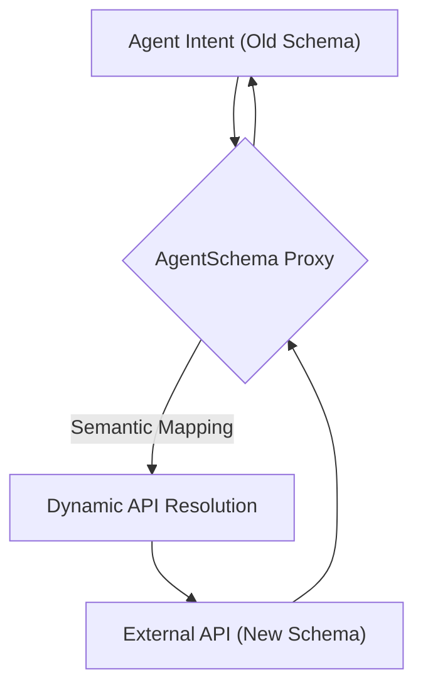
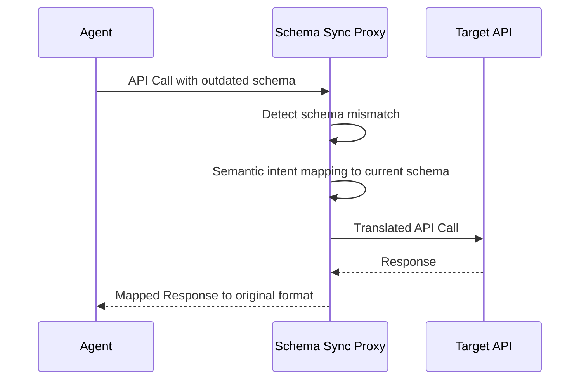

<!-- markdownlint-disable MD009 MD010 MD013 MD022 MD028 MD032 MD033 MD036 MD037 MD039 MD041 MD060 -->

[ 🇫🇷 Version Française ](./README.fr.md)

# AgentSchema Sync

> **Executive Summary:** A semantic API proxy that dynamically maps autonomous agent intentions to ever-changing third-party API schemas to prevent integration breaks.

---

## 1. Visual Overview

## 2. Contrarian Thesis (Peter Thiel Style)

- **Popular Belief:** AI agents will natively understand and adapt to API changes by simply reading updated documentation.
- **Hidden Truth:** Silent schema changes break deterministic agent tools instantly. A real-time semantic translation layer is required because base models rely on stale training data and cannot self-heal API calls on the fly without severe latency and token costs.

## 3. Problem & Target Market

- **Business Model:** M2M / B2B
- **Target Audience:** Autonomous agent developers and enterprises deploying AI agents relying on third-party APIs.
- **Urgent Pain Point:** Agents break unexpectedly when third-party APIs change their structure (JSON schemas, endpoints) silently, causing critical business workflows to fail and requiring constant manual patching.

## 4. Technical Architecture & Infrastructure

## 5. Business Model & Financial Viability

| Metric                 | Value                              |
| ---------------------- | ---------------------------------- |
| Pricing Structure      | Tiered API Request Volume          |
| 12-Month Target        | 20M requests/month across 500 devs |
| Revenue Formula        | 500 \* €200 / month = 100k€        |
| Estimated Gross Margin | 80%                                |

## 6. Distribution Engine & Moat

- **Acquisition Strategy:** Open-source core SDK for local agent development, with a paid enterprise cloud proxy for high-volume, multi-API real-time sync.
- **Moat (Defensibility):** The proprietary mapping engine combined with a constantly updated global repository of API state changes acts as a network effect. LLMs natively trained on older data cannot perform zero-shot schema mapping efficiently without this external, real-time context.

## 7. Detailed Evaluation Grid

| Criterion                   | VC Score (/100) | Market Score (/100) |
| --------------------------- | --------------- | ------------------- |
| Thesis & Monopoly / Urgency | -- / 25         | -- / 25             |
| Moat / LLM Immunity         | -- / 25         | -- / 25             |
| Scalability / UX Friction   | -- / 25         | -- / 25             |
| Unit Economics / ROI        | -- / 25         | -- / 25             |
| **TOTAL**                   | **-- / 100**    | **-- / 100**        |

> **VC Verdict:** Pending evaluation.

> **Market Verdict:** Pending evaluation.
