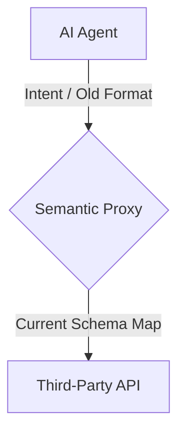
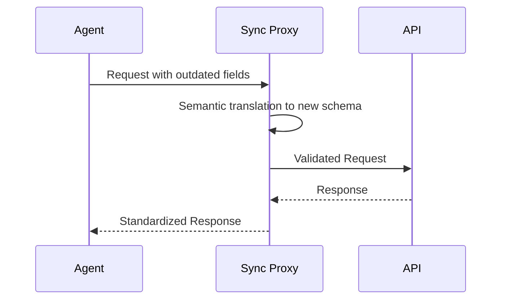

<!-- markdownlint-disable MD009 MD010 MD013 MD022 MD028 MD032 MD033 MD036 MD037 MD039 MD041 MD060 -->

[ 🇫🇷 Version Française ](./README.fr.md)

# AgentSchema Sync

> **Executive Summary:** A semantic proxy that dynamically maps agent intents to the most current API schemas, preventing agents from breaking when third-party APIs change silently.

---

## 1. Visual Overview & Wow Effect

```mermaid
graph TD
    %% Flow
    A["AI Agent"] -->|Intent / Old Format| B{"Semantic Proxy"}
    B -->|Current Schema Map| C["Third-Party API"]
```

## 2. Contrarian Thesis (Peter Thiel Style)

**Popular Belief:** Agents can simply read API documentation to adapt to changes.

**Hidden Truth:** API changes are often undocumented or silently deployed; a dynamic semantic translation layer is required in real-time.

## 3. Problem & Target Market

**Business Model:** M2M / B2B
**Target Audience:** Autonomous agent developers, enterprises deploying AI agents interacting with external services.
**Urgent Pain Point:** Agents break entirely when third-party API structures change, leading to workflow failures and constant maintenance overhead.

## 4. Technical Architecture & Infrastructure

**Technical Approach:** A semantic proxy that sits between the agent and the external API. It maps the agent's high-level intent to the current, validated API schema dynamically.

```mermaid
sequenceDiagram
    participant Agent
    participant Sync Proxy
    participant API
    Agent->>Sync Proxy: Request with outdated fields
    Sync Proxy->>Sync Proxy: Semantic translation to new schema
    Sync Proxy->>API: Validated Request
    API-->>Sync Proxy: Response
    Sync Proxy-->>Agent: Standardized Response
```

## 5. Business Model & Financial Viability

| Metric                     | Value                           |
| :------------------------- | :------------------------------ |
| **Pricing Structure**      | API Request Volume Tier         |
| **12-Month Target**        | 500 Developers/Teams            |
| **Revenue Formula**        | 500 teams \* $200/mo = $100k/mo |
| **Estimated Gross Margin** | 80%                             |

## 6. Distribution Engine & Moat

**Acquisition Strategy:** Developer adoption via open-source tools and premium enterprise SLA tiers.

**Moat (Defensibility):** Native LLMs rely on outdated training data and cannot dynamically adapt to silent, real-time API changes without an external schema resolution layer.

## 7. Detailed Evaluation Grid

| Criterion                       | VC Score (/100) | Market Score (/100) |
| :------------------------------ | :-------------- | :------------------ |
| **Thesis & Monopoly / Urgency** | -- / 25         | -- / 25             |
| **Moat / LLM Immunity**         | -- / 25         | -- / 25             |
| **Scalability / UX Friction**   | -- / 25         | -- / 25             |
| **Unit Economics / ROI**        | -- / 25         | -- / 25             |
| **TOTAL**                       | -- / 100        | -- / 100            |

> **VC Verdict:** Pending evaluation.
> **Market Verdict:** Pending evaluation.
