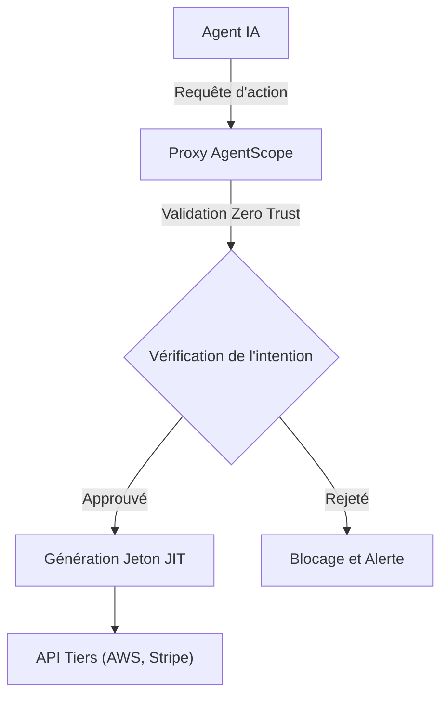
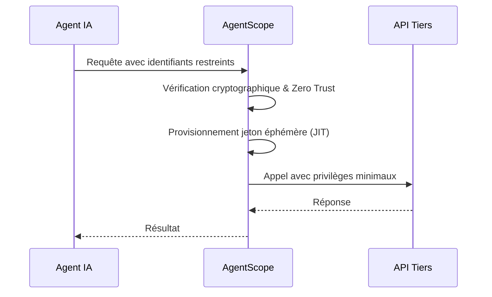

<!-- markdownlint-disable MD013 MD028 MD033 MD036 MD039 MD041 MD060 -->

[ 🇬🇧 English Version ](./README.md)

# AgentScope

> **Résumé exécutif :** Un proxy de sécurité API "Zero Trust" fournissant des jetons éphémères (Just-in-Time) à privilèges minimaux pour les agents IA autonomes.

---

## 1. Aperçu visuel

## 2. La thèse contrariante (Peter Thiel Style)

La croyance populaire : La sécurité des agents IA se gère en améliorant les prompts et les barrières internes du modèle.
La vérité cachée : La véritable sécurité doit être appliquée au niveau du réseau et du routage de l'infrastructure, de manière déterministe, totalement hors de portée du raisonnement probabiliste du modèle.

## 3. Le problème & La cible

Modèle économique : M2M
Cible précise : Les équipes d'ingénierie et de sécurité (SecOps, DevOps) déployant des agents autonomes IA.
La douleur urgente : Fournir des clés d'API statiques et puissantes à des systèmes non-déterministes représente un risque de sécurité critique (fuite de données, destruction d'infrastructures en cas de prompt injection).

## 4. Architecture technique & Plomberie

## 5. Modèle économique & Viabilité financière

| Métrique                    | Valeur                           |
| --------------------------- | -------------------------------- |
| Structure de prix           | Abonnement B2B / Volume d'agents |
| Objectif 12 mois            | 100 déploiements entreprise      |
| Calcul du CA (Target 100k€) | Clients \* Abonnement            |
| Marge brute estimée         | 80-90%                           |

## 6. Moteur de distribution & Fossé défensif (Moat)

Stratégie d'acquisition : Acquisition B2B directe (SecOps), adoption développeur (SDK).
Moat (Barrière à l'entrée) : Infrastructure de reverse proxy réseau. Un concurrent ou un LLM en 24h ne peut pas remplacer une brique de sécurité réseau profondément intégrée dans le routage d'entreprise.

## 7. Grille d'évaluation détaillée

| Critère                           | Score VC (/100) | Score Terrain (/100) |
| --------------------------------- | --------------- | -------------------- |
| Thèse & Monopole / Urgence        | 22 / 25         | 16 / 25              |
| Moat / Résistance aux LLM natifs  | 23 / 25         | 21 / 25              |
| Scalabilité / Friction d'adoption | 24 / 25         | 19 / 25              |
| Unit Economics / ROI direct       | 24 / 25         | 19 / 25              |
| **TOTAL**                         | **93 / 100**    | **75 / 100**         |

> **Verdict Terrain :** L'outil AgentScope répond à un besoin métier très ciblé avec un ROI tangible. Son positionnement en tant qu'infrastructure API garantit une bonne immunité face aux LLMs généralistes. Même si l'adoption demande un effort d'intégration, la viabilité du modèle économique est portée par la valeur apportée.
> **Verdict VC :** Agent Scope applique les principes éprouvés du Zero Trust au far-west des permissions d'agents IA, remplaçant les dangereuses clés statiques par des jetons éphémères. Son intégration profonde aux fournisseurs d'identité d'entreprise existants garantit une extrême fidélité et des coûts de changement élevés. La nature critique de l'outil pour la sécurité permet une tarification premium et des indicateurs économiques solides.
