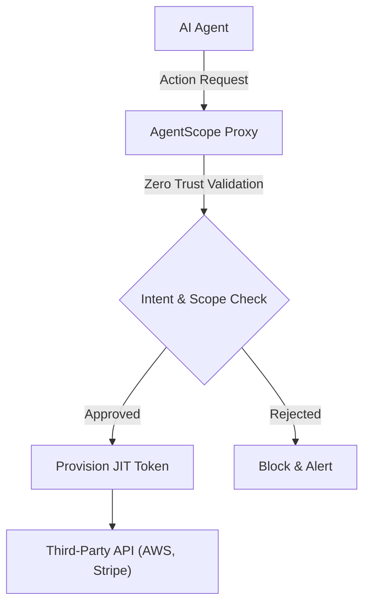
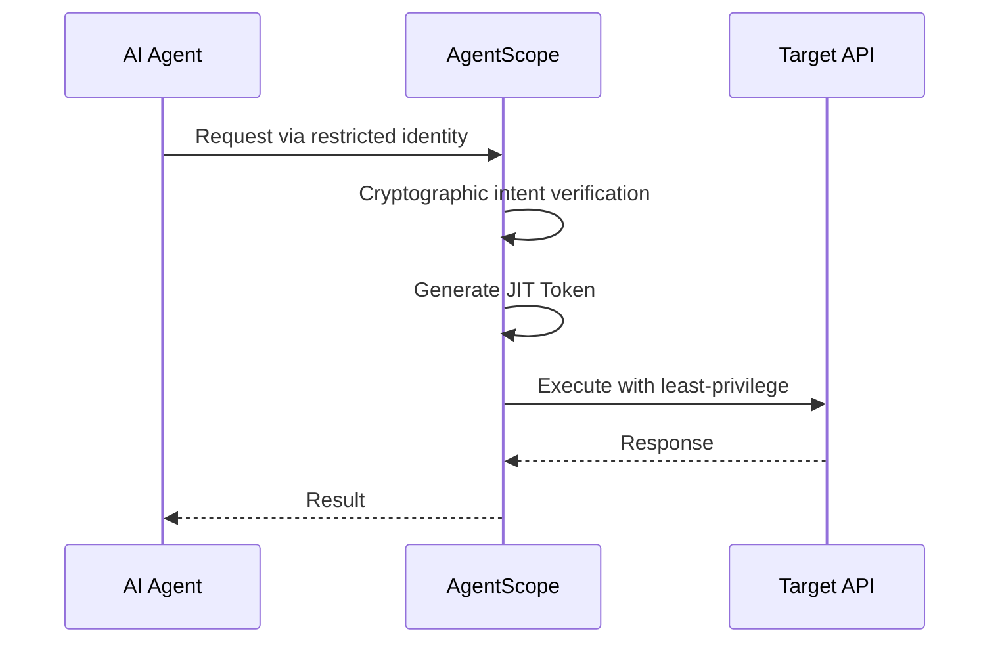

<!-- markdownlint-disable MD013 MD028 MD033 MD036 MD039 MD041 MD060 -->

[ 🇫🇷 Version Française ](./README.fr.md)

# AgentScope

> **Executive Summary:** A Zero Trust API security proxy that provisions Just-in-Time, least-privilege ephemeral tokens for autonomous AI agents.

---

## 1. Visual Overview

## 2. Contrarian Thesis (Peter Thiel Style)

Popular Belief: AI agent security can be solved by better system prompts and internal safety guardrails.
Hidden Truth: A probabilistic model can never guarantee deterministic safety against malicious prompts. True security must be applied at the network routing and infrastructure layer, completely out of reach of the model's reasoning.

## 3. Problem & Target Market

Business Model: M2M
Target Audience: Engineering and security teams (SecOps, DevOps) deploying autonomous AI agents.
Urgent Pain Point: Providing static, powerful API keys (AWS, GitHub, Stripe) to non-deterministic systems creates a critical security risk where a prompt injection can lead to data leaks or infrastructure destruction.

## 4. Technical Architecture & Infrastructure

## 5. Business Model & Financial Viability

| Metric                 | Value                                              |
| ---------------------- | -------------------------------------------------- |
| Pricing Structure      | Subscription based on active agents/proxied volume |
| 12-Month Target        | 100 enterprise deployments                         |
| Revenue Formula        | Customers \* Avg Subscription                      |
| Estimated Gross Margin | 80-90%                                             |

## 6. Distribution Engine & Moat

Acquisition Strategy: Open-source developer tools, direct SecOps B2B sales.
Moat (Defensibility): Network-level Zero Trust infrastructure that intercepts API routing. Native LLMs cannot replicate this as it requires external cryptographic infrastructure acting as a reverse proxy.

## 7. Detailed Evaluation Grid

| Criterion                   | VC Score (/100) | Market Score (/100) |
| --------------------------- | --------------- | ------------------- |
| Thesis & Monopoly / Urgency | -- / 25         | -- / 25             |
| Moat / LLM Immunity         | -- / 25         | -- / 25             |
| Scalability / UX Friction   | -- / 25         | -- / 25             |
| Unit Economics / ROI        | -- / 25         | -- / 25             |
| **TOTAL**                   | **-- / 100**    | **-- / 100**        |

VC Verdict: Pending evaluation.
Market Verdict: Pending evaluation.
