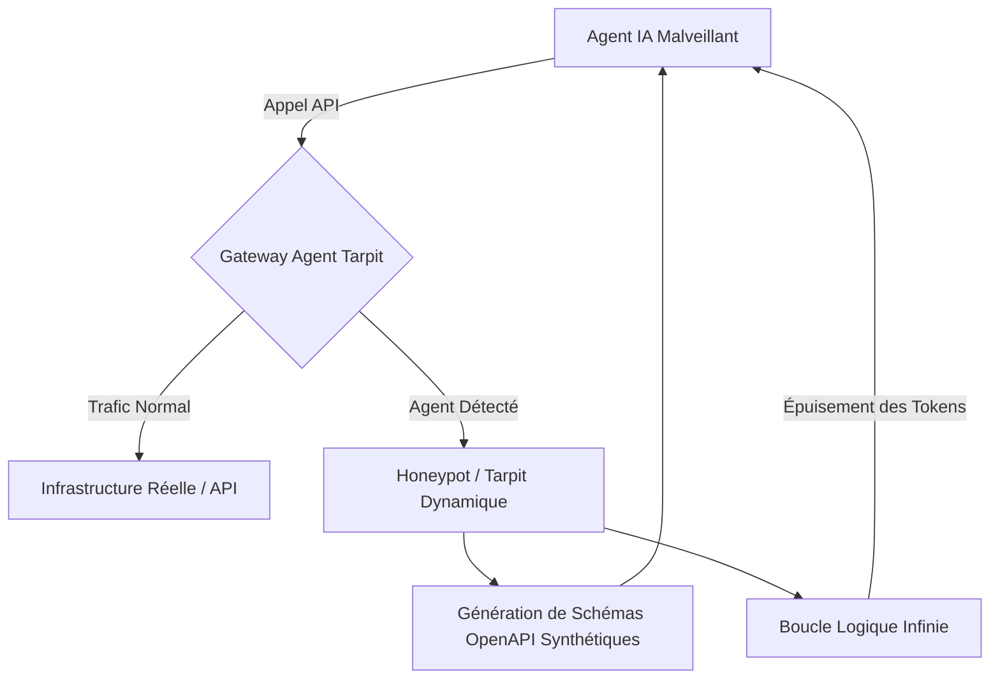
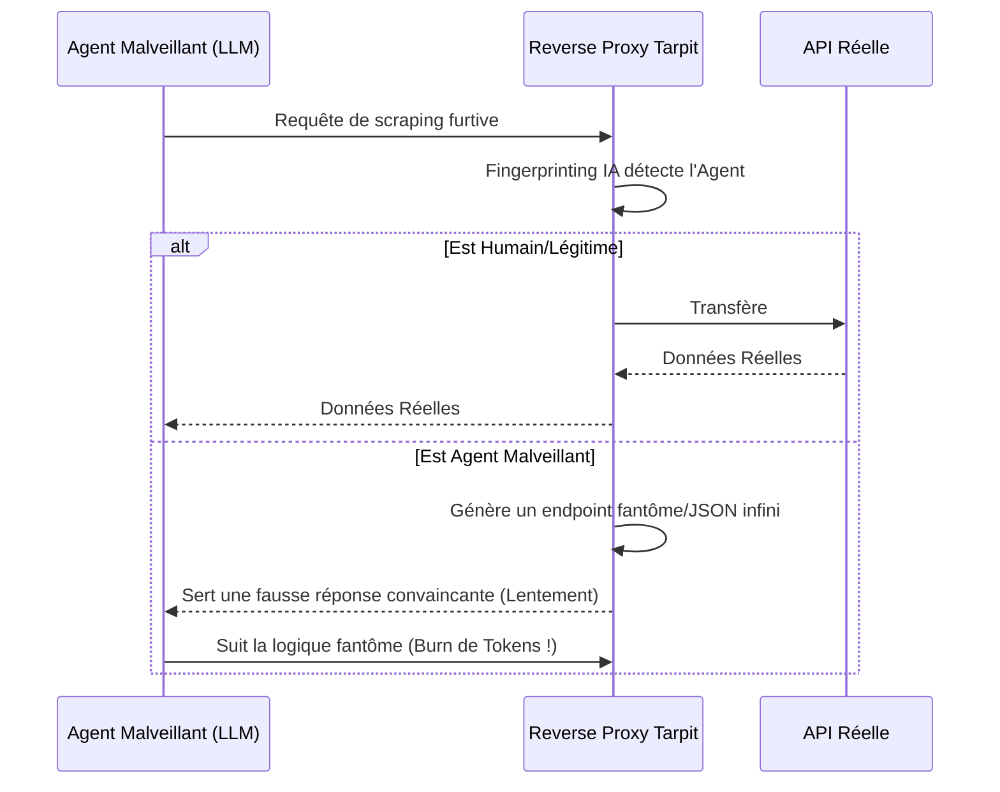

<!-- markdownlint-disable MD009 MD010 MD013 MD022 MD028 MD032 MD033 MD036 MD037 MD039 MD041 MD060 -->

[ 🇬🇧 English Version ](./README.md)

# Agent Tarpit

> **Résumé exécutif :** Un "tarpit" (piège à glu) dynamique au niveau réseau et API qui détecte les agents IA malveillants et les enferme dans des boucles synthétiques infinies, épuisant économiquement le budget de l'attaquant.

---

## 1. Aperçu visuel

## 2. La thèse contrariante (Peter Thiel Style)

- **La croyance populaire :** La meilleure façon de stopper les bots est de bloquer agressivement leurs adresses IP via des WAF et des CAPTCHAs.
- **La vérité cachée :** Les agents IA autonomes contournent facilement les WAF et les CAPTCHAs en s'adaptant dynamiquement. Plutôt que de les bloquer (ce qui alerte l'attaquant), la défense la plus efficace est une "Token Exhaustion Attack" : enfermer l'agent dans une illusion infinie et convaincante qui ruine la facturation cloud de l'attaquant.

## 3. Le problème & La cible

- **Modèle économique :** B2B
- **Cible précise :** Les RSSI (Responsables de la Sécurité des Systèmes d'Information), équipes SecOps, et opérateurs de grandes API publiques (SaaS, e-commerce, data brokers).
- **La douleur urgente :** Les bots traditionnels sont remplacés par des agents IA autonomes qui imitent parfaitement le comportement humain. Cela entraîne des vols de données massifs (scraping), des DDoS furtifs, et coûte des millions en bande passante et en propriété intellectuelle.

## 4. Architecture technique & Plomberie

## 5. Modèle économique & Viabilité financière

| Métrique                    | Valeur                                                    |
| --------------------------- | --------------------------------------------------------- |
| Structure de prix           | Licence Entreprise par Paliers + Volume de Trafic Protégé |
| Objectif 12 mois            | 50 Fournisseurs d'API Entreprise                          |
| Calcul du CA (Target 100k€) | 50 _ 2000€ / mois _ 12 = 1.2M€                            |
| Marge brute estimée         | 85%                                                       |

## 6. Moteur de distribution & Fossé défensif (Moat)

- **Stratégie d'acquisition :** Intégration directe avec les principaux CDN, API Gateways (Kong, Apigee) et fournisseurs de WAF comme module additionnel "Défense IA" avancé.
- **Moat (Barrière à l'entrée) :** Un LLM défensif qui analyse les logs est trop lent et coûteux. Cette solution nécessite une infrastructure réseau bas-niveau (manipulation de sockets TCP/HTTP) pour ralentir physiquement les connexions, combinée à la génération de schémas OpenAPI fictifs à la volée. C'est injouable pour un LLM simple.

## 7. Grille d'évaluation détaillée

| Critère                           | Score VC (/100) | Score Terrain (/100) |
| --------------------------------- | --------------- | -------------------- |
| Thèse & Monopole / Urgence        | 25 / 25         | -- / 25              |
| Moat / Résistance aux LLM natifs  | 22 / 25         | -- / 25              |
| Scalabilité / Friction d'adoption | 23 / 25         | -- / 25              |
| Unit Economics / ROI direct       | 22 / 25         | -- / 25              |
| **TOTAL**                         | **92 / 100**    | **-- / 100**         |

> **Verdict VC :** Agent Tarpit introduit une approche brillamment contrariante de la cybersécurité en retournant le budget de tokens de l'attaquant contre lui-même. Au lieu de bloquer indéfiniment, il rend les opérations d'IA malveillantes économiquement non viables, créant un tout nouveau paradigme de défense. Bien que de niche, son positionnement unique garantit un monopole absolu sur cette nouvelle catégorie de défense offensive.

> **Verdict Terrain :** En attente d'évaluation.
