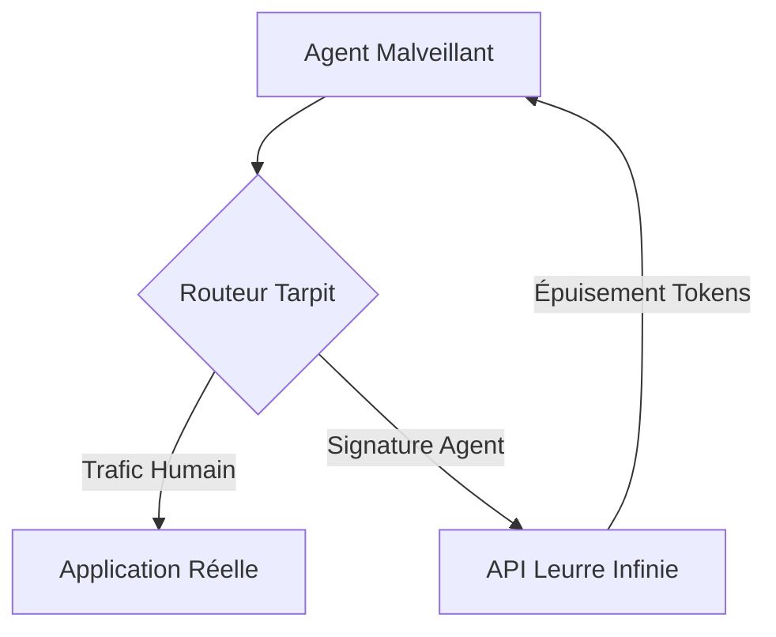
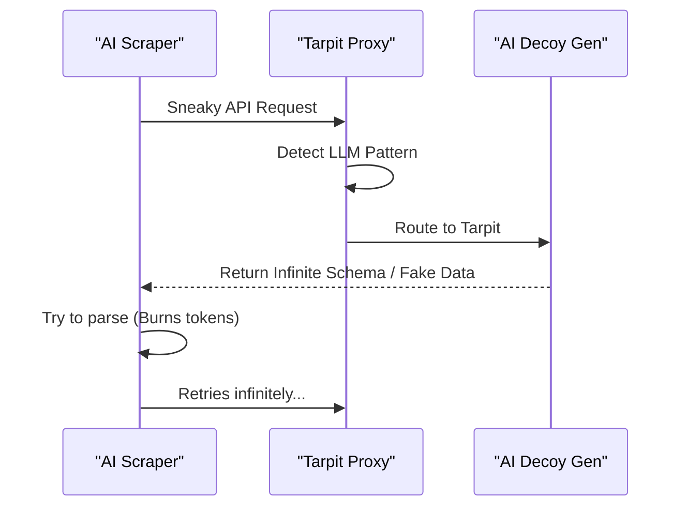

<!-- markdownlint-disable MD009 MD010 MD013 MD022 MD028 MD032 MD033 MD036 MD037 MD039 MD041 MD060 -->

[ 🇬🇧 English Version ](./README.md)

# Agent Tarpit

> **Résumé exécutif :** Une infrastructure de tarpit générée par l'IA pour piéger les bots de scraping autonomes dans des boucles infinies, épuisant leur budget token.

---

## 1. Aperçu visuel

```mermaid
graph TD
    %% Architecture Tarpit
    A["Agent Malveillant"] --> B{"Routeur Tarpit"}
    B -->|Trafic Humain| C["Application Réelle"]
    B -->|Signature Agent| D["API Leurre Infinie"]
    D -->|Épuisement Tokens| A
```

## 2. La thèse contrariante (Peter Thiel Style)

**La croyance populaire :** Les WAF traditionnels et les CAPTCHAs suffisent à stopper le scraping.

**La vérité cachée :** Les agents pilotés par LLM contournent les CAPTCHAs ; la seule défense est de rendre l'attaque économiquement non viable.

## 3. Le problème & La cible

**Modèle économique :** B2B
**Cible précise :** RSSI, équipes SecOps, et opérateurs de grandes API (SaaS, e-commerce) subissant du scraping massif.
**La douleur urgente :** Les agents IA autonomes imitent le comportement humain et contournent les WAF, entraînant vols de données et épuisement des ressources.

## 4. Architecture technique & Plomberie

**L'approche technique :** Un réseau de tarpits dynamiques. Sert des endpoints fantômes et schémas JSON infinis pour épuiser le budget token de l'attaquant (Token Exhaustion Attack) au lieu de simplement le bloquer.

```mermaid
sequenceDiagram
    participant Bot as "AI Scraper"
    participant WAF as "Tarpit Proxy"
    participant Decoy as "AI Decoy Gen"
    Bot->>WAF: Sneaky API Request
    WAF->>WAF: Detect LLM Pattern
    WAF->>Decoy: Route to Tarpit
    Decoy-->>Bot: Return Infinite Schema / Fake Data
    Bot->>Bot: Try to parse (Burns tokens)
    Bot->>WAF: Retries infinitely...
```

## 5. Modèle économique & Viabilité financière

| Métrique                        | Valeur                                   |
| :------------------------------ | :--------------------------------------- |
| **Structure de prix**           | Enterprise License / Monitored Bandwidth |
| **Objectif 12 mois**            | 20 Enterprise Contracts                  |
| **Calcul du CA (Target 100k€)** | 20 contracts \* $5k/mo = $100k/mo        |
| **Marge brute estimée**         | 75%                                      |

## 6. Moteur de distribution & Fossé défensif (Moat)

**Stratégie d'acquisition :** Ventes B2B directes aux grands courtiers en données et géants du e-commerce.

**Moat (Barrière à l'entrée) :** Nécessite une infrastructure réseau bas-niveau (reverse proxy) combinée à la génération de schémas fictifs à la volée, impossible pour un simple LLM défensif.

## 7. Grille d'évaluation détaillée

| Critère                               | Score VC (/100) | Score Terrain (/100) |
| :------------------------------------ | :-------------- | :------------------- |
| **Thèse & Monopole / Urgence**        | 22 / 25         | -- / 25              |
| **Moat / Résistance aux LLM natifs**  | 24 / 25         | -- / 25              |
| **Scalabilité / Friction d'adoption** | 21 / 25         | -- / 25              |
| **Unit Economics / ROI direct**       | 23 / 25         | -- / 25              |
| **TOTAL**                             | 90 / 100        | -- / 100             |

> **Verdict VC :** Agent Tarpit présente une infrastructure de sécurité très contrariante et efficace contre les attaques d'IA adverses. Ralentir financièrement les agents malveillants ruine leur opération, créant un puissant fossé économique que les LLM bruts ne peuvent contourner. La proposition de valeur défensive claire justifie aisément les budgets cybersécurité des entreprises.
> **Verdict Terrain :** En attente d'évaluation.
