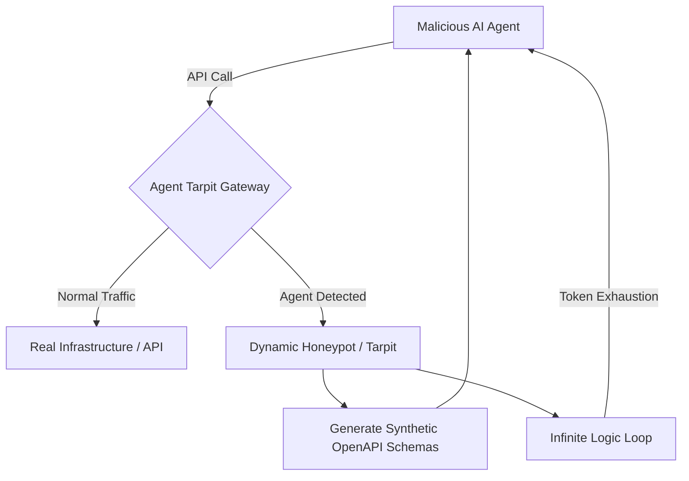
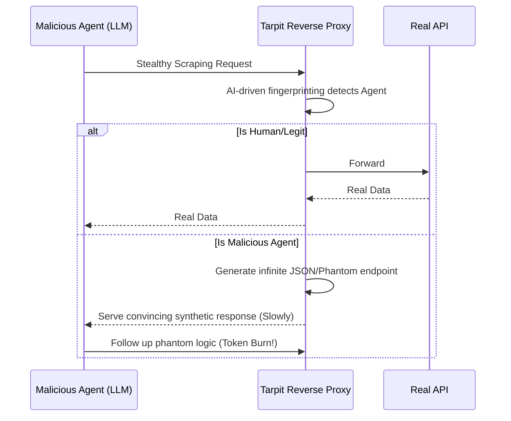

<!-- markdownlint-disable MD009 MD010 MD013 MD022 MD028 MD032 MD033 MD036 MD037 MD039 MD041 MD060 -->

[ 🇫🇷 Version Française ](./README.fr.md)

# Agent Tarpit

> **Executive Summary:** A dynamic API and network-level "tarpit" that detects malicious AI agents and traps them in infinite synthetic loops, economically exhausting the attacker's LLM token budget.

---

## 1. Visual Overview

## 2. Contrarian Thesis (Peter Thiel Style)

- **Popular Belief:** The best way to stop automated scrapers and bots is to aggressively block their IP addresses using WAFs and CAPTCHAs.
- **Hidden Truth:** Autonomous AI agents easily bypass WAFs and solve CAPTCHAs by adapting dynamically. Instead of blocking them (which alerts the attacker to mutate), the most effective defense is a "Token Exhaustion Attack"—trapping the agent in an infinite, convincing illusion that bankrupts the attacker's cloud billing.

## 3. Problem & Target Market

- **Business Model:** B2B
- **Target Audience:** CISOs, SecOps teams, and operators of large public APIs (SaaS, e-commerce, data brokers).
- **Urgent Pain Point:** AI agents driven by LLMs mimic human behavior perfectly, causing massive data scraping, stealthy application DDoS, and complex fraud, which costs millions in wasted bandwidth and stolen intellectual property.

## 4. Technical Architecture & Infrastructure

## 5. Business Model & Financial Viability

| Metric                 | Value                                                |
| ---------------------- | ---------------------------------------------------- |
| Pricing Structure      | Tiered Enterprise License + Protected Traffic Volume |
| 12-Month Target        | 50 Enterprise API Providers                          |
| Revenue Formula        | 50 _ €2,000 / month _ 12 = 1.2M€                     |
| Estimated Gross Margin | 85%                                                  |

## 6. Distribution Engine & Moat

- **Acquisition Strategy:** Direct integration with major CDNs, API Gateways (Kong, Apigee), and WAF providers as an advanced "AI Defense" add-on.
- **Moat (Defensibility):** Defensive LLMs analyzing logs are too slow and expensive. This requires low-level network infrastructure (TCP/HTTP socket manipulation) to physically slow connections, combined with real-time generation of fake OpenAPI schemas—a cryptographic cat-and-mouse game natively impossible for a simple LLM to replicate.

## 7. Detailed Evaluation Grid

| Criterion                   | VC Score (/100) | Market Score (/100) |
| --------------------------- | --------------- | ------------------- |
| Thesis & Monopoly / Urgency | -- / 25         | -- / 25             |
| Moat / LLM Immunity         | -- / 25         | -- / 25             |
| Scalability / UX Friction   | -- / 25         | -- / 25             |
| Unit Economics / ROI        | -- / 25         | -- / 25             |
| **TOTAL**                   | **-- / 100**    | **-- / 100**        |

> **VC Verdict:** Pending evaluation.

> **Market Verdict:** Pending evaluation.
