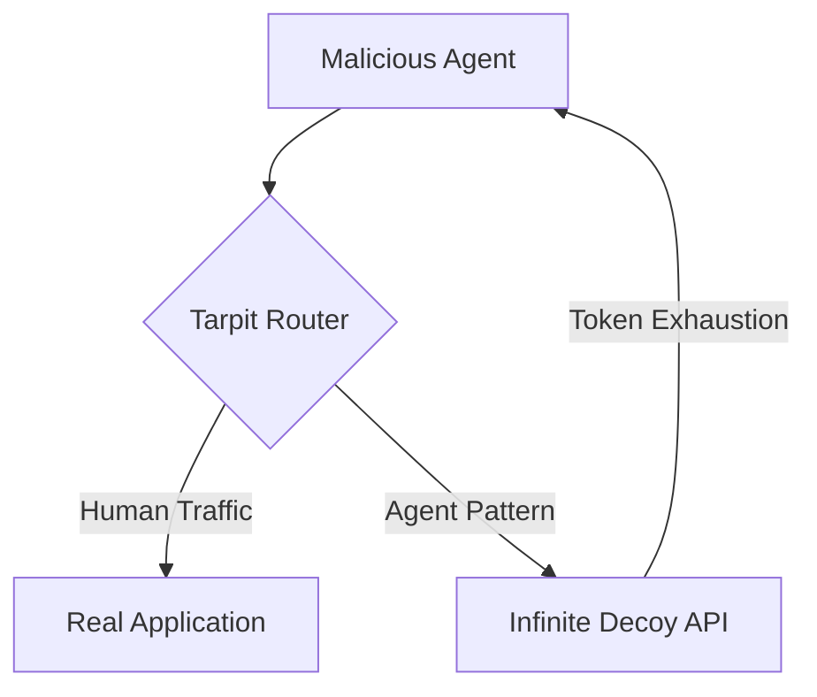
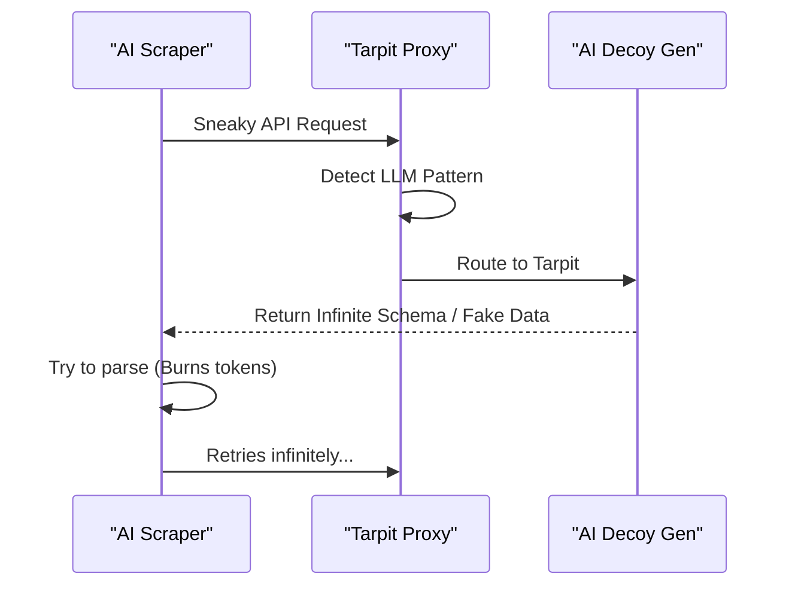

<!-- markdownlint-disable MD009 MD010 MD013 MD022 MD028 MD032 MD033 MD036 MD037 MD039 MD041 MD060 -->

[ 🇫🇷 Version Française ](./README.fr.md)

# Agent Tarpit

> **Executive Summary:** A dynamic AI-generated tarpit infrastructure designed to trap malicious autonomous scraping bots in infinite loops, exhausting their token budgets.

---

## 1. Visual Overview & Wow Effect

```mermaid
graph TD
    %% Tarpit Architecture
    A["Malicious Agent"] --> B{"Tarpit Router"}
    B -->|Human Traffic| C["Real Application"]
    B -->|Agent Pattern| D["Infinite Decoy API"]
    D -->|Token Exhaustion| A
```

## 2. Contrarian Thesis (Peter Thiel Style)

**Popular Belief:** Traditional WAFs and CAPTCHAs are enough to stop automated scraping.

**Hidden Truth:** LLM-driven agents easily bypass CAPTCHAs and WAFs by imitating human behavior; the only way to stop them is by making the attack economically unviable.

## 3. Problem & Target Market

**Business Model:** B2B
**Target Audience:** CISOs, SecOps teams, and operators of large public APIs (SaaS, e-commerce) facing massive AI-driven scraping.
**Urgent Pain Point:** Autonomous LLM agents bypass WAFs to steal data and cause stealthy DDoS, costing millions in bandwidth and lost IP.

## 4. Technical Architecture & Infrastructure

**Technical Approach:** A network of dynamic, AI-generated decoys (tarpits) at the API layer. Detects LLM patterns and serves phantom endpoints or infinite JSON schemas to trap the agent and exhaust its token budget (Token Exhaustion Attack).

```mermaid
sequenceDiagram
    participant Bot as "AI Scraper"
    participant WAF as "Tarpit Proxy"
    participant Decoy as "AI Decoy Gen"
    Bot->>WAF: Sneaky API Request
    WAF->>WAF: Detect LLM Pattern
    WAF->>Decoy: Route to Tarpit
    Decoy-->>Bot: Return Infinite Schema / Fake Data
    Bot->>Bot: Try to parse (Burns tokens)
    Bot->>WAF: Retries infinitely...
```

## 5. Business Model & Financial Viability

| Metric                     | Value                                    |
| :------------------------- | :--------------------------------------- |
| **Pricing Structure**      | Enterprise License / Monitored Bandwidth |
| **12-Month Target**        | 20 Enterprise Contracts                  |
| **Revenue Formula**        | 20 contracts \* $5k/mo = $100k/mo        |
| **Estimated Gross Margin** | 75%                                      |

## 6. Distribution Engine & Moat

**Acquisition Strategy:** Direct enterprise sales to major data brokers and e-commerce giants.

**Moat (Defensibility):** Requires low-level network infrastructure (socket management, reverse proxy) combined with real-time OpenAPI schema generation—a cryptographic cat-and-mouse game beyond simple text classification.

## 7. Detailed Evaluation Grid

| Criterion                   | VC Score (/100) | Market Score (/100) |
| --------------------------- | --------------- | ------------------- |
| Thesis & Monopoly / Urgency | 25 / 25         | 21 / 25             |
| Moat / LLM Immunity         | 22 / 25         | 22 / 25             |
| Scalability / UX Friction   | 23 / 25         | 18 / 25             |
| Unit Economics / ROI        | 22 / 25         | 20 / 25             |
| **TOTAL**                   | **92 / 100**    | **81 / 100**        |

> **VC Verdict:** Agent Tarpit introduces a brilliantly contrarian approach to cybersecurity by weaponizing the attacker's own token budget against them. Instead of playing endless whack-a-mole, it makes malicious AI operations economically unviable, creating a totally new paradigm in defense. While niche, its unique positioning ensures an absolute monopoly over this novel offensive defense category.

> **Market Verdict:** Innovative defense against malicious scraping and API abuse. Good niche for SecOps, but integration may introduce latency or complexity for legitimate M2M traffic.
