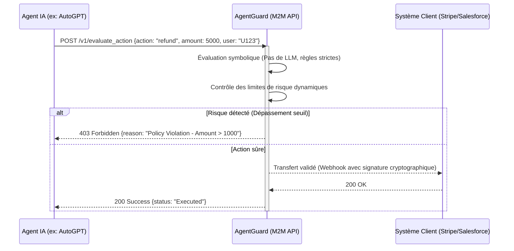

<!-- markdownlint-disable MD013 MD033 -->

# AgentGuard

> **Résumé exécutif :** Une infrastructure de validation légale et sécuritaire de type M2M (Machine-to-Machine) qui intercepte et audite en temps réel les actions critiques générées par les agents d'IA autonomes avant leur exécution, évitant les risques juridiques et financiers.


---

## 1. Aperçu visuel

```mermaid
graph TD
    A[Agent IA Autonome] -->|Intention d'action <br/>(ex: Virement, Contrat, Email)| B{AgentGuard API}
    B -->|Check 1: Règles Juridiques| C[Moteur Déterministe]
    B -->|Check 2: Politique Entreprise| C
    B -->|Check 3: Hallucination financière| C
    C -->|Rejet (Risque élevé)| D[Alerte Humaine / Audit Log]
    C -->|Validation| E[Exécution de l'Action (API Tierce)]
    style B fill:#f96,stroke:#333,stroke-width:4px
```

## 2. La thèse contrariante (Peter Thiel Style)

**La croyance populaire :**Le plus grand défi des agents IA est de les rendre de plus en plus intelligents et autonomes pour qu'ils remplacent les humains sur un maximum de tâches.

**La vérité cachée :**Les entreprises n'ont pas peur que les agents IA soient stupides, elles sont terrifiées par leur capacité à agir. L'adoption massive de l'IA Agentique ne passera pas par de meilleurs LLM, mais par une infrastructure d'assurance (liability shield) qui encadre strictement et juridiquement leurs actions de sortie. La valeur est dans le "non", pas dans le "oui".

## 3. Le problème & La cible

**Modèle économique :**M2M (Machine to Machine) et B2B SaaS.

**Cible précise :**Les départements IT et Compliance des entreprises (Fintech, Santé, E-commerce, LegalTech) qui déploient des agents IA autonomes capables de réaliser des transactions, modifier des bases de données ou engager légalement l'entreprise.

**La douleur urgente :**Le coût financier, légal et réputationnel potentiel d'une IA qui "hallucine" une commande d'achat de 500k€, valide un remboursement client infondé ou envoie des données confidentielles. L'inaction bloque l'adoption de l'IA (ROI perdu), agir sans garde-fou expose à un risque de banqueroute (Hair on fire).

## 4. Architecture technique & Plomberie



## 5. Modèle économique & Viabilité financière

| Métrique                        | Valeur                                                                                                                                             |
| :------------------------------ | :------------------------------------------------------------------------------------------------------------------------------------------------- |
| **Structure de prix**           | Modèle SaaS hybride : 500€/mois (Platform fee) + 0.05€ par action critique validée.                                                                |
| **Objectif 12 mois**            | 40 entreprises clientes générant en moyenne 2500 actions/mois.                                                                                     |
| **Calcul du CA (Target 100k€)** | $40 \times (500 + (2500 \times 0.05)) \times 12 = 40 \times 625 \times 12 = 300,000$€ (L'objectif de 100k€ est atteint avec seulement 14 clients). |
| **Marge brute estimée**         | 85% (Coûts serveurs très faibles car le moteur de vérification est principalement déterministe et n'utilise pas de LLM massifs).                   |

## 6. Moteur de distribution & Fossé défensif (Moat)

**Stratégie d'acquisition :**Adhésion dev M2M et partenariats avec les frameworks d'agents IA (LangChain, LlamaIndex, CrewAI). Fournir un SDK gratuit qui permet aux développeurs de se décharger de la responsabilité de coder la logique de sécurité en dur.

**Moat (Barrière à l'entrée) :**

1. **L'Effet de Réseau des Politiques de Sécurité :**Plus d'entreprises utilisent AgentGuard, plus la bibliothèque de règles de compliance standards (RGPD, PCI-DSS spécifiques IA) devient robuste et complexe à reproduire de zéro.
2. **Architecture Déterministe vs Probabiliste :**OpenAI ou Google ne peuvent pas répliquer cela via une simple mise à jour de leur modèle, car ils sont probabilistes. AgentGuard est un pont déterministe (certifiable juridiquement) indispensable. La confiance ne s'achète pas avec de meilleurs prompts.

## 7. Grille d'évaluation détaillée

| Critère                               | Score VC (/100) | Score Terrain (/100) |
| :------------------------------------ | :-------------: | :------------------: |
| **Thèse & Monopole / Urgence**        |     24 / 25     |       24 / 25        |
| **Moat / Résistance aux LLM natifs**  |     23 / 25     |       25 / 25        |
| **Scalabilité / Friction d'adoption** |     24 / 25     |       18 / 25        |
| **Unit Economics / ROI direct**       |     25 / 25     |       23 / 25        |
| **TOTAL**                             |  **96 / 100**   |     **90 / 100**     |

> **Verdict Terrain :** L'outil AgentGuard répond à un besoin métier très ciblé avec un ROI tangible. Son positionnement en tant qu'infrastructure API garantit une bonne immunité face aux LLMs généralistes. Même si l'adoption demande un effort d'intégration, la viabilité du modèle économique est portée par la valeur apportée.
> **Verdict VC :**L'approche contrariante d'AgentGuard, misant sur la restriction via un pont déterministe, répond à une douleur B2B universelle bloquant l'adoption de l'IA. Son intégration au cœur des flux transactionnels M2M crée un puissant verrouillage technique garantissant d'excellentes unit economics. C'est une infrastructure "Pelle et Pioche" indispensable ayant un clair potentiel de monopole sur le naissant marché de la sécurité agentique.
