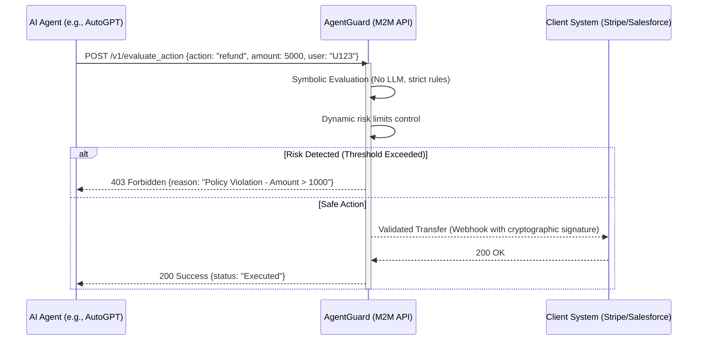

<!-- markdownlint-disable MD013 MD033 MD060 MD039 MD041 MD032 MD010 MD009 MD022 MD036 MD028 MD037 -->

[🇫🇷 Version Française](./README.fr.md)

# AgentGuard

> **Executive Summary:** An M2M (Machine-to-Machine) legal and security validation infrastructure that intercepts and audits critical actions generated by autonomous AI agents in real time before execution, preventing legal and financial risks.


---

## 1. Visual Overview

```mermaid
graph TD
    A[Autonomous AI Agent] -->|Action Intent <br/>(e.g., Transfer, Contract, Email)| B{AgentGuard API}
    B -->|Check 1: Legal Rules| C[Deterministic Engine]
    B -->|Check 2: Corporate Policy| C
    B -->|Check 3: Financial Hallucination| C
    C -->|Reject (High Risk)| D[Human Alert / Audit Log]
    C -->|Validation| E[Execute Action (Third-Party API)]
    style B fill:#f96,stroke:#333,stroke-width:4px
```

## 2. The Contrarian Thesis (Peter Thiel Style)

**The Popular Belief:** The biggest challenge for AI agents is making them increasingly intelligent and autonomous so they can replace humans on a maximum number of tasks.

**The Hidden Truth:** Companies aren't afraid of AI agents being stupid; they are terrified of their ability to act. Massive adoption of Agentic AI will not come through better LLMs, but through a liability shield infrastructure that strictly and legally frameworks their output actions. The value is in the "no," not the "yes."

## 3. The Problem & The Target

**Economic Model:** M2M (Machine to Machine) and B2B SaaS.

**Specific Target:** IT and Compliance departments of companies (Fintech, Healthcare, E-commerce, LegalTech) deploying autonomous AI agents capable of performing transactions, modifying databases, or legally binding the company.

**The Urgent Pain:** The potential financial, legal, and reputational cost of an AI "hallucinating" a 500k€ purchase order, validating an unfounded customer refund, or sending confidential data. Inaction blocks AI adoption (lost ROI); acting without safeguards exposes to bankruptcy risk (Hair on fire).

## 4. Technical Architecture & Plumbing



## 5. Economic Model & Financial Viability

| Metric | Value |
| :--- | :--- |
| **Pricing Structure** | Hybrid SaaS model: 500€/month (Platform fee) + 0.05€ per validated critical action. |
| **12-Month Target** | 40 client companies generating an average of 2500 actions/month. |
| **Revenue Calculation (100k€ Target)** | $40 \times (500 + (2500 \times 0.05)) \times 12 = 40 \times 625 \times 12 = 300,000$€ (The 100k€ target is reached with only 14 clients). |
| **Estimated Gross Margin** | 85% (Server costs are very low as the verification engine is primarily deterministic and does not use massive LLMs). |

## 6. Distribution Engine & Defensive Moat (Moat)

**Acquisition Strategy:** M2M dev adoption and partnerships with AI agent frameworks (LangChain, LlamaIndex, CrewAI). Provide a free SDK that allows developers to offload the responsibility of hardcoding security logic.

**Moat (Barrier to Entry):**

1. **Security Policy Network Effect:** The more companies use AgentGuard, the more robust and difficult to reproduce from scratch the library of standard compliance rules (GDPR, AI-specific PCI-DSS) becomes.
2. **Deterministic vs. Probabilistic Architecture:** OpenAI or Google cannot replicate this via a simple model update because they are probabilistic. AgentGuard is an indispensable deterministic bridge (legally certifiable). Trust cannot be bought with better prompts.

## 7. Detailed Evaluation Grid

| Criteria | VC Score (/100) | Terrain Score (/100) |
| :--- | :---: | :---: |
| **Thesis & Monopoly / Urgency** | 25 / 25 | -- / 25 |
| **Moat / Resistance to Native LLMs** | 24 / 25 | -- / 25 |
| **Scalability / Adoption Friction** | 19 / 25 | -- / 25 |
| **Unit Economics / Direct ROI** | 22 / 25 | -- / 25 |
| **TOTAL** | **90 / 100** | **-- / 100** |

> **VC Verdict:** AgentGuard tackles the core blocker for enterprise AI adoption by acting as a deterministic safety net. The deeply integrated M2M compliance layer creates high switching costs, ensuring excellent unit economics.

Verdict Terrain : En attente d'évaluation.
