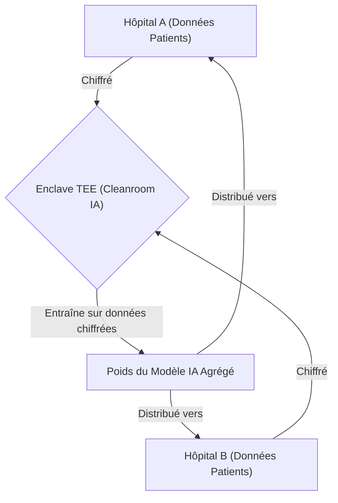
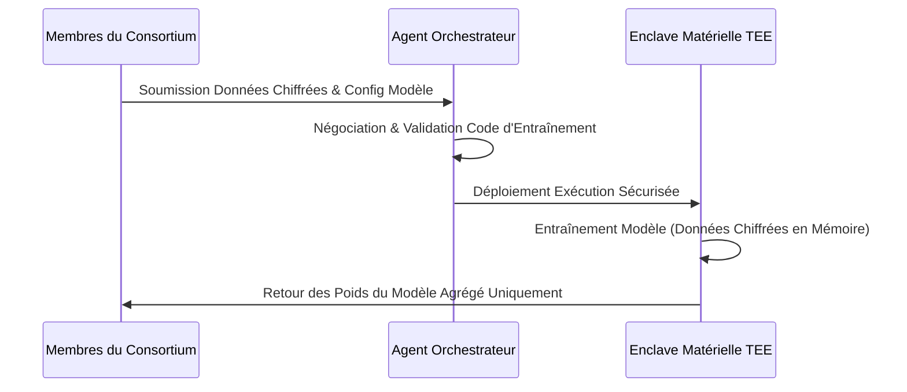

<!-- markdownlint-disable MD009 MD010 MD013 MD022 MD028 MD032 MD033 MD034 MD036 MD037 MD039 MD041 MD058 MD060 -->

[ 🇬🇧 English Version ](./README.md)

# Agentic Data Cleanroom

> **Résumé exécutif :** Une infrastructure de Cleanroom sécurisée opérée par des agents IA autonomes utilisant des environnements d'exécution de confiance (TEE) et du calcul multi-partite (MPC), permettant à des entités concurrentes d'entraîner collaborativement de grands modèles IA sans jamais exposer leurs données brutes.

---

## 1. Aperçu visuel & Effet Wahou

## 2. La thèse contrariante (Peter Thiel Style)

**La croyance populaire :** L'apprentissage fédéré classique (Federated Learning) ou de simples accords de partage de données suffisent pour l'entraînement collaboratif de modèles IA entre entreprises.
**La vérité cachée :** Les concurrents ne feront jamais véritablement confiance à l'apprentissage fédéré en raison des risques de rétro-ingénierie ; des garanties cryptographiques matérielles absolues (TEE + MPC) orchestrées par des agents IA impartiaux sont obligatoires pour la fusion de données multi-parties à fort enjeu.

## 3. Le problème & La cible

**Modèle économique :** B2B
**Cible précise :** Consortiums industriels, hôpitaux et institutions financières cherchant à collaborer sur l'entraînement d'IA spécialisées mais refusant catégoriquement de partager leurs données brutes propriétaires.
**La douleur urgente :** L'incapacité d'entraîner des modèles de langage massifs (LLM) ou des modèles du monde (World Models) spécialisés en raison du cloisonnement des données, entraînant des performances IA inférieures et des coûts d'opportunité colossaux.

## 4. Architecture technique & Plomberie

## 5. Modèle économique & Viabilité financière

| Métrique                    | Valeur                                                                                                         |
| --------------------------- | -------------------------------------------------------------------------------------------------------------- |
| Structure de prix           | Frais d'installation élevés par projet + frais récurrents d'accès à la plateforme basés sur le temps de calcul |
| Objectif 12 mois            | 4 projets majeurs de consortium (à 50 000€/projet)                                                             |
| Calcul du CA (Target 100k€) | 4 projets \* 50 000€ = 200 000€ de revenus annuels récurrents                                                  |
| Marge brute estimée         | 70%                                                                                                            |

## 6. Moteur de distribution & Fossé défensif (Moat)

**Stratégie d'acquisition :** Ventes B2B directes et haut de gamme, ciblant des consortiums verticaux spécifiques (ex: réseaux de partage de données de santé).
**Moat (Barrière à l'entrée) :** Exploiter efficacement des TEE sécurisés à grande échelle pour le deep learning est un défi d'infrastructure massif ; l'intégration complexe de la sécurité matérielle avec l'orchestration d'agents crée une barrière technique hautement défendable.

## 7. Grille d'évaluation détaillée

| Critère                           | Score VC (/100) | Score Terrain (/100) |
| --------------------------------- | --------------- | -------------------- |
| Thèse & Monopole / Urgence        | 22 / 25         | 21 / 25              |
| Moat / Résistance aux LLM natifs  | 24 / 25         | 24 / 25              |
| Scalabilité / Friction d'adoption | 20 / 25         | 18 / 25              |
| Unit Economics / ROI direct       | 22 / 25         | 22 / 25              |
| **TOTAL**                         | **88 / 100**    | **85 / 100**         |

> **Verdict VC :** Agentic Data Cleanroom innove dans l'espace de collaboration multi-agents B2B en résolvant le déficit de confiance inhérent entre des organisations concurrentes. L'exploitation d'enclaves cryptographiques et de l'apprentissage fédéré garantit une exposition nulle des connaissances tout en permettant aux agents de négocier et d'apprendre. Cette couche d'infrastructure crée de puissants effets de réseau et une forte rétention une fois adoptée.
> **Verdict Terrain :** Bien que l'entraînement collaboratif d'IA soit très recherché, former des consortiums prend du temps, réduisant légèrement l'urgence immédiate des ventes (21/25). La combinaison du matériel TEE et de la cryptographie MPC crée un fossé impénétrable face à l'IA générique (24/25). L'intégration d'infrastructures complexes cause de fortes frictions (18/25), mais la tarification premium pour les entreprises sécurise un ROI à long terme (22/25).
