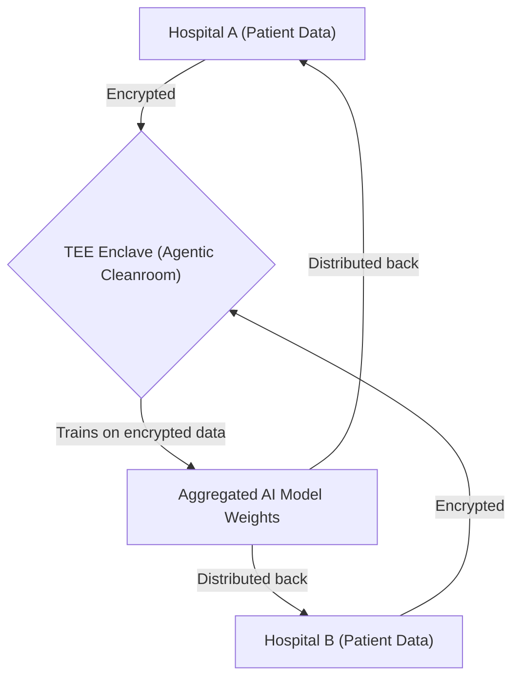
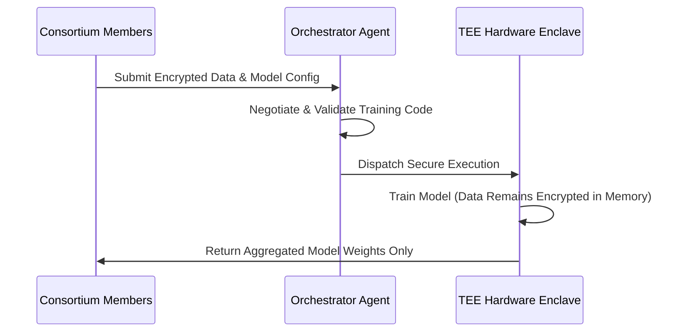

<!-- markdownlint-disable MD009 MD010 MD013 MD022 MD028 MD032 MD033 MD034 MD036 MD037 MD039 MD041 MD058 MD060 -->

[ 🇫🇷 Version Française ](./README.fr.md)

# Agentic Data Cleanroom

> **Executive Summary:** A Secure Data Cleanroom infrastructure operated by autonomous AI agents using Trusted Execution Environments (TEEs) and Multi-Party Computation (MPC), enabling competing entities to collaboratively train large AI models without ever exposing raw data.

---

## 1. Visual Overview & Wow Effect

## 2. Contrarian Thesis (Peter Thiel Style)

**Popular Belief:** Traditional Federated Learning or simple data-sharing agreements are sufficient for collaborative AI model training among enterprises.
**Hidden Truth:** Competitors will never truly trust Federated Learning due to reverse engineering risks; absolute cryptographic hardware guarantees (TEEs + MPC) orchestrated by impartial AI agents are mandatory for high-stakes, multi-party data fusion.

## 3. Problem & Target Market

**Business Model:** B2B
**Target Audience:** Industrial consortiums, hospitals, and financial institutions looking to collaborate on specialized AI training while flatly refusing to share raw proprietary data.
**Urgent Pain Point:** The inability to train specialized Large Language Models (LLMs) or World Models due to data siloing, resulting in inferior AI performance and huge opportunity costs.

## 4. Technical Architecture & Infrastructure

## 5. Business Model & Financial Viability

| Metric                 | Value                                                                                   |
| ---------------------- | --------------------------------------------------------------------------------------- |
| Pricing Structure      | High-ticket per-project setup fee + recurring platform access fee based on compute time |
| 12-Month Target        | 4 major consortium projects (at 50,000€/project)                                        |
| Revenue Formula        | 4 projects \* 50,000€ = 200,000€ ARR                                                    |
| Estimated Gross Margin | 70%                                                                                     |

## 6. Distribution Engine & Moat

**Acquisition Strategy:** High-touch enterprise sales, targeting specific vertical consortiums (e.g., healthcare data sharing networks).
**Moat (Defensibility):** Operating secure TEEs efficiently at scale for deep learning is a massive infrastructure challenge; the complex integration of hardware security with agent orchestration creates a highly defensible technical moat.

## 7. Detailed Evaluation Grid

| Criterion                   | VC Score (/100) | Market Score (/100) |
| --------------------------- | --------------- | ------------------- |
| Thesis & Monopoly / Urgency | 22 / 25         | -- / 25             |
| Moat / LLM Immunity         | 24 / 25         | -- / 25             |
| Scalability / UX Friction   | 20 / 25         | -- / 25             |
| Unit Economics / ROI        | 22 / 25         | -- / 25             |
| **TOTAL**                   | **88 / 100**    | **-- / 100**        |

> **VC Verdict:** Agentic Data Cleanroom pioneers the B2B multi-agent collaboration space by solving the inherent trust deficit between competing organizations. Leveraging cryptographic enclaves and federated learning guarantees zero knowledge exposure while allowing agents to negotiate and learn. This infrastructure layer creates strong network effects and significant lock-in once adopted.
> **Market Verdict:** Pending evaluation.
