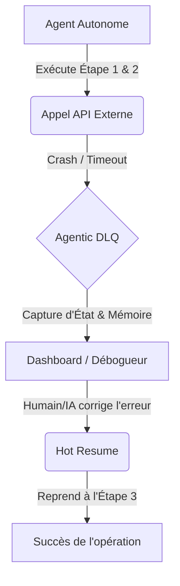

<!-- markdownlint-disable MD013 MD033 MD060 MD039 MD041 MD032 MD010 MD009 MD022 MD036 MD028 MD037 -->

[🇬🇧 English Version](./README.md)

# Agentic DLQ

> **Executive Summary:** Une infrastructure de "Dead Letter Queue" (DLQ) spécialisée pour les flux agentiques, capturant l'état d'exécution complet en cas d'échec pour permettre le débogage et la reprise à chaud (hot-resume), évitant le gaspillage de tokens et les réinitialisations catastrophiques.

---

## 1. Aperçu visuel & Effet Wahou

## 2. La thèse contrariante

> **La croyance populaire :** Lorsqu'un agent IA échoue, il suffit de réécrire le prompt et de recommencer toute la tâche depuis le début.
> **La vérité cachée :** À mesure que les agents passent du simple chat à des flux de travail autonomes complexes à plusieurs étapes, recommencer à zéro devient économiquement non viable (gaspillage de tokens) et opérationnellement désastreux. Tout comme les files de messages avaient besoin de DLQ pour des systèmes distribués fiables, les frameworks agentiques nécessitent des mécanismes de sauvegarde d'état pour la récupération après panne sans perdre le raisonnement intermédiaire.

## 3. Le problème & La cible

**Modèle économique :** SaaS B2B et Infrastructure.
**Cible précise :** Les équipes d'ingénierie, les ingénieurs MLOps et les plateformes RPA déployant des agents autonomes complexes en production.
**La douleur urgente :** Lorsqu'un agent autonome échoue de manière inattendue ou "plante" au milieu d'une tâche complexe (ex: flux asynchrones, appels d'API multiples), son état d'exécution et son contexte de raisonnement sont perdus. Cela oblige à recommencer toute la tâche depuis le début, ce qui entraîne un gaspillage massif de tokens, des échecs non résolus et une incapacité à déboguer efficacement les erreurs en production.

## 4. Architecture technique & Plomberie

Le système agit comme un middleware enveloppant la couche d'exécution de l'agent. En cas de défaillance, il capture instantanément l'état complet de l'agent : historique des prompts, variables d'environnement, état de l'API et mémoire de travail. Ce "dump" est stocké en toute sécurité. Une fois qu'un ingénieur (ou un agent réparateur) a corrigé l'erreur externe, le système DLQ réinjecte l'état exact dans le framework de l'agent, exécutant une reprise à chaud ("hot-resume") exactement là où il s'était arrêté.

## 5. Modèle économique & Viabilité financière

| Métrique                        | Valeur                                                                                    |
| :------------------------------ | :---------------------------------------------------------------------------------------- |
| **Structure de prix**           | Tarification à l'usage (par Go d'état capturé) + Frais de plateforme de base (299$/mois). |
| **Objectif 12 mois**            | 30 équipes d'ingénierie déployant des flux de travail agentiques à grande échelle.        |
| **Calcul du CA (Target 100k€)** | 30 équipes _ ~300$/mois _ 12 mois = 108 000$ ARR.                                         |
| **Marge brute estimée**         | 80% (Les coûts de stockage et de routage sont très optimisés).                            |

## 6. Moteur de distribution & Fossé défensif

**Stratégie d'acquisition :** Adoption centrée sur les développeurs via un SDK open-source qui s'intègre directement dans les frameworks populaires comme LangChain, CrewAI et AutoGPT.
**Moat (Barrière à l'entrée) :** Intégration profonde dans l'état d'exécution des frameworks d'agents. Bien que les LLMs soient sans état par nature, cette infrastructure fournit la gestion d'état et d'interruption manquante. Un LLM ne peut pas "mettre en pause" son propre environnement technique défaillant ; construire la plomberie robuste pour capturer les crashs et orchestrer les reprises à chaud est un jeu d'infrastructure, totalement hors de portée d'une simple requête de modèle d'OpenAI.

## 7. Grille d'évaluation détaillée

| Critère                               | Score VC (/100) | Score Terrain (/100) |
| :------------------------------------ | :-------------: | :------------------: |
| **Thèse & Monopole / Urgence**        |     -- / 25     |       -- / 25        |
| **Moat / Résistance aux LLM natifs**  |     -- / 25     |       -- / 25        |
| **Scalabilité / Friction d'adoption** |     -- / 25     |       -- / 25        |
| **Unit Economics / ROI direct**       |     -- / 25     |       -- / 25        |
| **TOTAL**                             |  **-- / 100**   |     **-- / 100**     |

> **Verdict VC :** En attente d'évaluation.
> **Verdict Terrain :** En attente d'évaluation.
