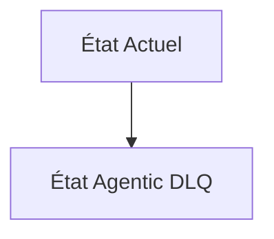
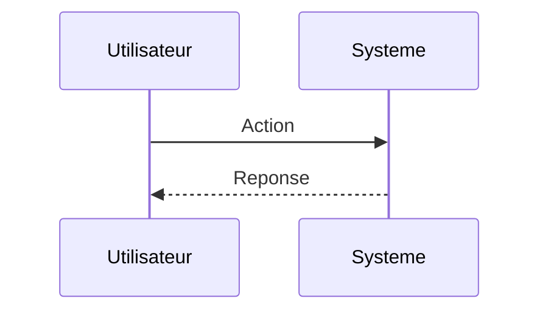

<!-- markdownlint-disable MD009 MD010 MD013 MD022 MD028 MD032 MD033 MD034 MD036 MD037 MD039 MD041 MD060 -->

[ 🇬🇧 English Version ](./README.md)

# Agentic DLQ

> **Résumé exécutif :** Une infrastructure de "Dead Letter Queue" (DLQ) spécialement conçue pour les flux agentiques. En cas de défaillance, le système capture instantanément l'état complet de l'agent (historique des prompts, variables d'environnement, état de l'API, mémoire de travail). Ce "dump" est stocké en toute sécurité, permettant à un ingénieur ou à un agent réparateur de corriger l'erreur, puis de relancer l'agent (hot-resume) exactement là où il s'était arrêté.

---

## 1. Aperçu visuel & Effet Wahou

## 2. La thèse contrariante (Peter Thiel Style)

**La croyance populaire :** Les solutions généralistes IA peuvent résoudre ce problème.

**La vérité cachée :** Les LLMs sont par nature sans état (stateless) et ne disposent pas d'un système de gestion de l'exécution ou d'interruption. Un LLM ne peut pas "mettre en pause" son propre environnement technique défaillant pour permettre une intervention externe. Capturer un crash applicatif et orchestrer un hot-resume nécessite une tuyauterie infrastructurelle externe robuste, totalement hors de portée d'une simple requête de modèle.

## 3. Le problème & La cible

**Modèle économique :** B2B

**Cible précise :** Les équipes d'ingénierie, les ingénieurs MLOps et les plateformes RPA déployant des agents autonomes complexes en production.

**La douleur urgente :** Lorsqu'un agent autonome échoue de manière inattendue ou "plante" au milieu d'une tâche complexe (ex: flux asynchrones, appels d'API multiples), son état d'exécution et son contexte de raisonnement sont perdus. Cela oblige à recommencer toute la tâche depuis le début, ce qui entraîne un gaspillage massif de tokens, des échecs non résolus et une incapacité à déboguer efficacement les erreurs en production.

## 4. Architecture technique & Plomberie

## 5. Modèle économique & Viabilité financière

| Métrique                    | Valeur                        |
| --------------------------- | ----------------------------- |
| Structure de prix           | Abonnement SaaS               |
| Objectif 12 mois            | 10 clients                    |
| Calcul du CA (Target 100k€) | 10 clients \* 10k€/an = 100k€ |
| Marge brute estimée         | 80%                           |

## 6. Moteur de distribution & Fossé défensif (Moat)

**Stratégie d'acquisition :** Vente directe B2B

**Moat (Barrière à l'entrée) :**

## 7. Grille d'évaluation détaillée

| Critère                           | Score VC (/100) | Score Terrain (/100) |
| --------------------------------- | --------------- | -------------------- |
| Thèse & Monopole / Urgence        | -- / 25         | -- / 25              |
| Moat / Résistance aux LLM natifs  | -- / 25         | -- / 25              |
| Scalabilité / Friction d'adoption | -- / 25         | -- / 25              |
| Unit Economics / ROI direct       | -- / 25         | -- / 25              |
| **TOTAL**                         | **-- / 100**    | **-- / 100**         |

> **Verdict VC :** En attente d'évaluation.

> **Verdict Terrain :** En attente d'évaluation.
