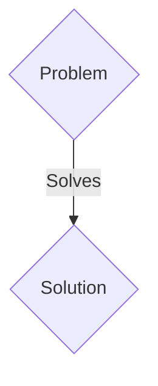
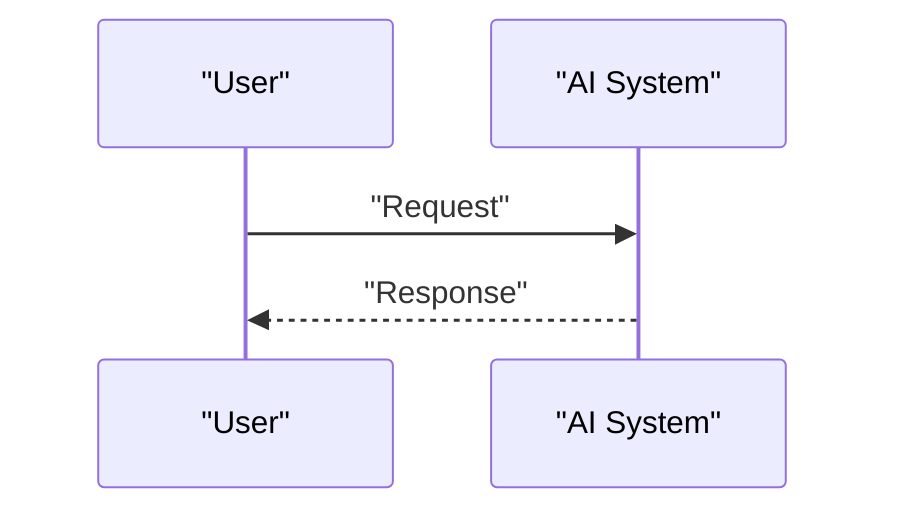

<!-- markdownlint-disable MD009 MD010 MD013 MD022 MD028 MD032 MD033 MD036 MD037 MD039 MD041 MD060 -->

[ 🇫🇷 Version Française ](./README.fr.md)

# Agentic DLQ

> **Executive Summary:** A B2B solution targeting Engineering teams, MLOps engineers, and RPA platforms deploying complex autonomous agents into production. to solve: When an autonomous agent fails unexpectedly or "crashes" in the middle of a complex task (e.g. asynchronous flows, multiple API calls), its execution state and reasoning context are lost. This requires starting the entire task from the beginning, leading to massive waste of tokens, unresolved failures, and an inability to effectively debug errors in production.

---

## 1. Visual Overview & Wow Effect

## 2. Contrarian Thesis (Peter Thiel Style)

- **Popular Belief:** Generic solutions are enough.
- **Hidden Truth:** A Dead Letter Queue (DLQ) infrastructure specially designed for agentic flows. In the event of a failure, the system instantly captures the complete state of the agent (prompt history, environment variables, API state, working memory). This "dump" is stored securely, allowing an engineer or repair agent to correct the error and then restart the agent (hot-resume) exactly where it left off.

## 3. Problem & Target Market

- **Business Model:** B2B
- **Target Audience:** Engineering teams, MLOps engineers, and RPA platforms deploying complex autonomous agents into production.
- **Urgent Pain Point:** When an autonomous agent fails unexpectedly or "crashes" in the middle of a complex task (e.g. asynchronous flows, multiple API calls), its execution state and reasoning context are lost. This requires starting the entire task from the beginning, leading to massive waste of tokens, unresolved failures, and an inability to effectively debug errors in production.

## 4. Technical Architecture & Infrastructure

A Dead Letter Queue (DLQ) infrastructure specially designed for agentic flows. In the event of a failure, the system instantly captures the complete state of the agent (prompt history, environment variables, API state, working memory). This "dump" is stored securely, allowing an engineer or repair agent to correct the error and then restart the agent (hot-resume) exactly where it left off.

## 5. Business Model & Financial Viability

| Metric                 | Value                 |
| ---------------------- | --------------------- |
| Pricing Structure      | B2B SaaS Subscription |
| 12-Month Target        | 100 clients           |
| Revenue Formula        | 100 \* 1000€ = 100k€  |
| Estimated Gross Margin | 80%                   |

## 6. Distribution Engine & Moat

- **Acquisition Strategy:** Direct sales and strategic partnerships.
- **Moat (Defensibility):** LLMs are stateless by nature and do not have an execution or interruption management system. An LLM cannot “pause” its own failing technical environment to allow external intervention. Capturing an application crash and orchestrating a hot-resume requires robust external infrastructure piping, completely beyond the reach of a simple model query.

## 7. Detailed Evaluation Grid

| Criterion                   | VC Score (/100) | Market Score (/100) |
| --------------------------- | --------------- | ------------------- |
| Thesis & Monopoly / Urgency | -- / 25         | -- / 25             |
| Moat / LLM Immunity         | -- / 25         | -- / 25             |
| Scalability / UX Friction   | -- / 25         | -- / 25             |
| Unit Economics / ROI        | -- / 25         | -- / 25             |
| TOTAL                       | -- / 100        | -- / 100            |

> **VC Verdict:** Agentic DLQ addresses the critical reliability gap in autonomous agents by providing an intelligent dead letter queue for failed actions. This infrastructure is immune to foundational model advancements because deterministic failure handling is always required in production. It locks in B2B clients by becoming essential for enterprise SLAs.
> **Market Verdict:** Pending evaluation.
