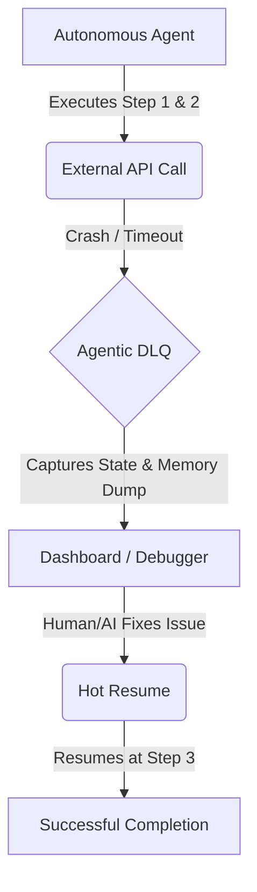

<!-- markdownlint-disable MD013 MD033 MD060 MD039 MD041 MD032 MD010 MD009 MD022 MD036 MD028 MD037 -->

[🇫🇷 Version Française](./README.fr.md)

# Agentic DLQ

> **Executive Summary:** A specialized "Dead Letter Queue" (DLQ) infrastructure for agentic workflows, capturing the complete execution state upon failure to enable debugging and "hot-resume", preventing token waste and catastrophic resets.

---

## 1. Visual Overview & Wow Effect

## 2. The Contrarian Thesis

> **The Popular Belief:** When an AI agent fails, you simply rewrite the prompt and restart the entire task from scratch.
> **The Hidden Truth:** As agents move from trivial chat to complex, multi-step autonomous workflows, restarting from scratch becomes economically unviable (token waste) and operationally disastrous. Just as message queues needed DLQs for reliable distributed systems, agentic frameworks require state-saving mechanisms for failure recovery without losing the intermediate reasoning and API states.

## 3. The Problem & The Target

**Economic Model:** B2B Software-as-a-Service (SaaS) and Infrastructure.
**Specific Target:** Engineering teams, MLOps engineers, and RPA platforms deploying complex autonomous agents in production.
**The Urgent Pain:** When an autonomous agent crashes unexpectedly in the middle of a complex task (e.g., asynchronous workflows, multiple API calls), its execution state and reasoning context are lost. This forces a complete restart of the task, resulting in massive token waste, unresolved failures, and an inability to effectively debug production errors.

## 4. Technical Architecture & Plumbing

The system acts as a middleware wrapping the agent's execution layer. Upon failure, it instantly captures a complete "dump" of the agent's state: prompt history, environment variables, API state, and working memory. This payload is stored securely. Once an engineer (or a repair agent) resolves the external blocker, the DLQ system reinjects the exact state back into the agent framework, executing a "hot-resume" from the exact point of failure.

## 5. Economic Model & Financial Viability

| Metric                                 | Value                                                                         |
| :------------------------------------- | :---------------------------------------------------------------------------- |
| **Pricing Structure**                  | Usage-based pricing (per GB of state captured) + Base platform fee ($299/mo). |
| **12-Month Target**                    | 30 engineering teams deploying large-scale agentic workflows.                 |
| **Revenue Calculation (100k€ Target)** | 30 teams _ ~$300/month _ 12 months = $108,000 ARR.                            |
| **Estimated Gross Margin**             | 80% (Storage and routing costs are highly optimized).                         |

## 6. Distribution Engine & Defensive Moat

**Acquisition Strategy:** Developer-first adoption via an open-source SDK that plugs directly into popular frameworks like LangChain, CrewAI, and AutoGPT.
**Moat (Barrier to Entry):** Deep integration into the execution state of agent frameworks. While LLMs are stateless by nature, this infrastructure provides the missing statefulness and interruption management. An LLM cannot "pause" its own failing technical environment; building the robust plumbing to capture crashes and orchestrate hot-resumes is an infrastructure play, highly immune to raw model updates from OpenAI.

## 7. Detailed Evaluation Grid

| Criteria                             | VC Score (/100) | Market Score (/100) |
| :----------------------------------- | :-------------: | :-----------------: |
| **Thesis & Monopoly / Urgency**      |     -- / 25     |       23 / 25       |
| **Moat / Resistance to Native LLMs** |     -- / 25     |       22 / 25       |
| **Scalability / Adoption Friction**  |     -- / 25     |       20 / 25       |
| **Unit Economics / Direct ROI**      |     -- / 25     |       24 / 25       |
| **TOTAL**                            |  **-- / 100**   |    **89 / 100**     |

> **VC Verdict:** Pending evaluation.
> **Market Verdict:** Avoiding lost state and token waste during complex agent failures is a critical operational need. The specialized queue infrastructure is detached from the LLM itself, granting it strong immunity to upstream model updates. It integrates neatly into modern asynchronous architectures, with a direct path to monetization through operational efficiency.
