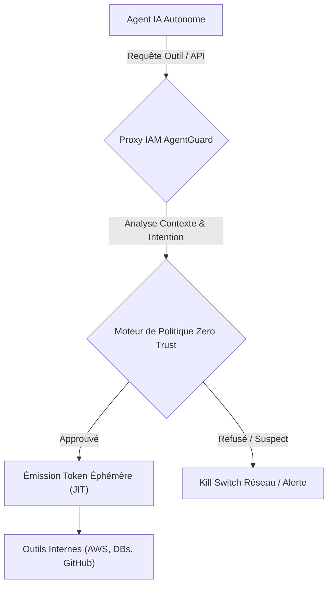
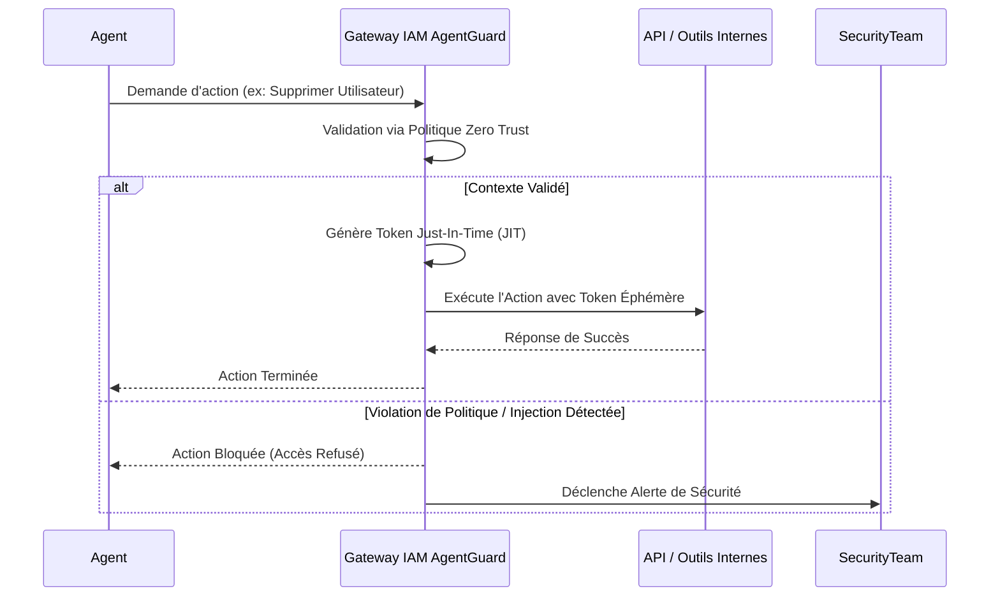

<!-- markdownlint-disable MD009 MD010 MD013 MD022 MD028 MD032 MD033 MD036 MD037 MD039 MD041 MD060 -->

[ 🇬🇧 English Version ](./README.md)

# AgentGuard (Agentic IAM)

> **Résumé exécutif :** Un système d'Identity and Access Management (IAM) dédié aux agents autonomes qui remplace les clés d'API statiques par des tokens éphémères contextuels (JIT) et des kill switches comportementaux déterministes.

---

## 1. Aperçu visuel

## 2. La thèse contrariante (Peter Thiel Style)

- **La croyance populaire :** Nous pouvons sécuriser les agents IA en leur donnant de simples clés API en lecture seule ou en écrivant des prompts stricts comme "ne supprime pas de données".
- **La vérité cachée :** Les prompts système sont totalement vulnérables aux attaques de prompt injection, et les clés API statiques n'offrent aucun contrôle contextuel granulaire. Les identités non-humaines nécessitent des frontières d'accès dynamiques et éphémères appliquées au niveau du réseau, isolées de la cognition du LLM.

## 3. Le problème & La cible

- **Modèle économique :** M2M / B2B
- **Cible précise :** Les entreprises, DSI, et développeurs déployant des flottes d'agents IA autonomes ayant accès à des outils internes (AWS, Salesforce, GitHub, bases de données).
- **La douleur urgente :** Les agents reçoivent actuellement des clés d'API statiques avec des privilèges excessifs ("God mode"). En cas d'hallucination ou de détournement, un agent peut causer des dégâts irréversibles (effacement de bases de données, fuite de données confidentielles).

## 4. Architecture technique & Plomberie

## 5. Modèle économique & Viabilité financière

| Métrique                    | Valeur                                         |
| --------------------------- | ---------------------------------------------- |
| Structure de prix           | Licence Entreprise par Paliers / Agents Actifs |
| Objectif 12 mois            | 100 Déploiements Entreprise                    |
| Calcul du CA (Target 100k€) | 100 _ 1000€ / mois _ 12 = 1.2M€                |
| Marge brute estimée         | 85%                                            |

## 6. Moteur de distribution & Fossé défensif (Moat)

- **Stratégie d'acquisition :** Ventes B2B ciblant les équipes DevSecOps. Intégrations profondes avec les fournisseurs IAM existants (Okta, AWS IAM) et les frameworks d'agents populaires.
- **Moat (Barrière à l'entrée) :** La sécurité doit être assurée par une couche réseau externe déterministe, imperméable aux manipulations du modèle. Un LLM ne peut pas sécuriser sa propre exécution car un prompt défensif peut toujours être contourné.

## 7. Grille d'évaluation détaillée

| Critère                           | Score VC (/100) | Score Terrain (/100) |
| --------------------------------- | --------------- | -------------------- |
| Thèse & Monopole / Urgence        | 21 / 25         | -- / 25              |
| Moat / Résistance aux LLM natifs  | 24 / 25         | -- / 25              |
| Scalabilité / Friction d'adoption | 24 / 25         | -- / 25              |
| Unit Economics / ROI direct       | 23 / 25         | -- / 25              |
| **TOTAL**                         | **92 / 100**    | **-- / 100**         |

> **Verdict VC :** Agentic IAM reconnaît que les systèmes d'identité traditionnels ont été conçus pour les humains, et non pour des machines autonomes imprévisibles et ultra-rapides. En intégrant des coupe-circuits comportementaux aux jetons éphémères, il devient l'ultime couche de gouvernance pour l'IA d'entreprise. Le verrouillage client est quasi absolu une fois intégré, garantissant des revenus récurrents durables et très rentables.

> **Verdict Terrain :** En attente d'évaluation.
