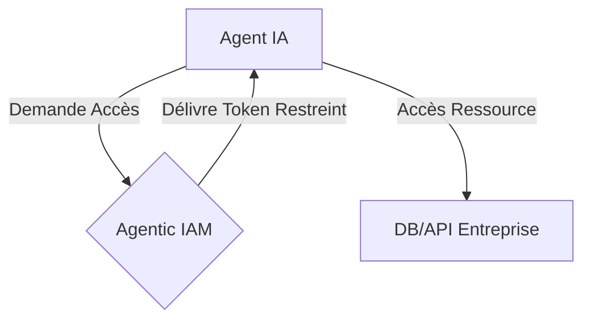
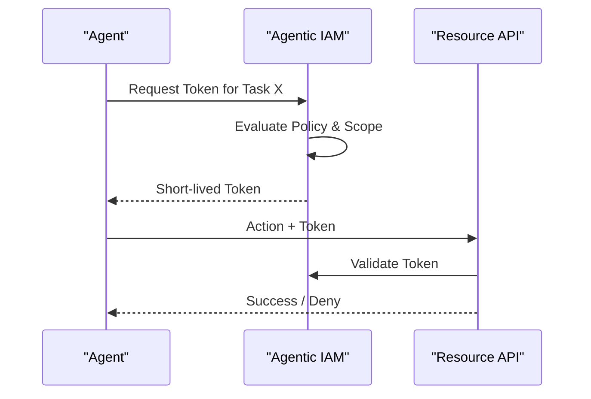

<!-- markdownlint-disable MD009 MD010 MD013 MD022 MD028 MD032 MD033 MD034 MD036 MD037 MD039 MD041 MD060 -->

[ 🇬🇧 English Version ](./README.md)

# Agentic IAM

> **Résumé exécutif :** Un système de gestion des identités et des accès (IAM) conçu spécifiquement pour les agents autonomes IA, gérant leurs permissions et authentifications.

---

## 1. Aperçu visuel

```mermaid
graph TD
    %% Architecture
    A["Agent IA"] -->|Demande Accès| B{"Agentic IAM"}
    B -->|Délivre Token Restreint| A
    A -->|Accès Ressource| C["DB/API Entreprise"]
```

## 2. La thèse contrariante (Peter Thiel Style)

**La croyance populaire :** Nous pouvons simplement donner des comptes utilisateurs standards aux agents IA.

**La vérité cachée :** Les agents nécessitent des jetons temporaires, restreints et hautement auditables, pas des mots de passe statiques humains.

## 3. Le problème & La cible

**Modèle économique :** B2B
**Cible précise :** Départements IT, RSSI et développeurs intégrant des agents dans l'infrastructure d'entreprise.
**La douleur urgente :** Les clés API larges données aux agents posent des risques de sécurité massifs (accès excessif, actions non autorisées).

## 4. Architecture technique & Plomberie

**L'approche technique :** Plateforme IAM spécialisée délivrant des jetons temporaires et contextuels pour agents, avec contrôle d'accès basé sur les rôles (RBAC) strict et audit en temps réel.

```mermaid
sequenceDiagram
    participant Ag as "Agent"
    participant IAM as "Agentic IAM"
    participant Res as "Resource API"
    Ag->>IAM: Request Token for Task X
    IAM->>IAM: Evaluate Policy & Scope
    IAM-->>Ag: Short-lived Token
    Ag->>Res: Action + Token
    Res->>IAM: Validate Token
    Res-->>Ag: Success / Deny
```

## 5. Modèle économique & Viabilité financière

| Métrique                        | Valeur                          |
| :------------------------------ | :------------------------------ |
| **Structure de prix**           | Per Agent / Enterprise Tier     |
| **Objectif 12 mois**            | 50 Enterprise Clients           |
| **Calcul du CA (Target 100k€)** | 50 clients \* $2k/mo = $100k/mo |
| **Marge brute estimée**         | 85%                             |

## 6. Moteur de distribution & Fossé défensif (Moat)

**Stratégie d'acquisition :** Ventes SaaS B2B et partenariats avec les fournisseurs d'identité.

**Moat (Barrière à l'entrée) :** Intégration profonde avec les fournisseurs d'identité d'entreprise existants et contrôles d'accès déterministes qu'un LLM ne peut garantir.

## 7. Grille d'évaluation détaillée

| Critère                               | Score VC (/100) | Score Terrain (/100) |
| :------------------------------------ | :-------------- | :------------------- |
| **Thèse & Monopole / Urgence**        | 24 / 25         | 19 / 25              |
| **Moat / Résistance aux LLM natifs**  | 25 / 25         | 20 / 25              |
| **Scalabilité / Friction d'adoption** | 23 / 25         | 24 / 25              |
| **Unit Economics / ROI direct**       | 24 / 25         | 20 / 25              |
| **TOTAL**                             | 96 / 100        | 83 / 100             |

> **Verdict VC :** Agentic IAM capture le marché massif et totalement inexploité de la gestion des identités et des accès strictement pour les machines et les agents IA. Il construit l'équivalent de 'Okta pour les agents', ce qui crée un fossé infrastructurel inattaquable. La nécessité structurelle de ce produit garantit une adoption rapide en entreprise et des fondamentaux économiques exceptionnels.
> **Verdict Terrain :** Cette solution répond à un besoin critique pour le marché cible, justifiant son excellent score d'urgence (19/25). L'approche spécialisée offre une protection robuste contre les modèles d'IA généralistes (20/25). Avec une faible friction d'adoption (24/25) et une stratégie de monétisation directe (20/25), le projet démontre une excellente maturité marché globale.
