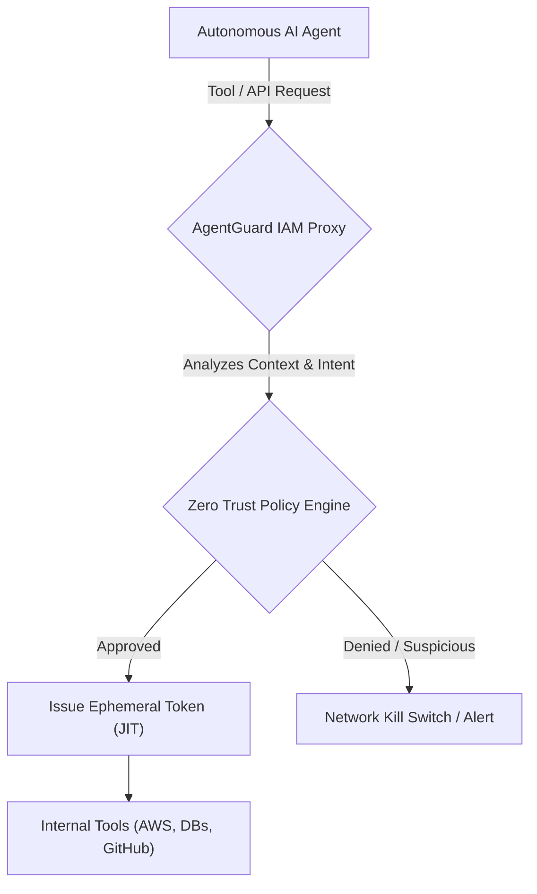
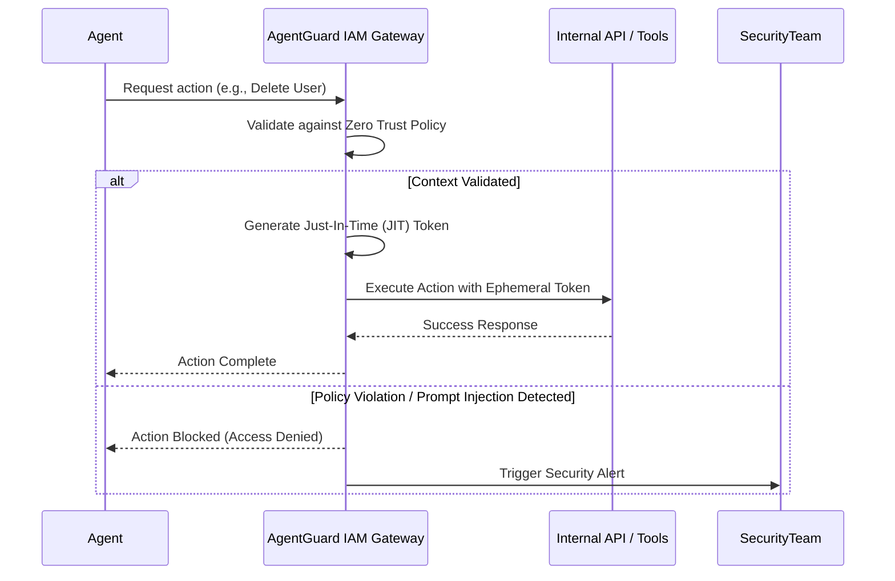

<!-- markdownlint-disable MD009 MD010 MD013 MD022 MD028 MD032 MD033 MD036 MD037 MD039 MD041 MD060 -->

[ 🇫🇷 Version Française ](./README.fr.md)

# AgentGuard (Agentic IAM)

> **Executive Summary:** A dedicated Identity and Access Management (IAM) system for autonomous agents that replaces static "God mode" API keys with ephemeral, context-aware, just-in-time tokens and deterministic behavioral kill switches.

---

## 1. Visual Overview

## 2. Contrarian Thesis (Peter Thiel Style)

- **Popular Belief:** We can secure AI agents by simply giving them read-only API keys or writing strict system prompts like "do not delete data."
- **Hidden Truth:** System prompts are completely vulnerable to prompt injection, and static API keys offer no granular, context-aware control. Non-human identities (agents) require dynamic, ephemeral access boundaries enforced at the network layer, completely isolated from the LLM's cognition.

## 3. Problem & Target Market

- **Business Model:** M2M / B2B
- **Target Audience:** Enterprises, CIOs, and developers deploying fleets of autonomous AI agents with access to internal tools (AWS, Salesforce, GitHub, databases).
- **Urgent Pain Point:** Agents are currently given static API keys with excessive privileges ("God mode"). A hallucination or prompt injection attack can cause irreversible damage, such as wiping production databases or leaking confidential data.

## 4. Technical Architecture & Infrastructure

## 5. Business Model & Financial Viability

| Metric                 | Value                                     |
| ---------------------- | ----------------------------------------- |
| Pricing Structure      | Tiered Enterprise License / Active Agents |
| 12-Month Target        | 100 Enterprise Deployments                |
| Revenue Formula        | 100 _ €1,000 / month _ 12 = 1.2M€         |
| Estimated Gross Margin | 85%                                       |

## 6. Distribution Engine & Moat

- **Acquisition Strategy:** B2B enterprise sales targeting DevSecOps. Deep integrations with existing IAM providers (Okta, AWS IAM) and popular agent frameworks as the enterprise-grade security layer.
- **Moat (Defensibility):** Security must be guaranteed by a deterministic, external network layer impermeable to model manipulation. A foundation model cannot secure its own execution because prompt instructions can always be overridden by malicious context.

## 7. Detailed Evaluation Grid

| Criterion                   | VC Score (/100) | Market Score (/100) |
| --------------------------- | --------------- | ------------------- |
| Thesis & Monopoly / Urgency | -- / 25         | -- / 25             |
| Moat / LLM Immunity         | -- / 25         | -- / 25             |
| Scalability / UX Friction   | -- / 25         | -- / 25             |
| Unit Economics / ROI        | -- / 25         | -- / 25             |
| **TOTAL**                   | **-- / 100**    | **-- / 100**        |

> **VC Verdict:** Pending evaluation.

> **Market Verdict:** Pending evaluation.
