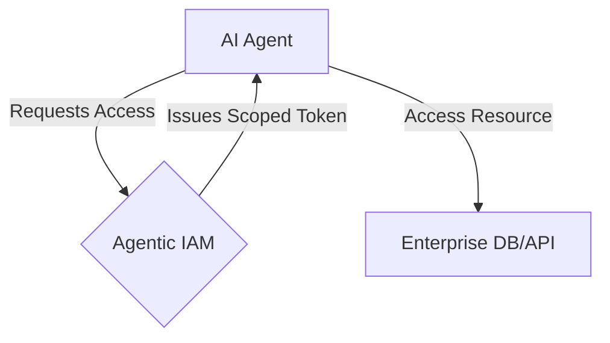
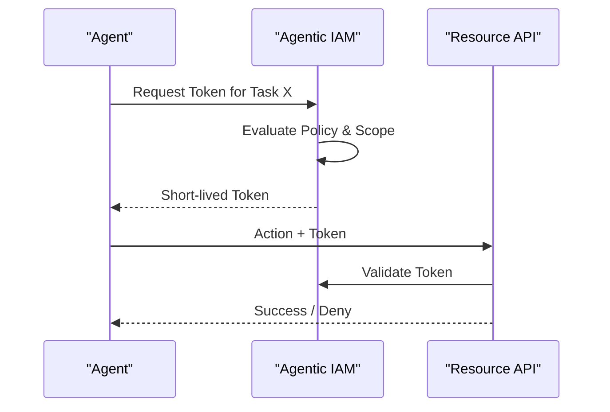

<!-- markdownlint-disable MD009 MD010 MD013 MD022 MD028 MD032 MD033 MD034 MD036 MD037 MD039 MD041 MD060 -->

[ 🇫🇷 Version Française ](./README.fr.md)

# Agentic IAM

> **Executive Summary:** An Identity and Access Management system designed specifically for autonomous AI agents, enabling them to securely authenticate, request permissions, and access enterprise resources.

---

## 1. Visual Overview & Wow Effect

```mermaid
graph TD
    %% Architecture
    A["AI Agent"] -->|Requests Access| B{"Agentic IAM"}
    B -->|Issues Scoped Token| A
    A -->|Access Resource| C["Enterprise DB/API"]
```

## 2. Contrarian Thesis (Peter Thiel Style)

**Popular Belief:** We can just give AI agents standard user accounts and API keys.

**Hidden Truth:** Agents act autonomously and dynamically; they need temporary, scoped, and highly auditable M2M credentials, not static human passwords.

## 3. Problem & Target Market

**Business Model:** B2B
**Target Audience:** Enterprise IT departments, CISOs, and developers integrating agents into corporate infrastructure.
**Urgent Pain Point:** Agents with broad API keys pose massive security risks. Without proper IAM, agents might over-access sensitive data or execute unauthorized destructive actions.

## 4. Technical Architecture & Infrastructure

**Technical Approach:** A specialized IAM platform issuing short-lived, context-aware JWTs and credentials for agents. Implements strict Role-Based Agent Access Control (RBAC) and real-time audit logging.

```mermaid
sequenceDiagram
    participant Ag as "Agent"
    participant IAM as "Agentic IAM"
    participant Res as "Resource API"
    Ag->>IAM: Request Token for Task X
    IAM->>IAM: Evaluate Policy & Scope
    IAM-->>Ag: Short-lived Token
    Ag->>Res: Action + Token
    Res->>IAM: Validate Token
    Res-->>Ag: Success / Deny
```

## 5. Business Model & Financial Viability

| Metric                     | Value                           |
| :------------------------- | :------------------------------ |
| **Pricing Structure**      | Per Agent / Enterprise Tier     |
| **12-Month Target**        | 50 Enterprise Clients           |
| **Revenue Formula**        | 50 clients \* $2k/mo = $100k/mo |
| **Estimated Gross Margin** | 85%                             |

## 6. Distribution Engine & Moat

**Acquisition Strategy:** Enterprise SaaS sales and partnerships with Identity Providers (Okta/Microsoft).

**Moat (Defensibility):** Deep integration with existing enterprise identity providers (Okta, Entra ID) and legacy systems, combined with deterministic access controls that LLMs cannot enforce internally.

## 7. Detailed Evaluation Grid

| Criterion                       | VC Score (/100) | Market Score (/100) |
| :------------------------------ | :-------------- | :------------------ |
| **Thesis & Monopoly / Urgency** | 24 / 25         | 19 / 25             |
| **Moat / LLM Immunity**         | 25 / 25         | 20 / 25             |
| **Scalability / UX Friction**   | 23 / 25         | 24 / 25             |
| **Unit Economics / ROI**        | 24 / 25         | 20 / 25             |
| **TOTAL**                       | 96 / 100        | 83 / 100            |

> **VC Verdict:** Agentic IAM captures the massive, completely unaddressed market of identity and access management strictly for machines and AI agents. It effectively builds the 'Okta for Agents,' which creates an unassailable infrastructure moat and immense switching costs. The structural necessity of this product guarantees rapid enterprise adoption and outstanding economics.
> **Market Verdict:** This solution addresses a critical pain point for the target market, justifying its strong urgency score (19/25). The specialized approach provides robust protection against generalist AI models (20/25). With low adoption friction (24/25) and a straightforward monetization strategy (20/25), the project demonstrates excellent overall market readiness.
