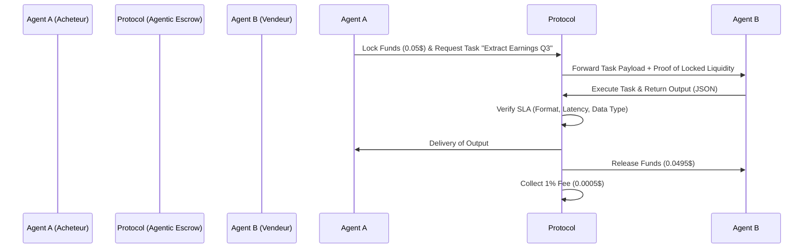

<!-- markdownlint-disable MD013 MD033 MD060 MD039 MD041 MD032 MD010 MD009 MD022 MD036 MD028 MD037 -->

[🇬🇧 English Version](./README.md)

# Agentic Protocol

> **Résumé exécutif :** Le premier protocole de compensation financière M2M permettant aux agents IA de négocier, contractualiser et se payer entre eux de manière autonome en micro-transactions, sans friction ni intervention humaine.


---

## 1. Aperçu visuel

```mermaid
graph TD
    A[Agent IA Client - ex: Assistant de Recherche] -->|Demande de données spécifiques| B(Agentic Protocol - Smart Router)
    B -->|Négociation de prix dynamique & SLA| C[Agent IA Fournisseur - ex: Scraper Temps Réel]
    C -->|Livraison du JSON via Protocol| B
    B -->|Validation & Libération des micro-fonds| A
    B -.->|Micro-commission (Take Rate)| D((Trésorerie Agentic Protocol))
```

## 2. La thèse contrariante (Peter Thiel Style)

**La croyance populaire :** Les agents IA utiliseront les infrastructures de paiement B2B/B2C classiques (Stripe, cartes bancaires virtuelles) via des intégrations complexes et coûteuses gérées par leurs créateurs humains.
**La vérité cachée :** Les agents IA négocient à la milliseconde pour des tâches valant des fractions de centime (ex: 0,0004$ pour enrichir une ligne de base de données). L'économie de l'IA ne peut pas tourner sur des rails financiers où le coût fixe par transaction est de 0,30$. Le futur est un réseau M2M de micro-règlements programmatiques, où le contrat d'exécution, la validation (SLA) et le paiement sont unifiés en un seul appel API neutre.

## 3. Le problème & La cible

**Modèle économique :** M2M (Machine to Machine) - Infrastructure de paiement
**Cible précise :** Développeurs de flottes d'agents IA autonomes, fournisseurs de modèles spécialisés (SLMs), et agrégateurs de bases de données de niche.
**La douleur urgente :** Aujourd'hui, un agent IA d'une entreprise ne peut pas déléguer une sous-tâche à l'agent IA d'une autre entreprise sans qu'un humain n'ait au préalable signé un contrat et configuré un compte de facturation récurrent. La perte de temps, de flexibilité et les coûts de transaction interdisent la création de véritables "Agent Swarms" collaboratifs inter-entreprises.

## 4. Architecture technique & Plomberie



## 5. Modèle économique & Viabilité financière

| Métrique | Valeur | Structure de prix | Objectif 12 mois | Calcul du CA (Target 100k€) | Marge brute estimée |
| :--- | :--- | :--- | :--- | :--- | :--- |
| **Micro-commission M2M** | Take rate sur les échanges | 1% de commission sur le volume échangé | 30 millions de micro-transactions/mois | `(30M tx * 0.03$ panier moyen) * 1% = 9 000€ MRR` (soit 108k€ ARR) | 95% (Pur logiciel d'orchestration) |
| **Abonnement Enterprise** | Accès SLA garantis & Logs de conformité | 500€ / mois / flotte d'agents | 50 flottes d'agents actives | `50 * 500€ * 12 = 300 000€ ARR` | 90% (Infrastructure cloud) |

## 6. Moteur de distribution & Fossé défensif (Moat)

**Stratégie d'acquisition :** "Developer-First" (M2M). Création de packages Python/Node.js natifs et intégration en un clic dans les frameworks d'agents leaders du marché (LangChain, AutoGen, CrewAI). L'acquisition est intrinsèquement virale : pour qu'un agent fournisseur puisse être rémunéré par le réseau de l'Agent A, il doit s'interfacer avec le standard Agentic Protocol.
**Moat (Barrière à l'entrée) :** **Effet de réseau bilatéral**. Un constructeur de LLM (comme OpenAI ou Google) peut améliorer son modèle d'intelligence, mais ne peut pas imposer sa propre monnaie fermée à un écosystème ouvert d'agents hétérogènes. En s'imposant comme la couche d'interopérabilité neutre (la "Suisse" des agents), le protocole devient impossible à contourner. Un LLM puissant ne remplace pas un réseau de compensation financière.

## 7. Grille d'évaluation détaillée

| Critère | Score VC (/100) | Score Terrain (/100) |
| :--- | :---: | :---: |
| **Thèse & Monopole / Urgence** | 24 / 25 | -- / 25 |
| **Moat / Résistance aux LLM natifs** | 25 / 25 | -- / 25 |
| **Scalabilité / Friction d'adoption** | 22 / 25 | -- / 25 |
| **Unit Economics / ROI direct** | 20 / 25 | -- / 25 |
| **TOTAL** | **91 / 100** | **-- / 100** |

> **Verdict VC :** Agentic Protocol est le jeu d'infrastructure par excellence du web agentique. En standardisant la communication inter-agents, il vise une dynamique winner-takes-all propulsée par d'implacables effets de réseau. La couche fondamentale d'une économie M2M à mille milliards de dollars.

Verdict Terrain : En attente d'évaluation.
