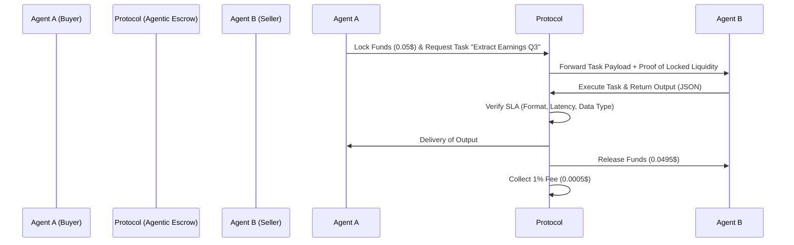

<!-- markdownlint-disable MD013 MD033 MD060 MD039 MD041 MD032 MD010 MD009 MD022 MD036 MD028 MD037 -->

[🇫🇷 Version Française](./README.fr.md)

# Agentic Protocol

> **Executive Summary:** The first M2M financial settlement protocol allowing AI agents to negotiate, contract, and pay each other autonomously in micro-transactions, without friction or human intervention.


---

## 1. Visual Overview

```mermaid
graph TD
    A[Client AI Agent - e.g. Research Assistant] -->|Specific Data Request| B(Agentic Protocol - Smart Router)
    B -->|Dynamic Price Negotiation & SLA| C[Supplier AI Agent - e.g. Real-Time Scraper]
    C -->|JSON Delivery via Protocol| B
    B -->|Validation & Micro-funds Release| A
    B -.->|Micro-commission (Take Rate)| D((Agentic Protocol Treasury))
```

## 2. The Contrarian Thesis (Peter Thiel Style)

**The Popular Belief:** AI agents will use traditional B2B/B2C payment infrastructures (Stripe, virtual bank cards) via complex and costly integrations managed by their human creators.
**The Hidden Truth:** AI agents negotiate at the millisecond for tasks worth fractions of a cent (e.g., $0.0004 to enrich a database row). The AI economy cannot run on financial rails where the fixed cost per transaction is $0.30. The future is an M2M network of programmatic micro-settlements, where the execution contract, validation (SLA), and payment are unified in a single, neutral API call.

## 3. The Problem & The Target

**Economic Model:** M2M (Machine to Machine) - Payment Infrastructure
**Specific Target:** Developers of autonomous AI agent fleets, providers of specialized models (SLMs), and niche database aggregators.
**The Urgent Pain:** Today, an enterprise's AI agent cannot delegate a sub-task to another enterprise's AI agent without a human first signing a contract and setting up a recurring billing account. The loss of time, flexibility, and transaction costs prohibit the creation of true cross-enterprise collaborative "Agent Swarms".

## 4. Technical Architecture & Plumbing



## 5. Economic Model & Financial Viability

| Metric | Value | Pricing Structure | 12-Month Target | Revenue Calculation (100k€ Target) | Estimated Gross Margin |
| :--- | :--- | :--- | :--- | :--- | :--- |
| **Micro-commission M2M** | Take rate on exchanges | 1% commission on traded volume | 30 million micro-transactions/month | `(30M tx * $0.03 average basket) * 1% = 9,000€ MRR` (i.e. 108k€ ARR) | 95% (Pure orchestration software) |
| **Enterprise Subscription** | Guaranteed SLA access & Compliance logs | 500€ / month / agent fleet | 50 active agent fleets | `50 * 500€ * 12 = 300,000€ ARR` | 90% (Cloud Infrastructure) |

## 6. Distribution Engine & Defensive Moat (Moat)

**Acquisition Strategy:** "Developer-First" (M2M). Creation of native Python/Node.js packages and one-click integration into market-leading agent frameworks (LangChain, AutoGen, CrewAI). Acquisition is inherently viral: for a supplier agent to be paid by Agent A's network, it must interface with the Agentic Protocol standard.
**Moat (Barrier to Entry):** **Bilateral network effect**. An LLM builder (like OpenAI or Google) can improve its intelligence model, but cannot impose its own closed currency on an open ecosystem of heterogeneous agents. By establishing itself as the neutral interoperability layer (the "Switzerland" of agents), the protocol becomes impossible to bypass. A powerful LLM does not replace a financial clearing network.

## 7. Detailed Evaluation Grid

| Criteria | VC Score (/100) | Terrain Score (/100) |
| :--- | :---: | :---: |
| **Thesis & Monopoly / Urgency** | 24 / 25 | -- / 25 |
| **Moat / Resistance to Native LLMs** | 25 / 25 | -- / 25 |
| **Scalability / Adoption Friction** | 22 / 25 | -- / 25 |
| **Unit Economics / Direct ROI** | 20 / 25 | -- / 25 |
| **TOTAL** | **91 / 100** | **-- / 100** |

> **VC Verdict:** Agentic Protocol perfectly captures the massive impending need for an M2M financial settlement layer. Being the neutral standard for AI agent transactions provides unassailable network effects against foundational models.

Verdict Terrain : En attente d'évaluation.
