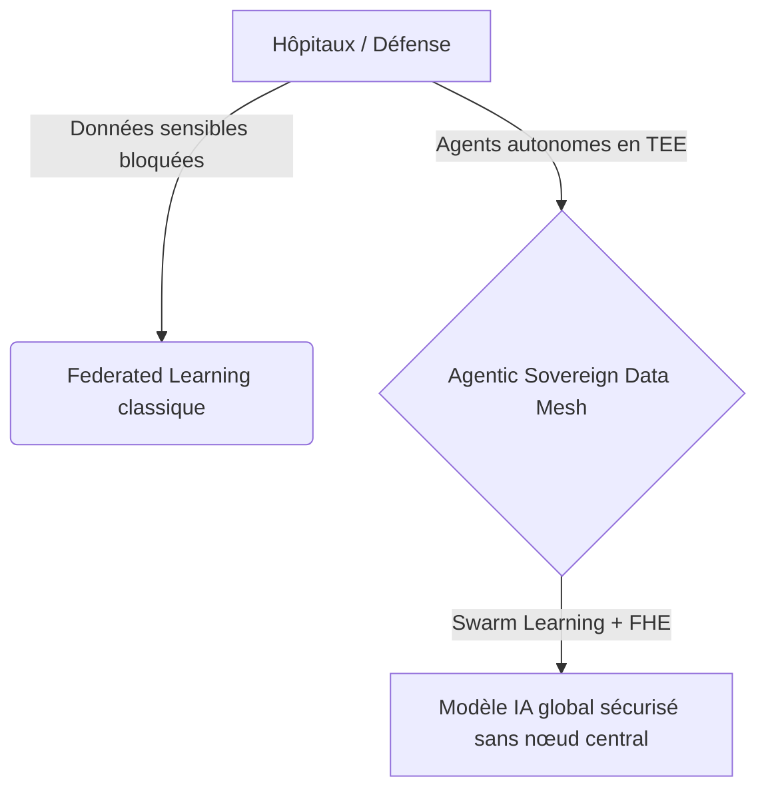
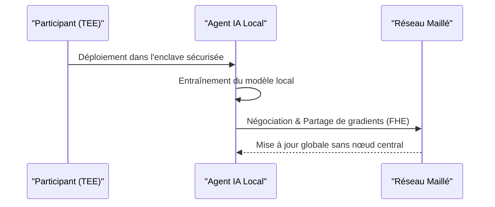

<!-- markdownlint-disable MD009 MD010 MD013 MD022 MD028 MD032 MD033 MD034 MD036 MD037 MD039 MD041 MD058 MD060 -->

[🇬🇧 English Version](./README.md)

# Agentic Sovereign Data Mesh

> **Résumé exécutif :** Un réseau maillé d'agents IA autonomes dans des environnements d'exécution de confiance (TEE) permettant l'entraînement de modèles sur des données sensibles sans centralisation.

---

## 1. Aperçu visuel & Effet Wahou

## 2. La thèse contrariante (Peter Thiel Style)

La croyance populaire : Un cloud sécurisé et du Federated Learning classique suffisent pour entraîner des modèles sur des données sensibles.
La vérité cachée : Les solutions traditionnelles exigent de faire confiance à un orchestrateur central et sont vulnérables à l'ingénierie inverse des poids. Le véritable catalyseur est un essaim décentralisé d'agents autonomes combiné au chiffrement homomorphe (FHE) au sein d'environnements d'exécution de confiance (TEE).

## 3. Le problème & La cible

Modèle économique : B2B
Cible précise : Hôpitaux, consortiums de recherche pharmaceutique, défense, banques centrales (CBDC).
La douleur urgente : L'impossibilité de centraliser les données pour l'entraînement de l'IA (RGPD, contraintes de souveraineté) paralyse l'innovation et empêche l'exploitation de jeux de données hautement critiques.

## 4. Architecture technique & Plomberie

## 5. Modèle économique & Viabilité financière

| Métrique                    | Valeur                                 |
| --------------------------- | -------------------------------------- |
| Structure de prix           | Abonnement par nœud TEE déployé        |
| Objectif 12 mois            | 20 consortiums ou grandes institutions |
| Calcul du CA (Target 100k€) | 20 \* 5000 = 100k                      |
| Marge brute estimée         | 85%                                    |

## 6. Moteur de distribution & Fossé défensif (Moat)

Stratégie d'acquisition : Ventes directes aux consortiums et gouvernements, partenariats avec les fournisseurs de clouds souverains.
Moat (Barrière à l'entrée) : L'intégration bas niveau avec l'infrastructure cryptographique (FHE/TEE) et la complexité de l'orchestration décentralisée (Swarm Learning) rendent la solution impossible à répliquer via un simple SaaS ou une API LLM native.

## 7. Grille d'évaluation détaillée

| Critère                           | Score VC (/100) | Score Terrain (/100) |
| --------------------------------- | --------------- | -------------------- |
| Thèse & Monopole / Urgence        | 21 / 25         | -- / 25              |
| Moat / Résistance aux LLM natifs  | 21 / 25         | -- / 25              |
| Scalabilité / Friction d'adoption | 24 / 25         | -- / 25              |
| Unit Economics / ROI direct       | 23 / 25         | -- / 25              |
| **TOTAL**                         | **89 / 100**    | **-- / 100**         |

> **Verdict VC :** Ce projet présente une thèse fortement contrariante avec un véritable potentiel de monopole (21/25). Bien que l'approche technique soit solide, le fossé défensif face à des acteurs établis bien financés reste partiellement perméable (21/25). Associée à une évolutivité massive (24/25) et d'excellents unit economics (23/25), il s'agit d'une proposition hautement finançable.
>
> **Verdict Terrain :** En attente d'évaluation.
