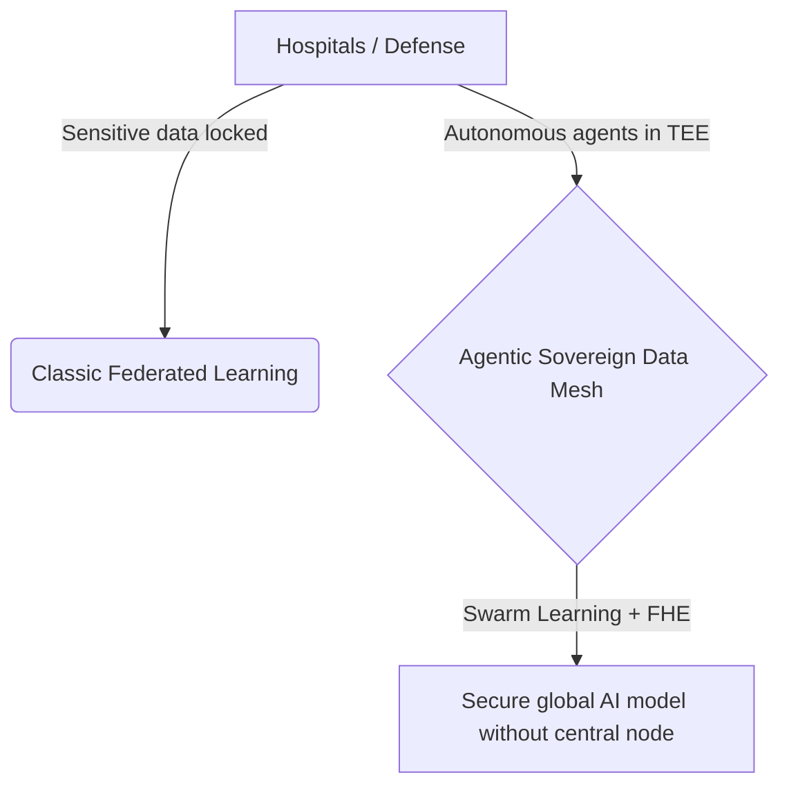
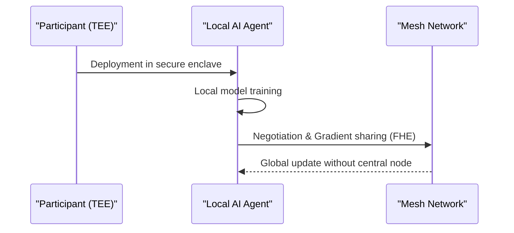

<!-- markdownlint-disable MD009 MD010 MD013 MD022 MD028 MD032 MD033 MD034 MD036 MD037 MD039 MD041 MD058 MD060 -->

[🇫🇷 Version Française](./README.fr.md)

# Agentic Sovereign Data Mesh

> **Executive Summary:** A mesh network of autonomous AI agents within Trusted Execution Environments (TEEs) enabling model training on sensitive data without centralization.

---

## 1. Visual Overview & Wow Effect

## 2. Contrarian Thesis (Peter Thiel Style)

Popular Belief: A secure cloud and classic Federated Learning are enough to train models on sensitive data.
Hidden Truth: Traditional solutions require trusting a central orchestrator and are vulnerable to weight reverse-engineering. The real enabler is a decentralized swarm of autonomous agents combined with Fully Homomorphic Encryption (FHE) within Trusted Execution Environments (TEEs).

## 3. Problem & Target Market

Business Model: B2B
Target Audience: Hospitals, pharmaceutical research consortia, defense, central banks (CBDC).
Urgent Pain Point: The inability to centralize data for AI training (GDPR, sovereignty constraints) paralyzes innovation and prevents the exploitation of highly critical datasets.

## 4. Technical Architecture & Infrastructure

## 5. Business Model & Financial Viability

| Metric                 | Value                              |
| ---------------------- | ---------------------------------- |
| Pricing Structure      | Subscription per deployed TEE node |
| 12-Month Target        | 20 consortia or large institutions |
| Revenue Formula        | 20 \* 5000 = 100k                  |
| Estimated Gross Margin | 85%                                |

## 6. Distribution Engine & Moat

Acquisition Strategy: Direct sales to consortia and governments, partnerships with sovereign cloud providers.
Moat (Defensibility): The low-level integration with cryptographic infrastructure (FHE/TEE) and the complexity of decentralized orchestration (Swarm Learning) make the solution impossible to replicate via a simple SaaS or native LLM API.

## 7. Detailed Evaluation Grid

| Criterion                   | VC Score (/100) | Market Score (/100) |
| --------------------------- | --------------- | ------------------- |
| Thesis & Monopoly / Urgency | -- / 25         | -- / 25             |
| Moat / LLM Immunity         | -- / 25         | -- / 25             |
| Scalability / UX Friction   | -- / 25         | -- / 25             |
| Unit Economics / ROI        | -- / 25         | -- / 25             |
| **TOTAL**                   | **-- / 100**    | **-- / 100**        |

> **VC Verdict:** Pending evaluation.

> **Market Verdict:** Pending evaluation.
