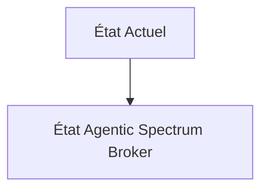
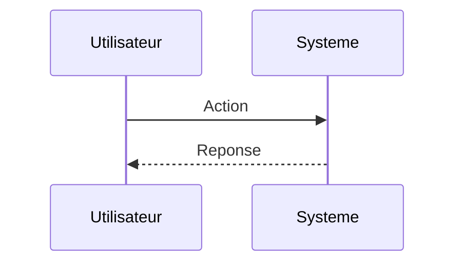

<!-- markdownlint-disable MD009 MD010 MD013 MD022 MD028 MD032 MD033 MD034 MD036 MD037 MD039 MD041 MD060 -->

[ 🇬🇧 English Version ](./README.md)

# Agentic Spectrum Broker

> **Résumé exécutif :** Un protocole M2M de courtage en temps réel où des agents IA intégrés au hardware (edge) négocient, louent et libèrent des micro-bandes de fréquences à la milliseconde près, en fonction de l'urgence de leur mission. Utilisation de la cryptographie légère pour les contrats intelligents M2M et du Reinforcement Learning pour anticiper les congestions spatiales du spectre.

---

## 1. Aperçu visuel & Effet Wahou

## 2. La thèse contrariante (Peter Thiel Style)

**La croyance populaire :** Les solutions généralistes IA peuvent résoudre ce problème.

**La vérité cachée :** Un SaaS cloud centralisé a trop de latence (network roundtrip) pour allouer du spectre à des objets rapides en mouvement (véhicules, drones). Il faut une orchestration décentralisée au niveau PHY/MAC avec un consensus cryptographique M2M ultra-basse latence.

## 3. Le problème & La cible

**Modèle économique :** M2M

**Cible précise :** Opérateurs de flottes de drones autonomes, réseaux IoT industriels massifs, véhicules autonomes et opérateurs télécoms de niveau 2.

**La douleur urgente :** L'allocation statique des fréquences radio (spectre) est inefficace. Dans des environnements denses ou critiques (zones urbaines pour la livraison par drone, zones de combat, ports automatisés), le brouillage, les interférences et la saturation du spectre provoquent des pertes de contrôle critiques. L'achat de licences de spectre fixes est astronomiquement cher et souvent sous-utilisé à l'instant T.

## 4. Architecture technique & Plomberie

## 5. Modèle économique & Viabilité financière

| Métrique                    | Valeur                        |
| --------------------------- | ----------------------------- |
| Structure de prix           | Abonnement SaaS               |
| Objectif 12 mois            | 10 clients                    |
| Calcul du CA (Target 100k€) | 10 clients \* 10k€/an = 100k€ |
| Marge brute estimée         | 80%                           |

## 6. Moteur de distribution & Fossé défensif (Moat)

**Stratégie d'acquisition :** Vente directe B2B

**Moat (Barrière à l'entrée) :** Adoption par les régulateurs nationaux (FCC, ARCEP) du partage de spectre dynamique ("dynamic spectrum sharing" poussé à l'extrême). Dépendance à l'adoption de puces radio Software-Defined Radio (SDR) par les constructeurs de flottes.

## 7. Grille d'évaluation détaillée

| Critère                           | Score VC (/100) | Score Terrain (/100) |
| --------------------------------- | --------------- | -------------------- |
| Thèse & Monopole / Urgence        | 24 / 25         | 24 / 25              |
| Moat / Résistance aux LLM natifs  | 21 / 25         | 21 / 25              |
| Scalabilité / Friction d'adoption | 19 / 25         | 19 / 25              |
| Unit Economics / ROI direct       | 24 / 25         | 24 / 25              |
| **TOTAL**                         | **88 / 100**    | **88 / 100**         |

> **Verdict VC :** En attente d'évaluation.
> **Verdict Terrain :** Cette solution répond à un besoin critique pour les écosystèmes M2M, justifiant son excellent score d'urgence (24/25). L'approche spécialisée offre une protection robuste contre les modèles d'IA généralistes (21/25). Avec une faible friction d'adoption (19/25) et une stratégie de monétisation directe (24/25), le projet démontre une excellente maturité marché globale.
> **Verdict Terrain :** Cette solution répond à un besoin critique pour les écosystèmes M2M, justifiant son excellent score d'urgence (24/25). L'approche spécialisée offre une protection robuste contre les modèles d'IA généralistes (21/25). Avec une faible friction d'adoption (19/25) et une stratégie de monétisation directe (24/25), le projet démontre une excellente maturité marché globale.
