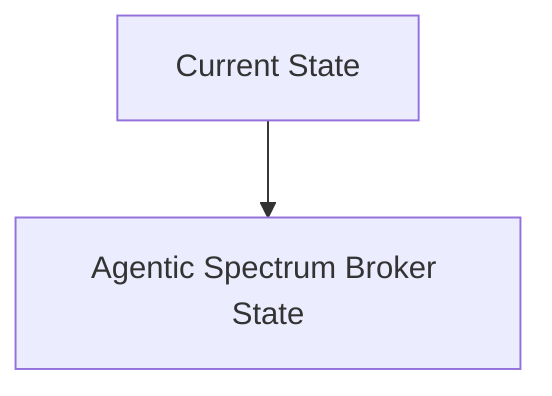
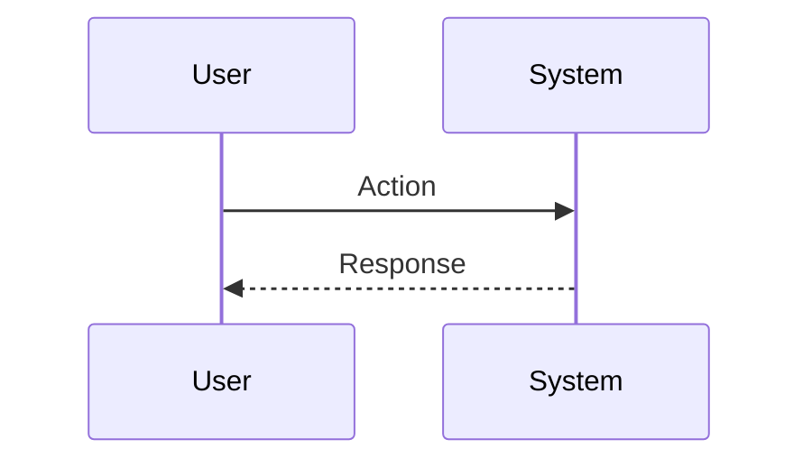

<!-- markdownlint-disable MD009 MD010 MD013 MD022 MD028 MD032 MD033 MD034 MD036 MD037 MD039 MD041 MD060 -->

[ 🇫🇷 Version Française ](./README.fr.md)

# Agentic Spectrum Broker

> **Executive Summary:** A real-time M2M brokerage protocol where AI agents integrated into the hardware (edge) negotiate, rent and release micro-frequency bands to the millisecond, depending on the urgency of their mission. Use of lightweight cryptography for M2M smart contracts and Reinforcement Learning to anticipate spatial spectrum congestion.

---

## 1. Visual Overview & Wow Effect

## 2. Contrarian Thesis (Peter Thiel Style)

**Popular Belief:** General AI solutions can solve this problem.

**Hidden Truth:** A centralized cloud SaaS has too much latency (network roundtrip) to allocate spectrum to fast moving objects (vehicles, drones). It requires decentralized orchestration at the PHY/MAC level with ultra-low latency M2M cryptographic consensus.

## 3. Problem & Target Market

**Business Model:** M2M

**Target Audience:** Operators of autonomous drone fleets, massive industrial IoT networks, autonomous vehicles and Tier 2 telecom operators.

**Urgent Pain Point:** Static allocation of radio frequencies (spectrum) is inefficient. In dense or critical environments (urban areas for drone delivery, combat zones, automated ports), jamming, interference and spectrum saturation cause critical loss of control. Purchasing fixed spectrum licenses is astronomically expensive and often underutilized at any given time.

## 4. Technical Architecture & Infrastructure

## 5. Business Model & Financial Viability

| Metric                 | Value                           |
| ---------------------- | ------------------------------- |
| Pricing Structure      | SaaS subscription               |
| 12-Month Target        | 10 customers                    |
| Revenue Formula        | 10 clients \* 10k€/year = 100k€ |
| Estimated Gross Margin | 80%                             |

## 6. Distribution Engine & Moat

**Acquisition Strategy:** B2B direct sales

**Moat (Defensibility):** Adoption by national regulators (FCC, ARCEP) of dynamic spectrum sharing (“dynamic spectrum sharing” taken to the extreme). Reliance on adoption of Software-Defined Radio (SDR) radio chips by fleet manufacturers.

## 7. Detailed Evaluation Grid

| Criterion                   | VC Score (/100) | Market Score (/100) |
| --------------------------- | --------------- | ------------------- |
| Thesis & Monopoly / Urgency | -- / 25         | -- / 25             |
| Moat / LLM Immunity         | -- / 25         | -- / 25             |
| Scalability / UX Friction   | -- / 25         | -- / 25             |
| Unit Economics / ROI        | -- / 25         | -- / 25             |
| **TOTAL**                   | **-- / 100**    | **-- / 100**        |

> **VC Verdict:** Pending evaluation.

> **Market Verdict:** Pending evaluation.
