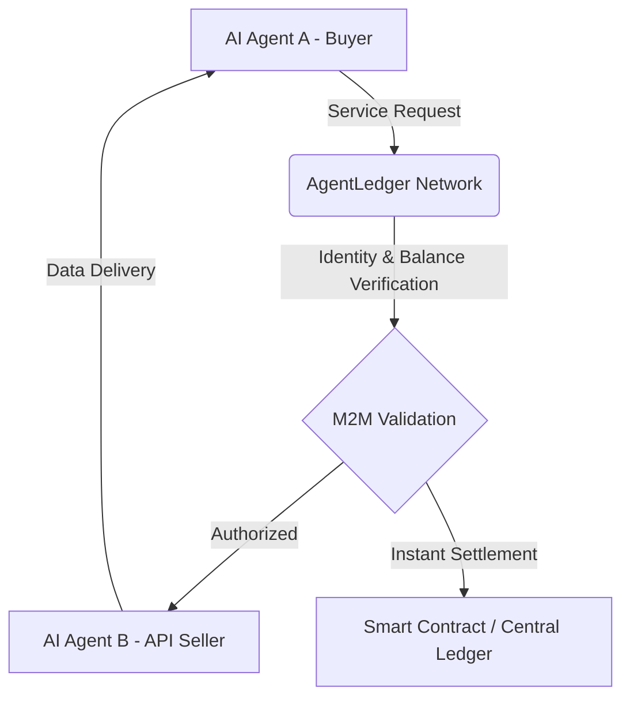
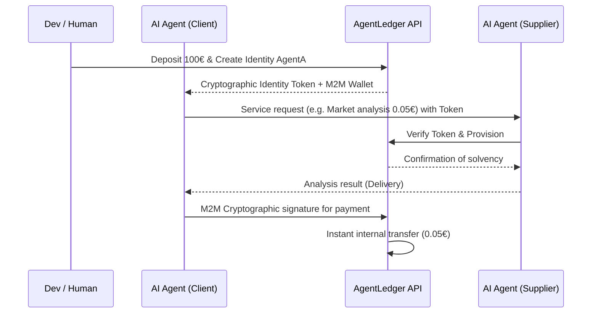

<!-- markdownlint-disable MD013 MD033 MD060 MD039 MD041 MD032 MD010 MD009 MD022 MD036 MD028 MD037 -->

[🇫🇷 Version Française](./README.fr.md)

# AgentLedger

> **Executive Summary:** AgentLedger is an M2M (Machine-to-Machine) infrastructure that endows autonomous AI agents with a verified identity and micro-transaction wallets, allowing them to interact, negotiate, and pay other agents or APIs securely without human intervention.

---

## 1. Visual Overview

## 2. The Contrarian Thesis (Peter Thiel Style)

**The Popular Belief:** AIs will simply act as super-powered assistants for humans who will continue to orchestrate and pay for each API or service with their own bank credit card.
**The Hidden Truth:** The next economy is not human. In 5 years, 90% of web transactions will be initiated and settled by AI agents negotiating with each other (M2M). Agents need their own sandboxed financial and identity system, because traditional banking networks are too slow, expensive, and unsuited for algorithmic micro-transactions at the millisecond.

## 3. The Problem & The Target

**Economic Model:** M2M
**Specific Target:** AI infrastructure developers (Swarm agencies, multi-agent platforms, LLM orchestrators) and data API providers.
**The Urgent Pain:** It is impossible today to give total financial autonomy to an agent (risk of ruin if entrusted with a credit card) to pay other agents. There is enormous friction (Stripe transaction costs > 30 cents) for API calls that are worth 0.001€.

## 4. Technical Architecture & Plumbing

## 5. Economic Model & Financial Viability

| Metric | Value |
| :--- | :--- |
| **Pricing Structure** | Hybrid SaaS model: Dev access subscription (49€/month) + 1% commission on the volume of routed M2M micro-transactions. |
| **12-Month Target** | 1,000 active developers (49,000€ ARR) + 5 million euros transacted monthly on the M2M network (60,000€ ARR via the 1% commission). |
| **Revenue Calculation (100k€ Target)** | (1000 devs * 49€ * 12 months) + (5,000,000€ * 1% * 12 months) = 58,800€ + 60,000€ = 118,800€ |
| **Estimated Gross Margin** | 85% (The ledger infrastructure is ultra-lightweight, centralized database optimized for concurrency). |

## 6. Distribution Engine & Defensive Moat (Moat)

**Acquisition Strategy:** M2M dev adoption (Developer-focused Product-Led Growth). Distribution of a very simple open-source SDK for agent orchestrators (e.g., LangChain, AutoGen). Integration into the existing supply chain, turning the customer acquisition cost (CAC) into almost zero thanks to bilateral network effects.

**Moat (Barrier to Entry):**

1. **Bilateral Network Effect:** The more agents accepting the AgentLedger standard to be paid, the more agent creators will use it to pay. A competitor would have to convince the entire independent API ecosystem to switch protocols.
2. **Regulatory & Infrastructural Moat:** Building a micro-transaction "ledger" requires anti-money laundering (KYC of agent creators) and high-availability infrastructure (Trust). A simple "LLM wrapper" absolutely cannot offer this transactional and legal reliability.

## 7. Detailed Evaluation Grid

| Criteria | VC Score (/100) | Terrain Score (/100) |
| :--- | :---: | :---: |
| **Thesis & Monopoly / Urgency** | 22 / 25 | -- / 25 |
| **Moat / Resistance to Native LLMs** | 23 / 25 | -- / 25 |
| **Scalability / Adoption Friction** | 24 / 25 | -- / 25 |
| **Unit Economics / Direct ROI** | 20 / 25 | -- / 25 |
| **TOTAL** | **89 / 100** | **-- / 100** |

> **VC Verdict:** AgentLedger introduces the definitive ledger for the M2M economy. By owning the settlement layer, it achieves ultimate lock-in and a quasi-monopolistic position. It perfectly exemplifies the 'don't build the AI, build the AI's bank' strategy.

Verdict Terrain : En attente d'évaluation.
