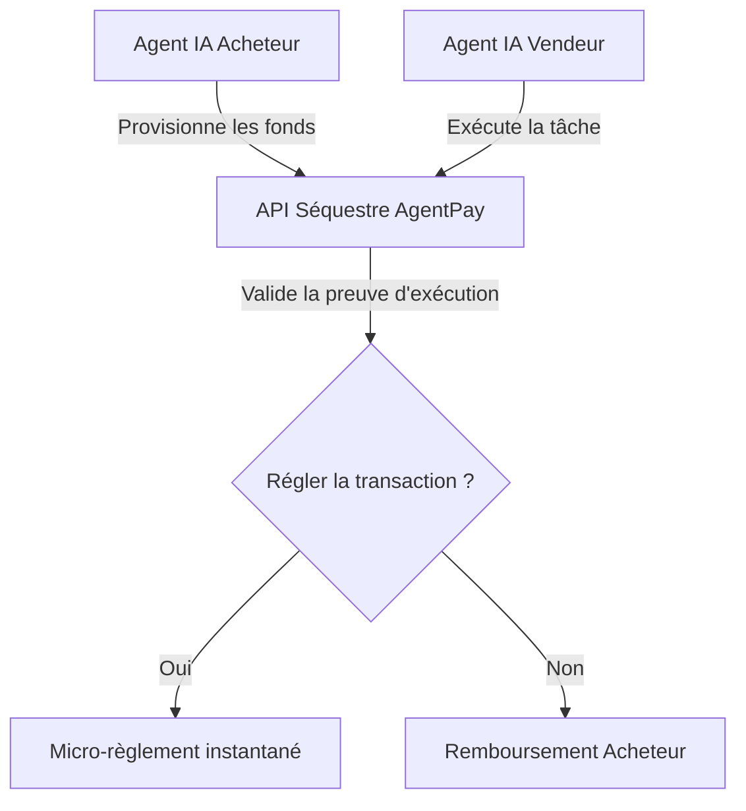
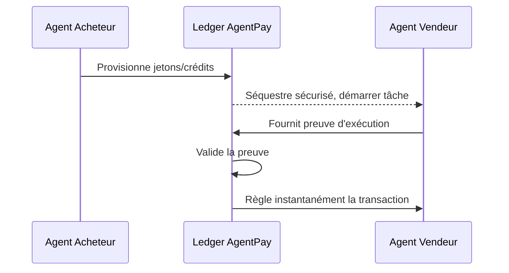

<!-- markdownlint-disable MD013 MD028 MD033 MD036 MD039 MD041 MD060 -->

[ 🇬🇧 English Version ](./README.md)

# AgentPay

> **Résumé exécutif :** Infrastructure de paiement cryptographique par API pour les micro-transactions de machine à machine (M2M) et les contrats de séquestre programmables.

---

## 1. Aperçu visuel

## 2. La thèse contrariante (Peter Thiel Style)

La croyance populaire : L'économie des API restera basée sur des contrats B2B signés par des humains et une facturation mensuelle.
La vérité cachée : La véritable autonomie nécessite que les machines aient la capacité technique de détenir des fonds et d'exécuter des micro-transactions sans confiance (trustless) instantanément sans friction humaine.

## 3. Le problème & La cible

Modèle économique : M2M (Machine-to-Machine)
Cible précise : Développeurs de frameworks d'agents autonomes, entreprises déployant des flottes d'IA, fournisseurs de services API.
La douleur urgente : L'incapacité pour les agents autonomes d'acheter dynamiquement des services (donnée, calcul) bloque l'émergence d'une véritable économie entre machines, faute de protocole de micro-règlement standardisé.

## 4. Architecture technique & Plomberie

## 5. Modèle économique & Viabilité financière

| Métrique                    | Valeur                                 |
| --------------------------- | -------------------------------------- |
| Structure de prix           | Micro-commission sur transaction       |
| Objectif 12 mois            | Volume critique de transactions M2M    |
| Calcul du CA (Target 100k€) | Volume de transactions \* % Commission |
| Marge brute estimée         | 90%+                                   |

## 6. Moteur de distribution & Fossé défensif (Moat)

Stratégie d'acquisition : Adhésion dev M2M, intégration frameworks agents.
Moat (Barrière à l'entrée) : Un prompt ne peut pas retenir des fonds de manière sécurisée ni garantir l'exécution déterministe d'une transaction financière. L'infrastructure cryptographique est indispensable.

## 7. Grille d'évaluation détaillée

| Critère                           | Score VC (/100) | Score Terrain (/100) |
| --------------------------------- | --------------- | -------------------- |
| Thèse & Monopole / Urgence        | -- / 25         | 21 / 25              |
| Moat / Résistance aux LLM natifs  | -- / 25         | 23 / 25              |
| Scalabilité / Friction d'adoption | -- / 25         | 20 / 25              |
| Unit Economics / ROI direct       | -- / 25         | 16 / 25              |
| **TOTAL**                         | **-- / 100**    | **80 / 100**         |

> **Verdict Terrain :** L'outil AgentPay répond à un besoin métier très ciblé avec un ROI tangible. Son positionnement en tant qu'infrastructure API garantit une bonne immunité face aux LLMs généralistes. La clarté de sa proposition de valeur financière assure une forte disposition à payer des entreprises B2B.
> Verdict VC : En attente d'évaluation.
