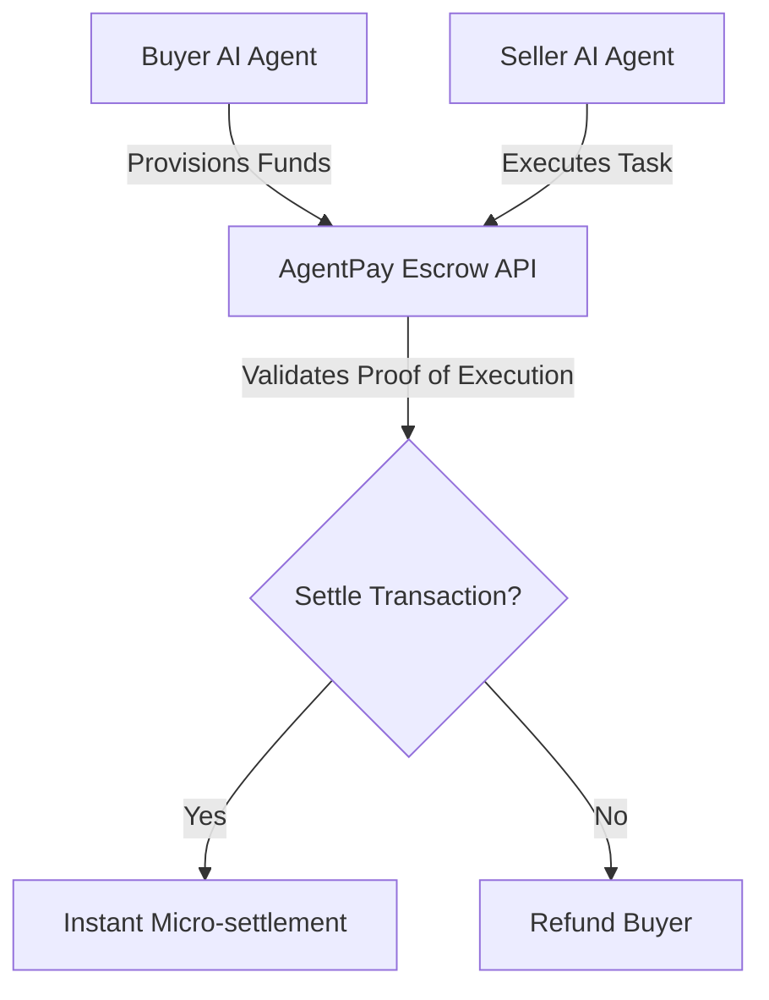
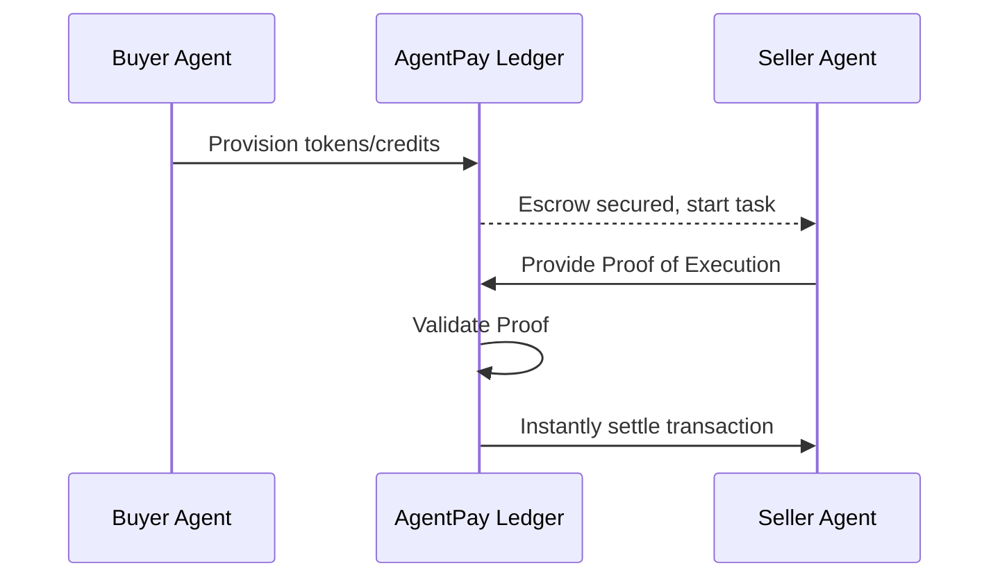

<!-- markdownlint-disable MD013 MD028 MD033 MD036 MD039 MD041 MD060 -->

[ 🇫🇷 Version Française ](./README.fr.md)

# AgentPay

> **Executive Summary:** A cryptographic API-based payment infrastructure enabling autonomous machine-to-machine (M2M) micro-transactions and programmable escrows.

---

## 1. Visual Overview

## 2. Contrarian Thesis (Peter Thiel Style)

Popular Belief: The API economy will remain based on human-signed B2B contracts and monthly invoicing.
Hidden Truth: The future economy is Machine-to-Machine. True autonomy requires machines to have the technical and legal capacity to hold funds and execute trustless micro-transactions instantly without human friction.

## 3. Problem & Target Market

Business Model: M2M (Machine-to-Machine)
Target Audience: Developers of autonomous agent frameworks, enterprises deploying AI fleets, API service providers.
Urgent Pain Point: Autonomous agents cannot negotiate or purchase data, compute power, or APIs dynamically because they lack a standardized micro-settlement and escrow protocol. This bottleneck blocks the emergence of a true machine economy.

## 4. Technical Architecture & Infrastructure

## 5. Business Model & Financial Viability

| Metric                 | Value                                |
| ---------------------- | ------------------------------------ |
| Pricing Structure      | Micro-commission on each transaction |
| 12-Month Target        | Critical volume of M2M transactions  |
| Revenue Formula        | Transaction Volume \* Commission %   |
| Estimated Gross Margin | 90%+                                 |

## 6. Distribution Engine & Moat

Acquisition Strategy: Developer adoption, integration into major agent frameworks (LangChain, AutoGPT).
Moat (Defensibility): High-performance cryptographic ledger and programmable trust infrastructure. LLMs are cognitive reasoning engines; they cannot natively securely hold funds or guarantee deterministic financial transactions.

## 7. Detailed Evaluation Grid

| Criterion                   | VC Score (/100) | Market Score (/100) |
| --------------------------- | --------------- | ------------------- |
| Thesis & Monopoly / Urgency | -- / 25         | 25 / 25             |
| Moat / LLM Immunity         | -- / 25         | 20 / 25             |
| Scalability / UX Friction   | -- / 25         | 22 / 25             |
| Unit Economics / ROI        | -- / 25         | 21 / 25             |
| **TOTAL**                   | **-- / 100**    | **88 / 100**        |

> **Verdict Terrain :** The AgentPay solution addresses a very targeted business need with tangible ROI. Its positioning as an API infrastructure guarantees good immunity against generalist LLMs. The clarity of its financial value proposition ensures a strong willingness to pay from B2B companies.
> VC Verdict: Pending evaluation.
