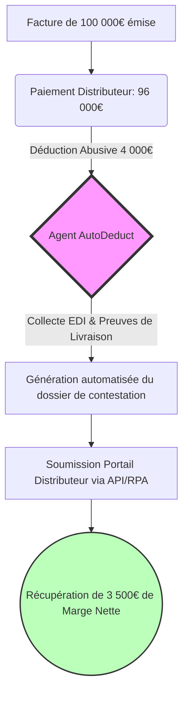
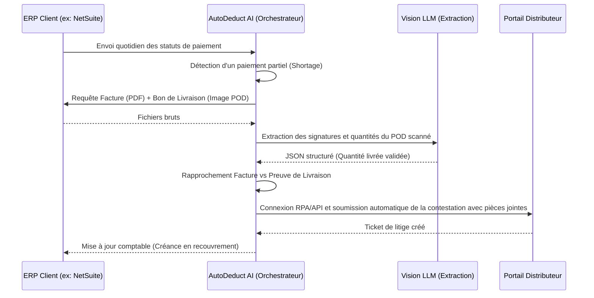

<!-- markdownlint-disable MD013 -->

# AutoDeduct AI

> **Résumé exécutif :** AutoDeduct AI est un agent financier autonome qui récupère automatiquement les millions d'euros perdus par les marques CPG (Consumer Packaged Goods) en contestant systématiquement et sans intervention humaine les déductions commerciales abusives des grands distributeurs (Amazon, Carrefour, Walmart).

---

## 1. Aperçu visuel

## 2. La thèse contrariante (Peter Thiel Style)

**La croyance populaire :** L'IA générative va principalement révolutionner la création de contenu (textes, images, code) et remplacer les emplois créatifs ou de service client.

**La vérité cachée :** L'opportunité la plus lucrative et la plus urgente pour l'IA se trouve dans l'automatisation agressive des litiges financiers inter-entreprises (B2B). Les méga-distributeurs utilisent la friction administrative (portails complexes, preuves impossibles à réunir) pour rogner les marges de leurs fournisseurs. Récupérer cet argent volé par l'attrition administrative est une proposition de valeur à ROI instantané et quantifiable au centime près, que les LLMs grand public sont incapables de réaliser seuls.

## 3. Le problème & La cible

**Modèle économique :** B2B (Software-as-a-Service avec commission sur performance)

**Cible précise :** Marques de biens de grande consommation (CPG / FMCG) réalisant entre 10M€ et 250M€ de chiffre d'affaires, vendant à la grande distribution physique et e-commerce (Amazon Vendor Central, Walmart, Carrefour).

**La douleur urgente :** Les distributeurs appliquent automatiquement des pénalités (chargebacks, shortages) représentant 2% à 5% du CA brut pour des motifs souvent erronés ("livraison en retard", "palette non conforme"). Pour contester une pénalité de 200€, un employé doit passer 45 minutes à croiser la facture, le bon de livraison (POD) scanné et l'EDI. Résultat : les marques abandonnent la majorité de ces créances. C'est une perte sèche de marge nette (souvent 10 à 20% de leur rentabilité globale).

## 4. Architecture technique & Plomberie

## 5. Modèle économique & Viabilité financière

| Métrique                        | Valeur                                                                                                                                                                                                                                |
| :------------------------------ | :------------------------------------------------------------------------------------------------------------------------------------------------------------------------------------------------------------------------------------ |
| **Structure de prix**           | Modèle hybride : 1000€/mois (frais fixes d'intégration) + 15% de commission (Success Fee) sur les sommes récupérées.                                                                                                                  |
| **Objectif 12 mois**            | 20 clients récupérant en moyenne 35 000€ par mois chacun.                                                                                                                                                                             |
| **Calcul du CA (Target 100k€)** | Fixe : 20*1000 = 20k€. Commission : (20* 35k€ *15%) = 105k€. Total mensuel : 125k€ (ARR potentiel > 1M€). Pour atteindre 100k€ d'ARR, seuls**2 à 3 clients** sont nécessaires (Ex: 3 clients*12k€ fixe/an + 20k€ comm/an = 96k€ ARR). |
| **Marge brute estimée**         | 85% (Coûts principaux : appels API LLM vision pour l'OCR des PODs, hébergement, RPA).                                                                                                                                                 |

## 6. Moteur de distribution & Fossé défensif (Moat)

**Stratégie d'acquisition :** Vente directe (Outbound) chirurgicale ciblant les CFOs et Directeurs Supply Chain. L'approche est un audit gratuit : "Donnez-nous l'accès en lecture à votre portail Amazon Vendor pendant 48h, nous vous dirons exactement combien de centaines de milliers d'euros vous n'avez pas réclamés les 6 derniers mois. Vous ne payez que si nous les récupérons pour vous."

**Moat (Barrière à l'entrée) :**

1. **Intégration et plomberie (Data Moat) :** Un LLM comme ChatGPT est aveugle aux systèmes fermés. Le vrai produit est la tuyauterie : se connecter à NetSuite, SAP, extraire des EDI 856 (Avis d'expédition), et manipuler des portails distributeurs archaïques via RPA (Robotic Process Automation) car ils n'ont pas d'APIs publiques pour les litiges.
2. **Proprietary Dataset :** En traitant des dizaines de milliers de bons de livraison griffonnés à la main par des chauffeurs routiers, le modèle Vision s'affine spécifiquement sur la lecture des "Proof of Delivery" de l'industrie du transport, devenant intraitable par rapport à un OCR générique.
3. **Switching Cost :** Une fois le système branché et l'argent qui coule automatiquement chaque mois vers le compte en banque du client, le désabonnement (churn) est pratiquement nul ("Sticky product").

## 7. Grille d'évaluation détaillée

| Critère                               | Score VC (/100) | Score Terrain (/100) |
| :------------------------------------ | :-------------: | :------------------: |
| **Thèse & Monopole / Urgence**        |     -- / 25     |       25 / 25        |
| **Moat / Résistance aux LLM natifs**  |     -- / 25     |       20 / 25        |
| **Scalabilité / Friction d'adoption** |     -- / 25     |       22 / 25        |
| **Unit Economics / ROI direct**       |     -- / 25     |       23 / 25        |
| **TOTAL**                             |  **-- / 100**   |     **90 / 100**     |

> **Verdict Terrain :** L'outil AutoDeduct AI répond à un besoin métier très ciblé avec un ROI tangible. Son intégration profonde dans les processus métiers le rend difficilement remplaçable par un simple chatbot. Même si l'adoption demande un effort d'intégration, la viabilité du modèle économique est portée par la valeur apportée.
> Verdict VC : En attente d'évaluation.
