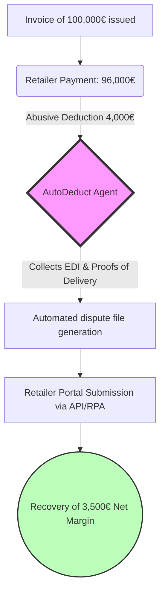
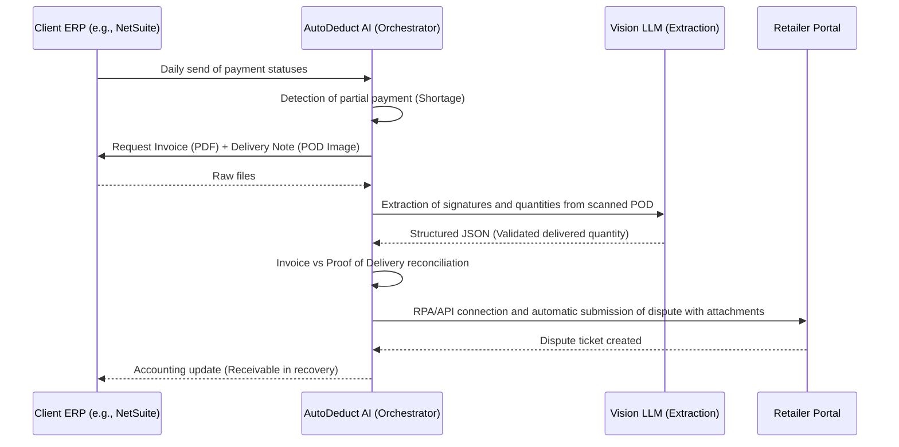

<!-- markdownlint-disable MD013 MD033 MD060 MD039 MD041 MD032 MD010 MD009 MD022 MD036 MD028 MD037 -->

[🇫🇷 Version Française](./README.fr.md)

# AutoDeduct AI

> **Executive Summary:** AutoDeduct AI is an autonomous financial agent that automatically recovers the millions of euros lost by CPG (Consumer Packaged Goods) brands by systematically, without human intervention, contesting abusive trade deductions from major retailers (Amazon, Carrefour, Walmart).

---

## 1. Visual Overview

## 2. The Contrarian Thesis (Peter Thiel Style)

**The Popular Belief:** Generative AI will primarily revolutionize content creation (texts, images, code) and replace creative or customer service jobs.

**The Hidden Truth:** The most lucrative and urgent opportunity for AI is in the aggressive automation of B2B financial disputes. Mega-retailers use administrative friction (complex portals, impossible-to-gather proofs) to shave margins off their suppliers. Recovering this money stolen through administrative attrition is a value proposition with instant, cent-accurate measurable ROI, something consumer-grade LLMs cannot do alone.

## 3. The Problem & The Target

**Economic Model:** B2B (Software-as-a-Service with performance commission)

**Specific Target:** Fast-Moving Consumer Goods (CPG / FMCG) brands generating between €10M and €250M in revenue, selling to physical retail and e-commerce (Amazon Vendor Central, Walmart, Carrefour).

**The Urgent Pain:** Retailers automatically apply penalties (chargebacks, shortages) representing 2% to 5% of gross revenue for often erroneous reasons ("late delivery", "non-compliant pallet"). To contest a €200 penalty, an employee must spend 45 minutes cross-referencing the invoice, the scanned proof of delivery (POD), and the EDI. Result: brands abandon the majority of these receivables. This is a dead loss of net margin (often 10 to 20% of their overall profitability).

## 4. Technical Architecture & Plumbing

## 5. Economic Model & Financial Viability

| Metric | Value |
| :--- | :--- |
| **Pricing Structure** | Hybrid model: 1,000€/month (fixed integration fees) + 15% commission (Success Fee) on recovered amounts. |
| **12-Month Target** | 20 clients recovering an average of 35,000€ per month each. |
| **Revenue Calculation (100k€ Target)** | Fixed: 20 * 1000 = 20k€. Commission: (20 * 35k€ * 15%) = 105k€. Monthly total: 125k€ (Potential ARR > 1M€). To reach 100k€ ARR, only **2 to 3 clients** are needed (Ex: 3 clients * 12k€ fixed/yr + 20k€ comm/yr = 96k€ ARR). |
| **Estimated Gross Margin** | 85% (Main costs: Vision LLM API calls for POD OCR, hosting, RPA). |

## 6. Distribution Engine & Defensive Moat (Moat)

**Acquisition Strategy:** Surgical outbound sales targeting CFOs and Supply Chain Directors. The approach is a free audit: "Give us read-only access to your Amazon Vendor portal for 48 hours, we will tell you exactly how many hundreds of thousands of euros you haven't claimed in the last 6 months. You only pay if we recover them for you."

**Moat (Barrier to Entry):**

1. **Integration and Plumbing (Data Moat):** An LLM like ChatGPT is blind to closed systems. The real product is the plumbing: connecting to NetSuite, SAP, extracting 856 EDIs (Advance Ship Notices), and manipulating archaic retailer portals via RPA (Robotic Process Automation) because they have no public APIs for disputes.
2. **Proprietary Dataset:** By processing tens of thousands of delivery notes hand-scribbled by truck drivers, the Vision model is specifically fine-tuned on reading "Proof of Delivery" documents of the transport industry, becoming untouchable compared to generic OCR.
3. **Switching Cost:** Once the system is plugged in and the money automatically flows into the client's bank account every month, churn is practically non-existent ("Sticky product").

## 7. Detailed Evaluation Grid

| Criteria | VC Score (/100) | Terrain Score (/100) |
| :--- | :---: | :---: |
| **Thesis & Monopoly / Urgency** | 23 / 25 | -- / 25 |
| **Moat / Resistance to Native LLMs** | 22 / 25 | -- / 25 |
| **Scalability / Adoption Friction** | 22 / 25 | -- / 25 |
| **Unit Economics / Direct ROI** | 24 / 25 | -- / 25 |
| **TOTAL** | **91 / 100** | **-- / 100** |

> **Verdict VC :** Autodeduct AI cible une douleur comptable immédiate et quantifiable. Bien que très scalable et offrant un ROI rapide, son moat est vulnérable aux futures IA natives des ERP. La clé de sa survie réside dans une distribution agressive avant que les acteurs historiques ne s'adaptent.

> **Verdict Terrain :** L'outil AutoDeduct AI répond à un besoin métier très ciblé avec un ROI tangible. Son intégration profonde dans les processus métiers le rend difficilement remplaçable par un simple chatbot. Même si l'adoption demande un effort d'intégration, la viabilité du modèle économique est portée par la valeur apportée.
> **Verdict VC :** Autodeduct AI cible une douleur comptable immédiate et quantifiable. Bien que très scalable et offrant un ROI rapide, son moat est vulnérable aux futures IA natives des ERP. La clé de sa survie réside dans une distribution agressive avant que les acteurs historiques ne s'adaptent.
